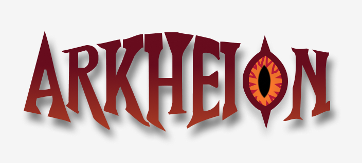

# Arkheion



O Arkheion tem como finalidade descomplicar o processo de criação de fichas de personagens para RPG, assim como facilitar o gerenciamento para grupos de jogos de RPG online, conhecido como "mesa".

<br>

# Equipe e formas de contato

1. Agnes Gonçalves [](https://github.com/AgnesGB) [](mailto:agnesgobarbosa.17@gmail.com)

1. João Victor [](https://github.com/JVictorFonseca) [](mailto:v.fonseca@academico.ifrn.edu.br)

1. Lucas Pinheiro [](https://github.com/lucas-pinheiro-costa) [](mailto:costa.pinheiro@escolar.ifrn.edu.br)

1. Nathan Cavalcante [](https://github.com/N4teC) [](mailto:nathan.c.1377@gmail.com)

1. Walber Ranniere [](https://github.com/WalberRanniere) [](mailto:walber.r@escolar.ifrn.edu.br)

1. Gerente: Alan Glei Gomes da Silva [](mailto:alan.glei@ifrn.edu.br)

<br>

# Horário de Reuniões

Quintas-feiras, das 14:30 às 16:00 presencialmente na sala Audiovisual 01 da DIATINF.

<br>

# Documentação

[Link para os documentos do projeto](doc/documentacao.md)

<br>

# Manual do Desenvolvedor

[Orientações para os desenvolvedores do projeto](doc/guia-ds/guia.md)
<br>

# Deploy e Infraestrutura

## 🚀 Deploy AWS com K3S

Para instruções completas de deploy no AWS Academy com K3S, veja:
- [Guia Completo de Deploy AWS](aws/README.md)
- [Setup do Master](aws/setup-master.sh)
- [Deploy da Aplicação](aws/deploy-app.sh)

## ⚡ Solução para IP Dinâmico do AWS Lab

Quando o laboratório AWS cai e o IP muda, use o script de atualização automática:

```bash
./update-ip.sh ec2-SEU-IP.compute-1.amazonaws.com
```

📚 Documentação:
- [Guia Rápido](QUICK-UPDATE-IP.md) - Comando único para atualizar
- [Documentação Completa](aws/IP-DINAMICO.md) - Detalhes técnicos da solução

<br>