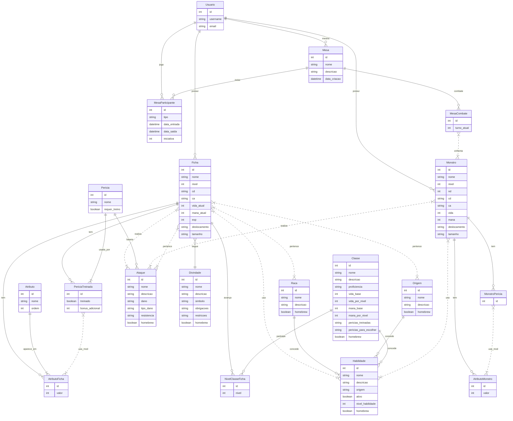

# Modelo de Dados

## Diagrama ER

- ||--o{ → Relacionamento um para muitos (1:N)
- }o--|| → Relacionamento muitos para um (N:1)
- }|..|{  → Relacionamento muitos para muitos (N:N)

## Modelo Relacional

```mermaid
erDiagram

    %% ==== USUARIO E FICHA ====
    Usuario {
        int id PK
        string username
        string email
    }

    Ficha {
        int id PK
        int usuario_id FK
        string nome
        int nivel
        string cd
        string ca
        int vida_atual
        int mana_atual
        int exp
        string deslocamento
        string tamanho
        int divindade_id FK
        int raca_id FK
        int origem_id FK
    }

    %% ==== ATRIBUTOS E PERÍCIAS ====
    Atributo {
        int id PK
        string nome
        int ordem
    }

    AtributoFicha {
        int id PK
        int ficha_id FK
        int atributo_id FK
        int valor
    }

    Pericia {
        int id PK
        string nome
        boolean requer_treino
        int atributo_id FK
    }

    PericiaTreinada {
        int id PK
        int ficha_id FK
        int pericia_id FK
        boolean treinado
        int bonus_adicional
    }

    %% ==== ATAQUES ====
    Ataque {
        int id PK
        int ficha_id FK
        string nome
        string descricao
        string dano
        string tipo_dano
        string resistencia
        boolean homebrew
        int pericia_id FK
    }

    %% ==== CLASSES E NÍVEIS ====
    Classe {
        int id PK
        string nome
        string descricao
        string proficiencia
        int vida_base
        int vida_por_nivel
        int mana_base
        int mana_por_nivel
        string pericias_treinadas
        string pericias_para_escolher
        boolean homebrew
    }

    NivelClasseFicha {
        int id PK
        int ficha_id FK
        int classe_id FK
        int nivel
    }

    %% ==== ORIGEM, RAÇA, DIVINDADE E HABILIDADES ====
    Origem {
        int id PK
        string nome
        string descricao
        boolean homebrew
    }

    Raca {
        int id PK
        string nome
        string descricao
        boolean homebrew
    }

    Divindade {
        int id PK
        string nome
        string descricao
        string simbolo
        string obrigacoes
        string restricoes
        boolean homebrew
    }

    Habilidade {
        int id PK
        string nome
        string descricao
        string origem
        boolean ativo
        int nivel_habilidade
        boolean homebrew
    }

    FichaHabilidade {
        int id PK
        int ficha_id FK
        int habilidade_id FK
    }

    %% ==== MONSTROS ====
    Monstro {
        int id PK
        int usuario_id FK
        string nome
        int nivel
        int nd
        string cd
        string ca
        int vida
        int mana
        string deslocamento
        string tamanho
    }

    AtributoMonstro {
        int id PK
        int monstro_id FK
        int atributo_id FK
        int valor
    }

    MonstroPericia {
        int id PK
        int monstro_id FK
        int pericia_id FK
        int atributo_id FK
        int bonus
    }

    MonstroAtaque {
        int id PK
        int monstro_id FK
        int ataque_id FK
    }

    MonstroHabilidade {
        int id PK
        int monstro_id FK
        int habilidade_id FK
    }

    %% ==== MESA, PARTICIPANTES E COMBATES ====
    Mesa {
        int id PK
        int usuario_id FK
        string nome
        string descricao
        datetime data_criacao
    }

    MesaParticipante {
        int id PK
        int usuario_id FK
        int mesa_id FK
        int ficha_id FK
        string tipo
        datetime data_entrada
        datetime data_saida
        int iniciativa
    }

    MesaCombate {
        int id PK
        int mesa_id FK
        int turno_atual
    }

    CombateMonstro {
        int id PK
        int mesa_combate_id FK
        int monstro_id FK
        int iniciativa
    }

    


    %% === USUÁRIO E MESA ===
    Usuario ||--o{ Ficha : possui
    Usuario ||--o{ Monstro : cria
    Usuario ||--o{ Mesa : cria
    Usuario ||--o{ MesaParticipante : participa

    Mesa ||--o{ MesaParticipante : possui
    Mesa ||--o{ MesaCombate : gera

    MesaCombate ||--o{ CombateMonstro : possui

    %% === FICHA DE PERSONAGEM ===
    Ficha }o--|| Raca : pertence
    Ficha }o--|| Origem : tem
    Ficha }o--|| Divindade : segue

    Ficha ||--o{ AtributoFicha : define
    Ficha ||--o{ PericiaTreinada : treina
    Ficha ||--o{ NivelClasseFicha : recebe
    Ficha ||--o{ Ataque : realiza
    Ficha ||--o{ FichaHabilidade : possui
    Ficha ||--o{ MesaParticipante : usada

    %% === ATRIBUTOS, PERÍCIAS E CLASSES ===
    Atributo ||--o{ AtributoFicha : define
    Atributo ||--o{ AtributoMonstro : define
    Atributo ||--o{ Pericia : influencia

    Pericia ||--o{ PericiaTreinada : configurada
    Pericia ||--o{ Ataque : usada_em
    Pericia ||--o{ MonstroPericia : usada_em

    Classe ||--o{ NivelClasseFicha : relacionada
    Classe ||--o{ Habilidade : concede
    
    %% === ORIGEM, RAÇA, DIVINDADE E HABILIDADES ===
    Origem ||--o{ Habilidade : concede
    Raca ||--o{ Habilidade : concede

    Habilidade ||--o{ FichaHabilidade : associada
    Habilidade ||--o{ MonstroHabilidade : associada

    %% === MONSTROS ===
    Monstro ||--o{ AtributoMonstro : define
    Monstro ||--o{ MonstroPericia : treina
    Monstro ||--o{ MonstroAtaque : usa
    Monstro ||--o{ MonstroHabilidade : possui
    Monstro ||--o{ CombateMonstro : entra

    Ataque ||--o{ MonstroAtaque : usado_por
```

- ||--o{ → Relacionamento um para muitos (1:N)
- }o--|| → Relacionamento muitos para um (N:1)
- }|..|{  → Relacionamento muitos para muitos (N:N)

## Dicionário de Dados

### **Tabela**: USUARIO

*Descrição*: Armazena os dados dos usuários do sistema.  
*Observações*: Cada usuário pode possuir várias fichas.

| Colunas | Descrição                | Tipo de Dado | Tamanho | Null | PK  | FK  | Unique | Identity | Default | Check |
| ------- | ------------------------ | ------------ | ------- | ---- | --- | --- | ------ | -------- | ------- | ----- |
| id      | Identificador único      | int          | -       | ❌   | ✔️  | ❌  | ✔️     | ✔️       | -       | -     |
| nome    | Nome do usuário          | string       | 200     | ❌   | ❌  | ❌  | ❌     | ❌       | -       | -     |
| email   | E-mail do usuário        | string       | -       | ❌   | ❌  | ❌  | ✔️     | ❌       | -       | -     |
| senha   | Senha do usuário         | string       | 200     | ❌   | ❌  | ❌  | ❌     | ❌       | -       | -     |

---

### **Tabela**: FICHA

*Descrição*: Armazena os dados das fichas dos personagens.  
*Observações*: Cada ficha pertence a um usuário e pode ter múltiplos relacionamentos com outras tabelas.

| Colunas       | Descrição                          | Tipo de Dado | Tamanho | Null | PK  | FK  | Unique | Identity | Default                  | Check |
| ------------- | ---------------------------------- | ------------ | ------- | ---- | --- | --- | ------ | -------- | ------------------------ | ----- |
| id            | Identificador único                | int          | -       | ❌   | ✔️  | ❌  | ❌     | ✔️       | -                        | -     |
| nome          | Nome da ficha                      | string       | 200     | ❌   | ❌  | ❌  | ❌     | ❌       | -                        | -     |
| nivel         | Nível do personagem                | int          | -       | ❌   | ❌  | ❌  | ❌     | ❌       | 0                        | -     |
| divindade     | Divindade escolhida                | string       | 2       | ❌   | ❌  | ❌  | ❌     | ❌       | 'NO'                     | -     |
| cd            | Classe de dificuldade de magias    | string       | 200     | ❌   | ❌  | ❌  | ❌     | ❌       | '10'                     | -     |
| ca            | Classe de armadura                 | string       | 200     | ❌   | ❌  | ❌  | ❌     | ❌       | '10'                     | -     |
| vida_atual    | Vida atual do personagem           | int          | -       | ❌   | ❌  | ❌  | ❌     | ❌       | 0                        | -     |
| mana_atual    | Mana atual do personagem           | int          | -       | ❌   | ❌  | ❌  | ❌     | ❌       | 0                        | -     |
| exp           | Experiência acumulada              | int          | -       | ❌   | ❌  | ❌  | ❌     | ❌       | 0                        | -     |
| deslocamento  | Deslocamento do personagem         | string       | 50      | ❌   | ❌  | ❌  | ❌     | ❌       | '9 metros/ 6 quadrados'  | -     |
| tamanho       | Tamanho do personagem              | string       | 50      | ❌   | ❌  | ❌  | ❌     | ❌       | 'Médio'                  | -     |
| dono_id       | Referência ao usuário dono da ficha| int          | -       | ❌   | ❌  | ✔️  | ❌     | ❌       | -                        | -     |

---

### **Tabela**: PERICIA

*Descrição*: Armazena as perícias disponíveis no sistema.  
*Observações*: Cada perícia pode estar associada a múltiplas fichas através da tabela PERICIA_TREINADA.

| Colunas         | Descrição                | Tipo de Dado | Tamanho | Null | PK  | FK  | Unique | Identity | Default | Check |
| --------------- | ------------------------ | ------------ | ------- | ---- | --- | --- | ------ | -------- | ------- | ----- |
| id              | Identificador único      | int          | -       | ❌   | ✔️  | ❌  | ❌     | ✔️       | -       | -     |
| nome            | Nome da perícia          | string       | 3       | ❌   | ❌  | ❌  | ❌     | ❌       | -       | -     |
| requer_treino   | Indica se requer treino  | bool         | -       | ❌   | ❌  | ❌  | ❌     | ❌       | False   | -     |

---

### **Tabela**: ATRIBUTO

*Descrição*: Armazena os atributos disponíveis no sistema.  
*Observações*: Cada atributo pode estar associado a múltiplas fichas através da tabela ATRIBUTO_FICHA.

| Colunas | Descrição                | Tipo de Dado | Tamanho | Null | PK  | FK  | Unique | Identity | Default | Check |
| ------- | ------------------------ | ------------ | ------- | ---- | --- | --- | ------ | -------- | ------- | ----- |
| id      | Identificador único      | int          | -       | ❌   | ✔️  | ❌  | ❌     | ✔️       | -       | -     |
| nome    | Nome do atributo         | string       | 3       | ❌   | ❌  | ❌  | ❌     | ❌       | -       | -     |
| ordem   | Ordem de exibição        | int          | -       | ❌   | ❌  | ❌  | ❌     | ❌       | 1       | -     |

---

### **Tabela**: PERICIA_TREINADA

*Descrição*: Armazena as perícias treinadas associadas a uma ficha.  
*Observações*: Relaciona fichas, perícias e atributos.

| Colunas           | Descrição                          | Tipo de Dado | Tamanho | Null | PK  | FK  | Unique | Identity | Default | Check |
| ----------------- | ---------------------------------- | ------------ | ------- | ---- | --- | --- | ------ | -------- | ------- | ----- |
| id                | Identificador único                | int          | -       | ❌   | ✔️  | ❌  | ❌     | ✔️     | -       | -     |
| ficha_id          | Referência à ficha                 | int          | -       | ❌   | ❌  | ✔️  | ❌     | ❌     | -       | -     |
| pericia_id        | Referência à perícia               | int          | -       | ❌   | ❌  | ✔️  | ❌     | ❌     | -       | -     |
| atributo_ficha_id | Referência à perícia               | int          | -       | ❌   | ❌  | ✔️  | ❌     | ❌     | -       | -     |
| treinado          | Indica se a perícia está treinada  | bool         | -       | ❌   | ❌  | ❌  | ❌     | ❌     | False   | -     |
| bonus_adicional   | Bônus adicional na perícia         | int          | -       | ❌   | ❌  | ❌  | ❌     | ❌     | 0       | -     |

---

### **Tabela**: ATRIBUTO_FICHA

*Descrição*: Armazena os valores dos atributos associados a uma ficha.  
*Observações*: Relaciona fichas e atributos.

| Colunas     | Descrição                | Tipo de Dado | Tamanho | Null | PK  | FK  | Unique | Identity | Default | Check |
| ----------- | ------------------------ | ------------ | ------- | ---- | --- | --- | ------ | -------- | ------- | ----- |
| id          | Identificador único      | int          | -       | ❌  | ✔️  | ❌  | ❌     | ✔️      | -       | -     |
| atributo_id | Referência ao atributo   | int          | -       | ❌  | ❌  | ✔️  | ❌     | ❌      | -       | -     |
| ficha_id    | Referência à ficha       | int          | -       | ❌  | ❌  | ✔️  | ❌     | ❌      | -       | -     |
| valor       | Valor do atributo        | int          | -       | ❌  | ❌  | ❌  | ❌     | ❌      | -       | -     |

---

### **Tabela**: ATAQUE

*Descrição*: Armazena os ataques associados a uma ficha.  
*Observações*: Cada ataque pode estar associado a uma perícia.

| Colunas       | Descrição                           | Tipo de Dado | Tamanho | Null | PK   | FK   | Unique | Identity| Default | Check |
| ------------- | ----------------------------------- | ------------ | ------- | ---- | ---  | ---  | ------ | --------| ------- | ----- |
| id            | Identificador único                 | int          | -       | ❌   | ✔️  | ❌  | ❌     | ✔️     | -       | -     |
| nome          | Nome do ataque                      | string       | 200     | ❌   | ❌  | ❌  | ❌     | ❌     | -       | -     |
| descricao     | Descrição do ataque                 | string       | -       | ❌   | ❌  | ❌  | ❌     | ❌     | -       | -     |
| dano          | Dano causado pelo ataque            | string       | 200     | ❌   | ❌  | ❌  | ❌     | ❌     | -       | -     |
| tipo_dano     | Tipo de dano do ataque              | string       | 3       | ❌   | ❌  | ❌  | ❌     | ❌     | -       | -     |
| resistencia   | Resistência ao ataque               | string       | 200     | ❌   | ❌  | ❌  | ❌     | ❌     | '---'   | -     |
| pericia_id    | Referência à perícia usada no ataque| int          | -       | ✔️   | ❌  | ✔️  | ❌     | ❌     | -       | -     |

---

### **Tabela**: CLASSE

*Descrição*: Armazena as classes disponíveis no sistema.  
*Observações*: Cada classe pode estar associada a múltiplas fichas através da tabela NIVEL_CLASSE_FICHA.

| Colunas               | Descrição                          | Tipo de Dado | Tamanho | Null | PK  | FK  | Unique | Identity | Default | Check |
| --------------------- | ---------------------------------- | ------------ | ------- | ---- | --- | --- | ------ | -------- | ------- | ----- |
| id                    | Identificador único                | int          | -       | ❌   | ✔️ | ❌  | ❌    | ✔️       | -       | -     |
| nome                  | Nome da classe                     | string       | 200     | ❌   | ❌ | ❌  | ❌    | ❌       | -       | -     |
| descricao             | Descrição da classe                | string       | -       | ✔️   | ❌ | ❌  | ❌    | ❌       | -       | -     |
| proficiencia          | Proficiências da classe            | string       | -       | ❌   | ❌ | ❌  | ❌    | ❌       | -       | -     |
| vida_base             | Vida base da classe                | int          | -       | ❌   | ❌ | ❌  | ❌    | ❌       | 0       | -     |
| vida_por_nivel        | Vida por nível da classe           | int          | -       | ❌   | ❌ | ❌  | ❌    | ❌       | 0       | -     |
| mana_base             | Mana base da classe                | int          | -       | ❌   | ❌ | ❌  | ❌    | ❌       | 0       | -     |
| mana_por_nivel        | Mana por nível da classe           | int          | -       | ❌   | ❌ | ❌  | ❌    | ❌       | 0       | -     |
| pericias_treinadas    | Perícias treinadas da classe       | string       | -       | ✔️   | ❌ | ❌  | ❌    | ❌       | -       | -     |
| pericias_para_escolher| Perícias para escolher da classe   | string       | -       | ✔️   | ❌ | ❌  | ❌    | ❌       | -       | -     |

---

### **Tabela**: NIVEL_CLASSE_FICHA

*Descrição*: Armazena os níveis de classe associados a uma ficha.  
*Observações*: Relaciona fichas e classes.

| Colunas     | Descrição                | Tipo de Dado | Tamanho | Null | PK  | FK  | Unique | Identity | Default | Check |
| ----------- | ------------------------ | ------------ | ------- | ---- | --- | --- | ------ | -------- | ------- | ----- |
| id          | Identificador único      | int          | -       | ❌   | ✔️  | ❌  | ❌     | ✔️       | -       | -     |
| classe_id   | Referência à classe      | int          | -       | ❌   | ❌  | ✔️  | ❌     | ❌       | -       | -     |
| ficha_id    | Referência à ficha       | int          | -       | ❌   | ❌  | ✔️  | ❌     | ❌       | -       | -     |
| nivel       | Nível da classe na ficha | int          | -       | ❌   | ❌  | ❌  | ❌     | ❌       | 1       | -     |

---

### **Tabela**: ORIGEM

*Descrição*: Armazena as origens disponíveis no sistema.  
*Observações*: Cada origem pode estar associada a múltiplas fichas.

| Colunas                   | Descrição                          | Tipo de Dado | Tamanho | Null | PK  | FK  | Unique | Identity | Default | Check |
| ------------------------- | ---------------------------------- | ------------ | ------- | ---- | --- | --- | ------ | -------- | ------- | ----- |
| id                        | Identificador único                | int          | -       | ❌   | ✔️ | ❌  | ❌    | ✔️       | -       | -     |
| nome                      | Nome da origem                     | string       | 200     | ❌   | ❌ | ❌  | ❌    | ❌       | -       | -     |
| descricao                 | Descrição da origem                | string       | -       | ✔️   | ❌ | ❌  | ❌    | ❌       | -       | -     |
| poderes_concedidos_origem | Poderes concedidos pela origem     | string       | 200     | ✔️   | ❌ | ❌  | ❌    | ❌       | -       | -     |

---

### **Tabela**: RACA

*Descrição*: Armazena as raças disponíveis no sistema.  
*Observações*: Cada raça pode estar associada a múltiplas fichas.

| Colunas                | Descrição                          | Tipo de Dado | Tamanho | Null | PK  | FK  | Unique | Identity | Default | Check |
| ---------------------- | ---------------------------------- | ------------ | ------- | ---- | --- | --- | ------ | -------- | ------- | ----- |
| id                     | Identificador único                | int          | -       | ❌   | ✔️  | ❌  | ❌     | ✔️       | -       | -     |
| nome                   | Nome da raça                       | string       | 200     | ❌   | ❌  | ❌  | ❌     | ❌       | -       | -     |
| descricao              | Descrição da raça                  | string       | -       | ✔️   | ❌  | ❌  | ❌     | ❌       | -       | -     |
| poderes_concedidos_raca| Poderes concedidos pela raça       | string       | 200     | ✔️   | ❌  | ❌  | ❌     | ❌       | -       | -     |

---

### **Tabela**: HABILIDADE

*Descrição*: Armazena as habilidades disponíveis no sistema.  
*Observações*: Cada habilidade pode estar associada a raças, origens ou classes, ou pode não ser associada a nenhuma.

| Colunas           | Descrição                          | Tipo de Dado | Tamanho | Null | PK   | FK  | Unique  | Identity | Default | Check |
| ----------------- | ---------------------------------- | ------------ | ------- | ---- | ---- | --- | ------- | -------- | ------- | ----- |
| id                | Identificador único                | int          | -       | ❌   | ✔️  | ❌  | ❌     | ✔️       | -       | -     |
| nome              | Nome da habilidade                 | string       | 200     | ❌   | ❌  | ❌  | ❌     | ❌       | -       | -     |
| descricao         | Descrição da habilidade            | string       | -       | ❌   | ❌  | ❌  | ❌     | ❌       | -       | -     |
| origem            | Origem da habilidade               | string       | 2       | ❌   | ❌  | ❌  | ❌     | ❌       | -       | -     |
| ativo             | Indica se a habilidade está ativa  | bool         | -       | ❌   | ❌  | ❌  | ❌     | ❌       | False   | -     |
| nivel_habilidade  | Nível da habilidade                | int          | -       | ❌   | ❌  | ❌  | ❌     | ❌       | 0       | -     |
| raca_id           | Referência à raça                  | int          | -       | ✔️   | ❌  | ✔️  | ❌     | ❌       | -       | -     |
| origem_id         | Referência à origem                | int          | -       | ✔️   | ❌  | ✔️  | ❌     | ❌       | -       | -     |
| classe_id         | Referência à classe                | int          | -       | ✔️   | ❌  | ✔️  | ❌     | ❌       | -       | -     |
