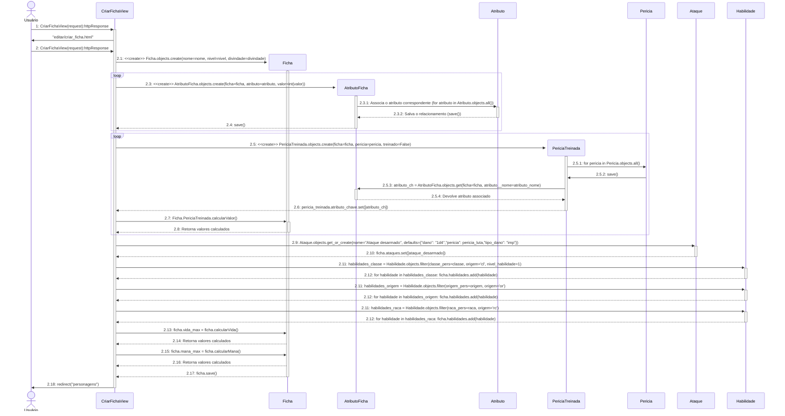
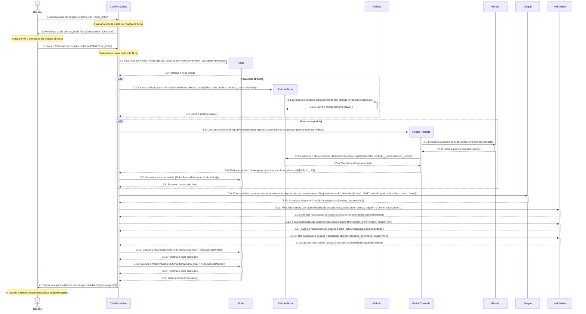
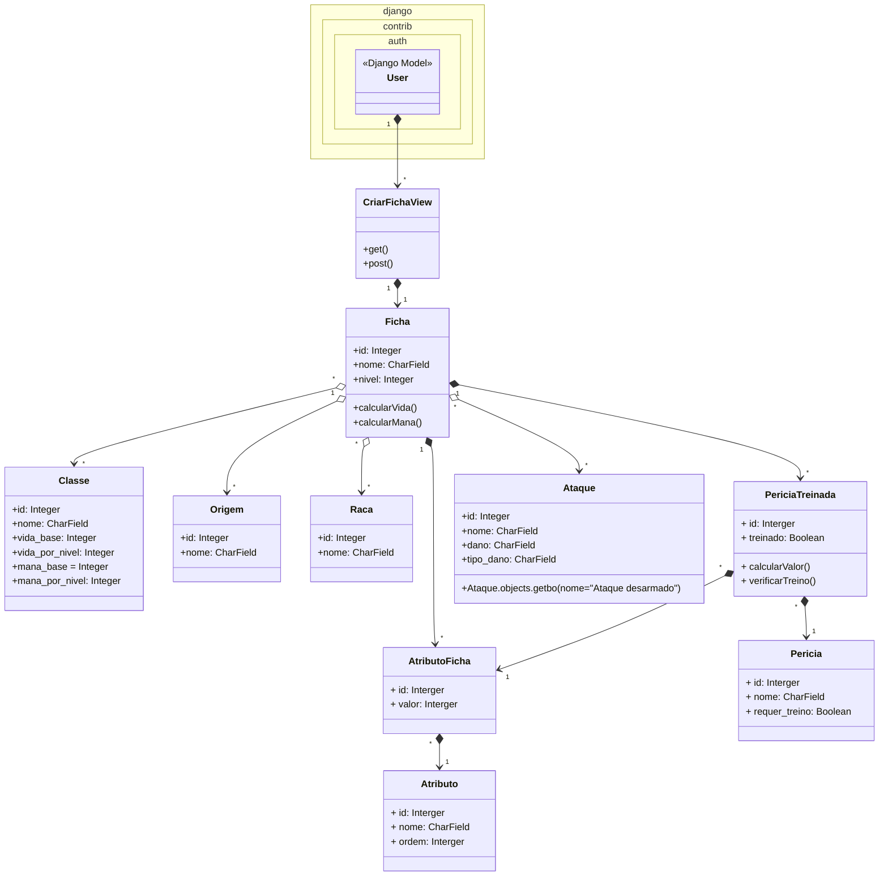

# CDU001. Criar Ficha de Personagem
- **Ator principal**: Usuário
- **Atores secundários**: ---
- **Resumo**: O usuário faz a sua ficha de personagem.
- **Pré-condição**: Estar logado
- **Pós-Condição**: A ficha é criada e salva na conta do jogador.

## Fluxo Principal
| Ações do ator | Ações do sistema |
| :-----------------: | :-----------------: | 
| 1 - Entra na tela de personagem. | 2 - Mostra a tela de  Personagem. |  
| 3 - Clica na opção de "Criar personagem". | 4 - Mostra a tela de escolha de Nome, Divindade, Raça, Classe, Origem, e Atributos. | 
| 5 - Preenche Nome e Atributos e escolhe dentre as opções oferecidas Divindade, Raça, Classe e Origem. | 6 - Mostra a tela de ficha preenchida com as pericias, vida e mana já devidamente calculadas. |

## Fluxo Alternativo I - Usuário não logado.
| Ações do ator | Ações do sistema |
| :-----------------: | :-----------------: | 
| 3.1 - Clica na opção de "Criar personagem". | 4.1 - Mostra a mensagem de erro, informando que é necessário estar logado para criar uma ficha.|
| 5.1 - Decide logar para continuar o processo de criação de ficha. | 6.1 - Redireciona para o caso de uso de logar usuário. | 

## Diagrama de Sequência

## Diagrama de Comunicação

## Diagrama de Classes de Projeto

