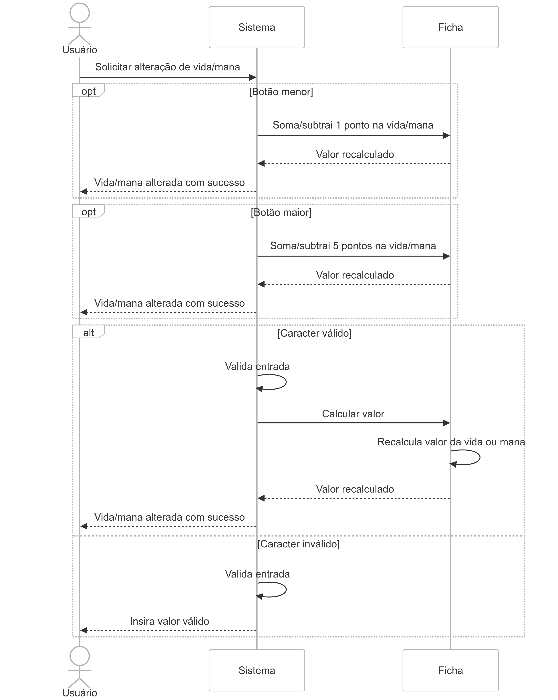
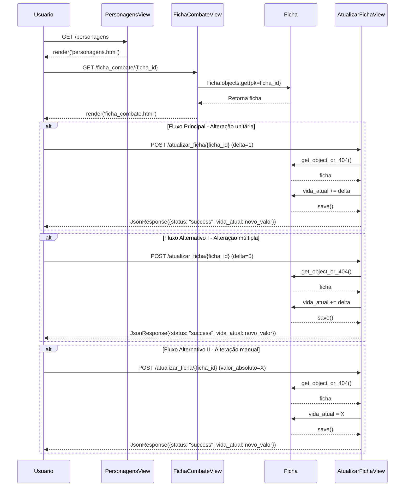
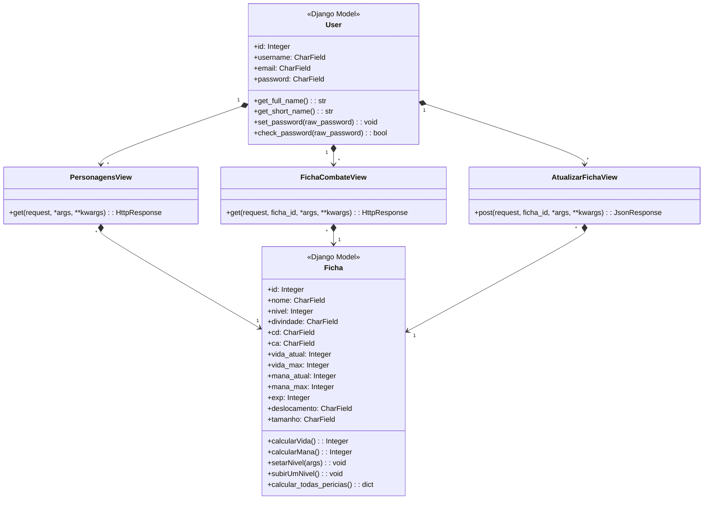

# CDU005. Alterar Mana ou Vida.

- **Ator principal**: Usuário
- **Atores secundários**: ---
- **Resumo**: O usuário usa uma ficha de personagem.
- **Pré-condição**: Estar logado; ter uma ficha já feita e editada.
- **Pós-Condição**: ---

## Fluxo Principal
| Ações do ator | Ações do sistema |
| :-----------------: | :-----------------: |
| 1 - Entra na tela de personagem. | 2 - Exibe a tela de  Personagem. |  
| 3 - Clica na opção de vizualização de ficha de personagem. | 4 - Exibe a tela de ficha já devidamente preenchida. |
| 5 - Aperta na seta menor para alterar os pontos de mana/vida do personagem. | 6 - Altera, de um em um, a quantidade de mana/vida atual. |

## Fluxo Alternativo I - Botão maior.
| Ações do ator | Ações do sistema |
| :-----------------: |:-----------------: | 
| 5.1 - Aperta na seta maior para alterar os pontos de mana/vida do personagem. | 6.1 - Altera, de cinco em cinco, a quantidade de mana/vida atual. | 

## Fluxo Alternativo II - Alterar manualmente.
| Ações do ator | Ações do sistema |
| :-----------------: |:-----------------: | 
| 5.2 - Aperta em cima do número para alterar os pontos de mana/vida do personagem, e informa a quantidade de pontos que deseja soomar ou subtrair. | 6.2 - Altera, de acordo com a quantidade informada, a quantidade de mana/vida atual. | 

## Diagrama de Comunicação

## Diagrama de Sequência

## Diagrama de Classes de Projeto

