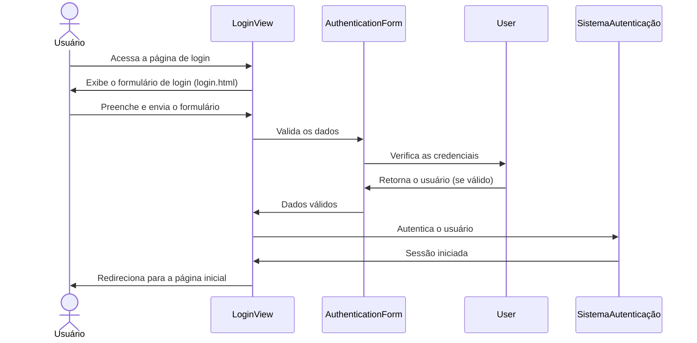
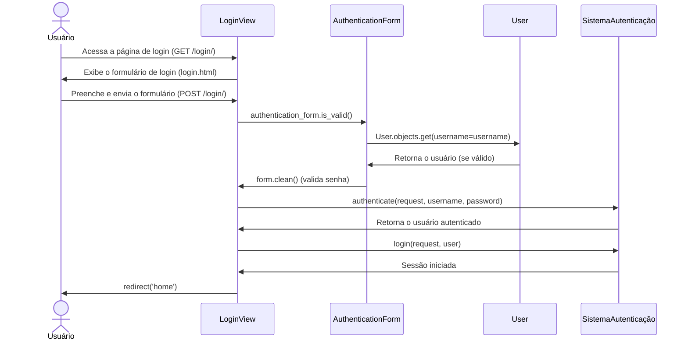
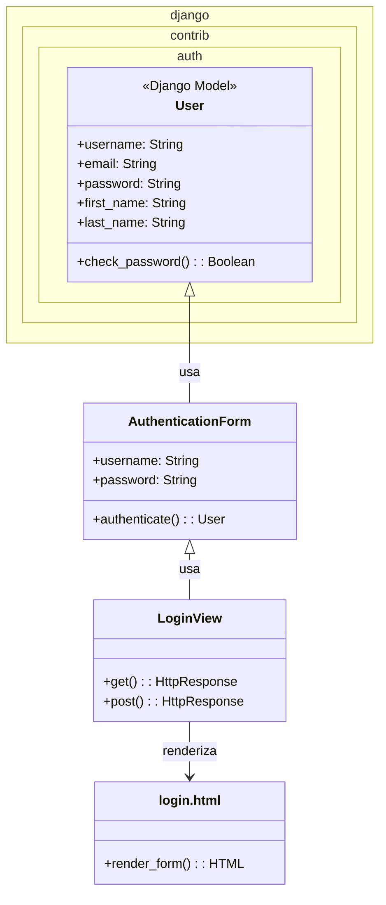

# CDU006. Logar usuário.

- **Ator principal**: Usuário
- **Atores secundários**: ---
- **Resumo**: O usuário loga em sua conta.
- **Pré-condição**: Ter uma conta.
- **Pós-Condição**: ---

## Fluxo Principal
| Ações do ator | Ações do sistema |
| :-----------------: | :-----------------: | 
| 1 - Entra na tela principal e selecionar "Entre". | 2 - Exibe a tela de Login. |  
| 3 - Preenche os dados nos campos informados. | 4 - Autentica os dados e carrega a tela de perfil do usuário. |

## Fluxo Alternativo I - Senha incorreta.
| Ações do ator | Ações do sistema |
| :-----------------: |:-----------------: |  
| 3.1 - Preenche os dados nos campos informados incorretamente. | 4.1 - Envia um aviso de senha incorreta, pedindo para que tente novamente. A ação se repete até que os dados sejam inseridos corretamente. |
| 5.1 - Insere os dados corretamente. | 6.1 - Autentica os dados e carrega a tela principal. |

## Fluxo Alternativo II - Conta não encontrada/ Usuário inválido.
| Ações do ator | Ações do sistema |
| :-----------------: |:-----------------: | 
| 3.2 - Preenche os dados nos campos informados incorretamente. | 4.2 - Envia um aviso constando um usuário não cadastrado, pedindo para que tente novamente ou que faça uma nova conta. A ação se repete até que os dados sejam inseridos corretamente ou que seja direcionado ao caso de uso de criação de conta. |
| 5.2 - Insere os dados corretamente. | 6.2 - Autentica os dados e carrega a tela principal. |

## Fluxo Alternativo III
| Ações do ator | Ações do sistema |
| :-----------------: | :-----------------: | 
| 1.3 - Entra na tela principal e selecionar "Usuário" e em seguida "Entrar". | 2.3 - Exibe a tela de Login. |  
| 3.3 - Preenche os dados nos campos informados. | 4.3 - Autentica os dados e carrega a tela de perfil do usuário. |

## Diagrama de Interação (Comunicação)

## Diagrama de Interação (Sequência)

## Diagrama de Classes de Projeto

