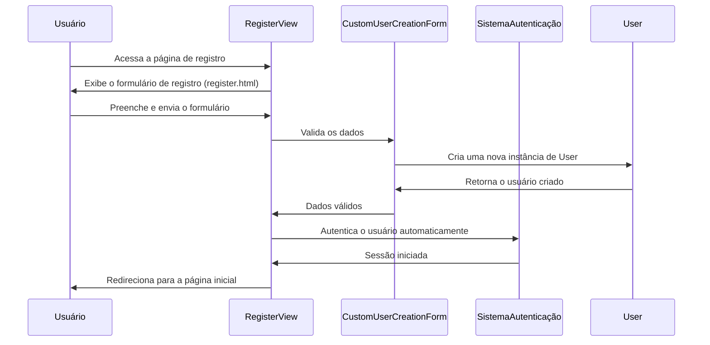
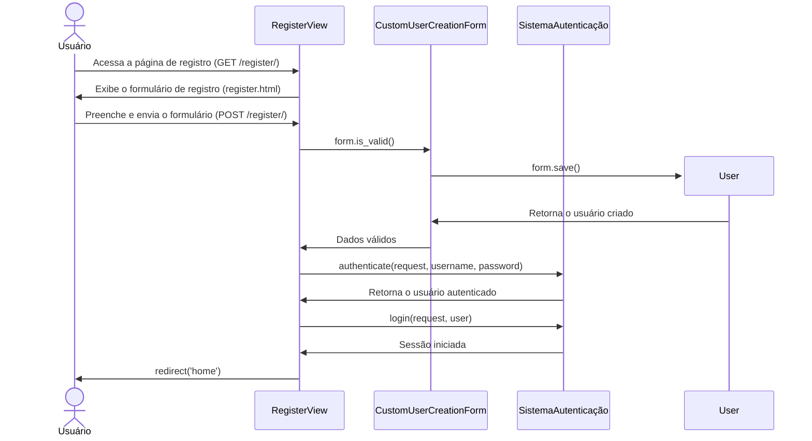
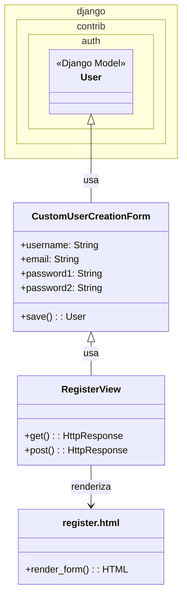

# CDU007. Criar conta.

- **Ator principal**: Usuário
- **Atores secundários**: ---
- **Resumo**: O usuário cria uma conta.
- **Pré-condição**: ---
- **Pós-Condição**: ---

## Fluxo Principal
| Ações do ator | Ações do sistema |
| :-----------------: | :-----------------: | 
| 1 - Entra na tela principal e selecionar "Registre-se". | 2 - Exibe o formulário de criação de conta. |  
| 3 - Preenche os dados nos campos informados. | 4 - Autentica os dados e carrega a tela principal. |

## Fluxo Alternativo I - Senha inválida.
| Ações do ator | Ações do sistema |
| :-----------------: |:-----------------: |   
| 3.1 - Preenche os dados nos campos informados incorretamente, com caracteres inválidos ou acima do limite permitido. | 4.1 - Envia um aviso de senha inválida, pedindo para que tente novamente. A ação se repete até que os dados sejam inseridos corretamente. |
| 5.1 - Insere os dados corretamente. | 6.1 - Autentica os dados e carrega a tela principal. |

## Fluxo Alternativo II
| Ações do ator | Ações do sistema |
| :-----------------: | :-----------------: | 
| 1.2 - Entra na tela principal e selecionar "Usuário" e em seguida "Entrar". | 2.2 - Exibe a tela de Login. |  
| 3.2 - Pressiona em Registrar. | 4.2 - Exibe o formulário de criação de conta. |  
| 5.2 - Preenche os dados nos campos informados. | 6.2 - Autentica os dados e carrega a tela de perfil do usuário. |

## Diagrama de Comunicação

## Diagrama de Sequência

## Diagrama de Classes de Projeto

