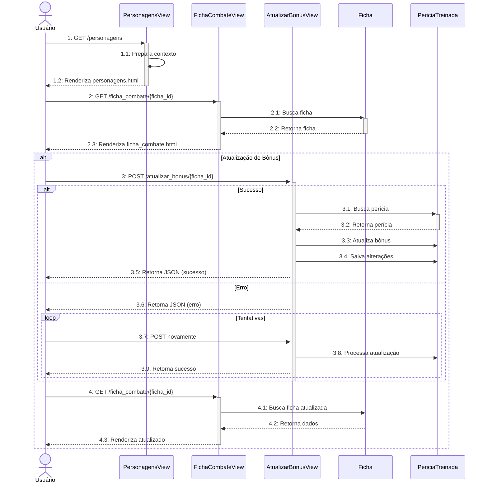
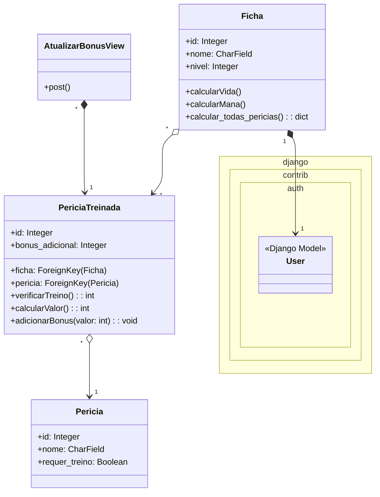

# CDU008. Adicionar bônus de perícia.

- **Ator principal**: Usuário
- **Atores secundários**: ---
- **Resumo**: O usuário adiciona um bônus a uma perícia.
- **Pré-condição**: ---
- **Pós-Condição**: ---

## Fluxo Principal
| Ações do ator | Ações do sistema |
| :-----------------: | :-----------------: | 
| 1 - Entra na tela de personagem. | 2 - Exibe a tela de Personagem. |  
| 3 - Clica na opção de vizualização de ficha de personagem. | 4 - Exibe a tela de ficha já devidamente preenchida. |
| 5 - Escolhe, dentre as opções de períciais, uma pericia para adicionar o bônus, digita o valor desejado. | 6 - Atualiza o valor da perícia automaticamente. |

## Fluxo Alternativo I - Caractere Inválido.
| Ações do ator | Ações do sistema |
| :-----------------: |:-----------------: |   
| 5.1 - Preenche os dados nos campos informados incorretamente, com caracteres inválidos. | 6.1 - Envia um aviso de caractere inválido, pedindo para que tente novamente. A ação se repete até que os dados sejam inseridos corretamente. |
| 7.1 - Insere os dados corretamente. | 8.1 - Atualiza o valor da perícia automaticamente. |

## Fluxo Alternativo II - Botões.
| Ações do ator | Ações do sistema |
| :-----------------: |:-----------------: |   
| 5.2 - Clica no botãozinho no campo indicado. | 6.2 - Atualiza o valor da perícia automaticamente de um em um. |

## Diagrama de Interação (Sequência)

## Diagrama de Classes de Projeto

