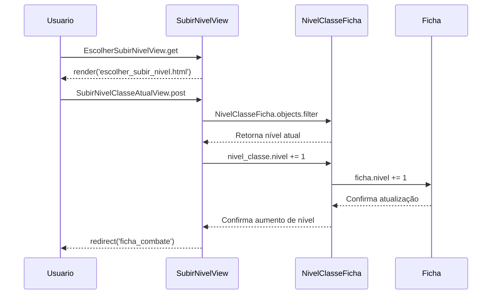
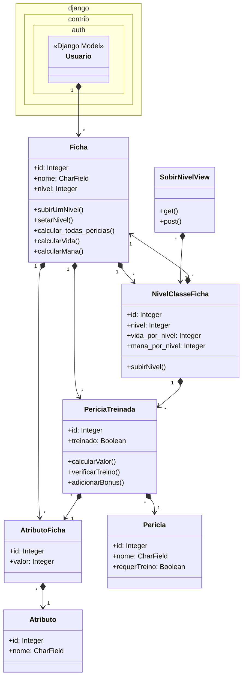

# CDU010. Subir de Nível.

- **Ator principal**: Usuário
- **Atores secundários**: ---
- **Resumo**: O usuário sobe de nível.
- **Pré-condição**: ---
- **Pós-Condição**: ---

## Fluxo Principal
| Ações do ator | Ações do sistema |
| :-----------------: | :-----------------: | 
| 1 - Entra na tela de personagem. | 2 - Exibe a tela de Personagem. |  
| 3 - Clica na opção de vizualização de ficha de personagem. | 4 - Exibe a tela de ficha já devidamente preenchida. |
| 5 - Clica na caixa de edição do perfil de personagem. | 6 - Mostra a tela de edição dos dados de personagem. |
| 7 - Clica na caixinha numérica para subir de nível e confirma a edição. | 8 - Salva o novo nível e exibe a ficha com os novos cálculos de perícia. |

## Fluxo Alternativo I - Caractere Inválido.
| Ações do ator | Ações do sistema |
| :-----------------: |:-----------------: |   
| 7.1 - Clica para editar o número manualmente e preenche os dados incorretamente, com caracteres inválidos. | 8.1 - Envia um aviso de caractere inválido, pedindo para que tente novamente. A ação se repete até que os dados sejam inseridos corretamente ou que a ação seja cancelada. |
| 9.1 - Insere os dados corretamente. | 10.1 - Autentica os dados e volta para a página de vizualização de ficha com o valor do atributo atualizada. |

## Diagrama de Interação (Sequência ou Comunicação)

## Diagrama de Classes de Projeto

