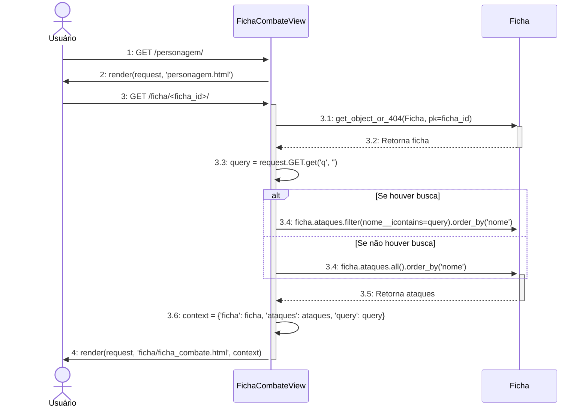
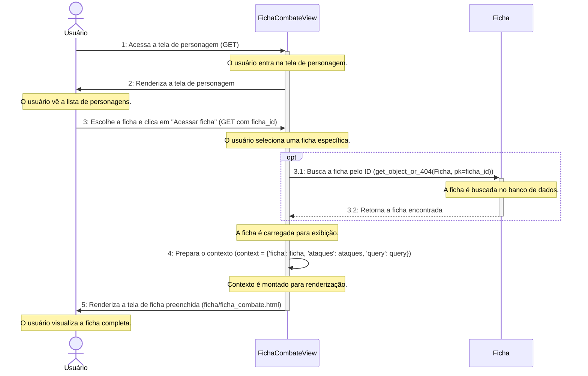

# CDU014. Visualizar Ficha de Personagem
- **Ator principal**: Usuário
- **Atores secundários**: ---
- **Resumo**: O usuário visualiza a sua ficha de personagem.
- **Pré-condição**: Estar logado
- **Pós-Condição**: A ficha é criada e salva na conta do jogador.

## Fluxo Principal
| Ações do ator | Ações do sistema |
| :-----------------: | :-----------------: | 
| 1 - Entra na tela de personagem. | 2 - Mostra a tela de  Personagem. |  
| 3 - Escolhe a ficha e clica na opção de "Acessar ficha". | 4 - Mostra a tela de ficha ja preenchida | 

## Diagrama de Sequência 



## Diagrama de Comunicação




## Diagrama de Classes de Projeto

```mermaid
classDiagram
    class FichaCombateView {
        +get()
        +post()
    }

    class FichaHabilidadesView{
        +get()
        +post()
    }

    namespace django.contrib.auth{
        class User {
            <<Django Model>>
        }
    }

    class Ficha {
        +id: Integer
        +nome: CharField
        +nivel: Integer
        +calcularVida()
        +calcularMana()
    }

    class Ataque {
        +id: Integer
        +nome: CharField
        +dano: CharField
        +tipo_dano: CharField
        +Ataque.objects.get(nome="Ataque desarmado")
    }

    class Classe {
        +id: Integer
        +nome: CharField
        +vida_base: Integer
        +vida_por_nivel: Integer
        +mana_base =  Integer
        +mana_por_nivel: Integer
    }

    class Origem {
        +id: Integer
        +nome: CharField
    }

    class Raca {
        +id: Integer
        +nome: CharField
    }

    class Atributo{
        + id: Interger
        + nome: CharField
        + ordem: Interger
    }

    class AtributoFicha{
        + id: Interger
        + valor: Interger

    }

    class Pericia{
        + id: Interger
        + nome: CharField
        + requer_treino: Boolean
    }

    class PericiaTreinada{
        + id: Interger
        + treinado: Boolean
        + calcularValor()
        + verificarTreino()
    }

        class Habilidade {
        +nome = CharField
        +descricao = TextField
        +origem = CharField
        +ativo = Boolean
        +nivel_habilidade: Interger
    }

    User "1" *--> "*"  FichaCombateView 
    FichaCombateView "*" * --> "1" Ficha 
    User "1" *--> "*"  FichaHabilidadesView
    FichaHabilidadesView"*" * --> "1" Ficha 
    Ficha "*" o--> "*" Classe 
    Ficha "1" o--> "*" Origem 
    Ficha "*" o--> "*" Raca 
    Origem "*"o-->"*" Habilidade
    Classe "*"o-->"*" Habilidade
    Raca "*"o-->"*" Habilidade
    Ficha "*"o-->"*" Habilidade
    Ficha "*" o--> "*" Ataque
    Ficha "1" *--> "*" AtributoFicha
    AtributoFicha "*" *--> "1" Atributo
    Ficha "1" *--> "*" PericiaTreinada
    PericiaTreinada "*" *--> "1" Pericia
    PericiaTreinada "*" *--> "1" AtributoFicha
  ```

## Diagrama de Atividade
```mermaid
flowchart TD
    A[Início] --> B{Usuário está logado?}
    B -- Não --> Z[Fim - Redireciona para login]
    B -- Sim --> C[Usuário acessa tela de personagem]
    C --> D[Mostrar lista de personagens]
    D --> E[Usuário escolhe uma ficha]
    E --> F[Usuário clica em Acessar ficha]
    F --> G[Buscar ficha no banco de dados]
    G --> H{Ficha encontrada?}
    H -- Não --> Y[Exibir mensagem de erro]
    H -- Sim --> J[Exibir ficha preenchida]
    J --> L[Fim]

```
