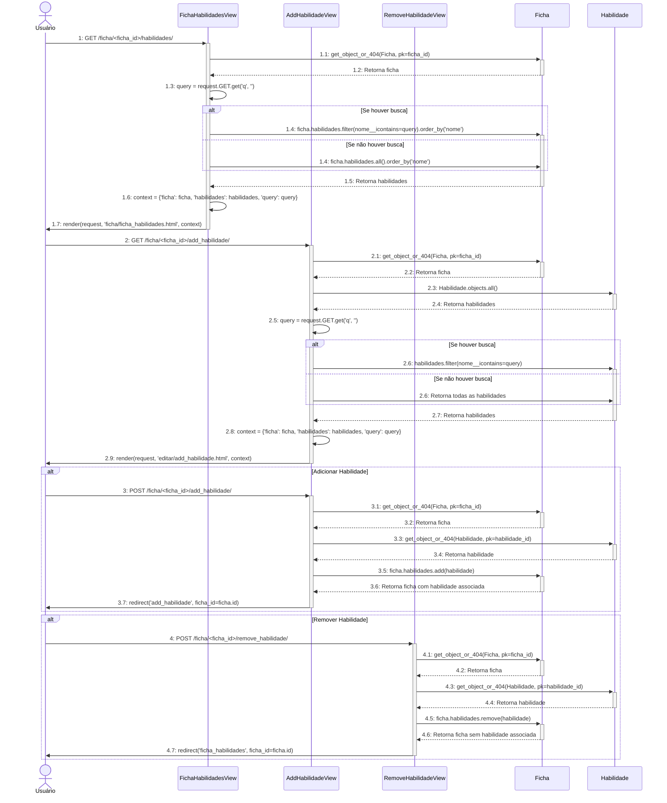
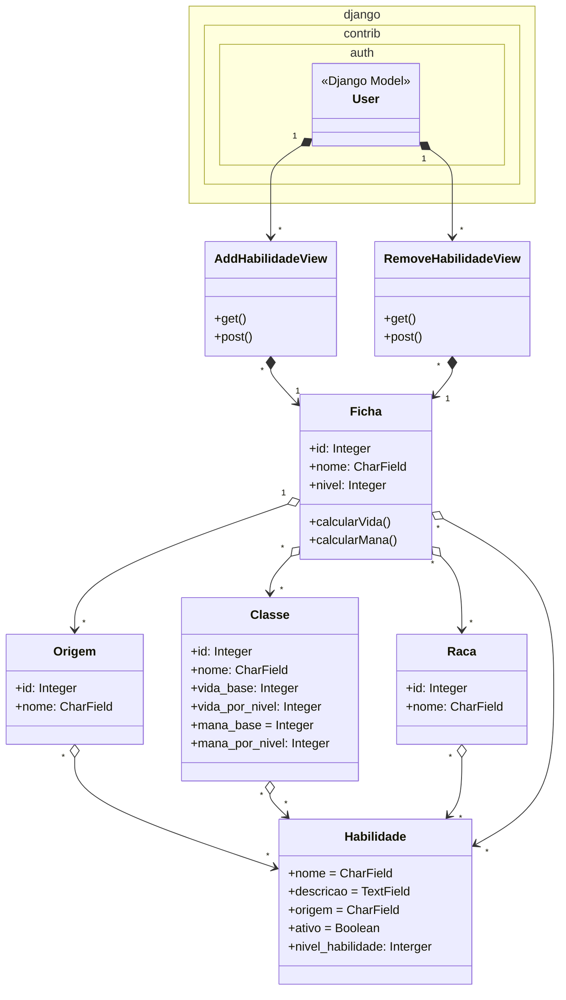

# CDU015. Gerenciar Habilidades de Personagem
- **Ator principal**: Usuário
- **Atores secundários**: ---
- **Resumo**: O usuário gerencia suas habilidades de personagem.
- **Pré-condição**: Estar logado
- **Pós-Condição**: A habilidade é adicionada ou removida da ficha do personagem.

## Fluxo Principal
| Ações do ator | Ações do sistema |
| :-----------------: | :-----------------: | 
| 1 - Clica no botão de editar habilidade. | 2 - Mostra a tela de adicionar habilidade. |  
| 3 - Dentre as opções, escolhe a habilidade que deseja e clica em adicionar ou remover as já escolhidas, e clica em confirmar. | 4 - Adiciona ou remove a habilidade da ficha e retorna à tela de visualização da ficha.|  

## Diagrama de Sequência

## Diagrama de Comunicação
sequenceDiagram
    actor Usuário
    participant FichaHabilidadesView
    participant AddHabilidadeView
    participant RemoveHabilidadeView
    participant Ficha
    participant Habilidade

    Usuário->>+FichaHabilidadesView: 5: Clica em "Gerenciar Habilidades" (GET /ficha/<ficha_id>/habilidades/)
    Note over FichaHabilidadesView: O usuário solicita a tela de gerenciamento de habilidades.
    FichaHabilidadesView->>+Ficha: 5.1: Busca a ficha pelo ID (get_object_or_404(Ficha, pk=ficha_id))
    Note over Ficha: A ficha é buscada no banco de dados.
    Ficha-->>-FichaHabilidadesView: 5.2: Retorna a ficha encontrada
    Note over FichaHabilidadesView: A ficha é carregada para exibição.

    FichaHabilidadesView->>FichaHabilidadesView: 5.3: Verifica se há parâmetro de busca (query = request.GET.get('q', ''))
    Note over FichaHabilidadesView: Verifica se o usuário fez uma busca.
    alt Se houver busca
        FichaHabilidadesView->>+Ficha: 5.4: Filtra as habilidades pelo nome (ficha.habilidades.filter(nome__icontains=query).order_by('nome'))
        Note over Ficha: Habilidades são filtradas pelo nome.
    else Se não houver busca
        FichaHabilidadesView->>Ficha: 5.4: Retorna todas as habilidades (ficha.habilidades.all().order_by('nome'))
        Note over Ficha: Todas as habilidades são carregadas.
    end
    Ficha-->>-FichaHabilidadesView: 5.5: Retorna as habilidades filtradas ou todas
    Note over FichaHabilidadesView: Habilidades são preparadas para exibição.

    FichaHabilidadesView->>FichaHabilidadesView: 5.6: Prepara o contexto (context = {'ficha': ficha, 'habilidades': habilidades, 'query': query})
    Note over FichaHabilidadesView: Contexto é montado para renderização.
    FichaHabilidadesView->>-Usuário: 6: Renderiza a tela de habilidades da ficha (ficha/ficha_habilidades.html)
    Note over Usuário: O usuário visualiza as habilidades da ficha.

    Usuário->>+AddHabilidadeView: 7: Clica em "Adicionar Habilidade" (GET /ficha/<ficha_id>/add_habilidade/)
    Note over AddHabilidadeView: O usuário solicita a tela de adição de habilidades.
    AddHabilidadeView->>+Ficha: 7.1: Busca a ficha pelo ID (get_object_or_404(Ficha, pk=ficha_id))
    Note over Ficha: A ficha é buscada no banco de dados.
    Ficha-->>-AddHabilidadeView: 7.2: Retorna a ficha encontrada
    Note over AddHabilidadeView: A ficha é carregada para exibição.

    AddHabilidadeView->>+Habilidade: 7.3: Busca todas as habilidades (Habilidade.objects.all())
    Note over Habilidade: Todas as habilidades são carregadas.
    Habilidade-->>-AddHabilidadeView: 7.4: Retorna a lista de habilidades
    Note over AddHabilidadeView: Habilidades são preparadas para exibição.

    AddHabilidadeView->>AddHabilidadeView: 7.5: Verifica se há parâmetro de busca (query = request.GET.get('q', ''))
    Note over AddHabilidadeView: Verifica se o usuário fez uma busca.
    alt Se houver busca
        AddHabilidadeView->>+Habilidade: 7.6: Filtra as habilidades pelo nome (habilidades.filter(nome__icontains=query))
        Note over Habilidade: Habilidades são filtradas pelo nome.
    else Se não houver busca
        AddHabilidadeView->>Habilidade: 7.6: Retorna todas as habilidades
        Note over Habilidade: Todas as habilidades são carregadas.
    end
    Habilidade-->>-AddHabilidadeView: 7.7: Retorna as habilidades filtradas ou todas
    Note over AddHabilidadeView: Habilidades são preparadas para exibição.

    AddHabilidadeView->>AddHabilidadeView: 7.8: Prepara o contexto (context = {'ficha': ficha, 'habilidades': habilidades, 'query': query})
    Note over AddHabilidadeView: Contexto é montado para renderização.
    AddHabilidadeView->>-Usuário: 8: Renderiza a tela de adição de habilidades (editar/add_habilidade.html)
    Note over Usuário: O usuário vê a lista de habilidades disponíveis.

    alt Adicionar Habilidade
        Usuário->>+AddHabilidadeView: 9: Escolhe uma habilidade e clica em "Adicionar" (POST /ficha/<ficha_id>/add_habilidade/)
        Note over AddHabilidadeView: O usuário envia o ID da habilidade a ser adicionada.
        AddHabilidadeView->>+Habilidade: 9.1: Busca a habilidade pelo ID (get_object_or_404(Habilidade, pk=habilidade_id))
        Note over Habilidade: A habilidade é buscada no banco de dados.
        Habilidade-->>-AddHabilidadeView: 9.2: Retorna a habilidade encontrada
        Note over AddHabilidadeView: A habilidade é carregada para associação.
        AddHabilidadeView->>+Ficha: 9.3: Adiciona a habilidade à ficha (ficha.habilidades.add(habilidade))
        Note over Ficha: A habilidade é associada à ficha.
        Ficha-->>-AddHabilidadeView: 9.4: Retorna a ficha com a habilidade associada
        Note over AddHabilidadeView: A habilidade é adicionada com sucesso.
        AddHabilidadeView->>-Usuário: 10: Redireciona para a tela de adição de habilidades (redirect('add_habilidade', ficha_id=ficha.id))
        Note over Usuário: O usuário vê a habilidade adicionada.
    end

    alt Remover Habilidade
        Usuário->>+RemoveHabilidadeView: 11: Escolhe uma habilidade e clica em "Remover" (POST /ficha/<ficha_id>/remove_habilidade/)
        Note over RemoveHabilidadeView: O usuário envia o ID da habilidade a ser removida.
        RemoveHabilidadeView->>+Habilidade: 11.1: Busca a habilidade pelo ID (get_object_or_404(Habilidade, pk=habilidade_id))
        Note over Habilidade: A habilidade é buscada no banco de dados.
        Habilidade-->>-RemoveHabilidadeView: 11.2: Retorna a habilidade encontrada
        Note over RemoveHabilidadeView: A habilidade é carregada para remoção.
        RemoveHabilidadeView->>+Ficha: 11.3: Remove a habilidade da ficha (ficha.habilidades.remove(habilidade))
        Note over Ficha: A habilidade é removida da ficha.
        Ficha-->>-RemoveHabilidadeView: 11.4: Retorna a ficha sem a habilidade associada
        Note over RemoveHabilidadeView: A habilidade é removida com sucesso.
        RemoveHabilidadeView->>-Usuário: 12: Redireciona para a tela de habilidades da ficha (redirect('ficha_habilidades', ficha_id=ficha.id))
        Note over Usuário: O usuário vê a habilidade removida.
    end

## Diagrama de Classes de Projeto

