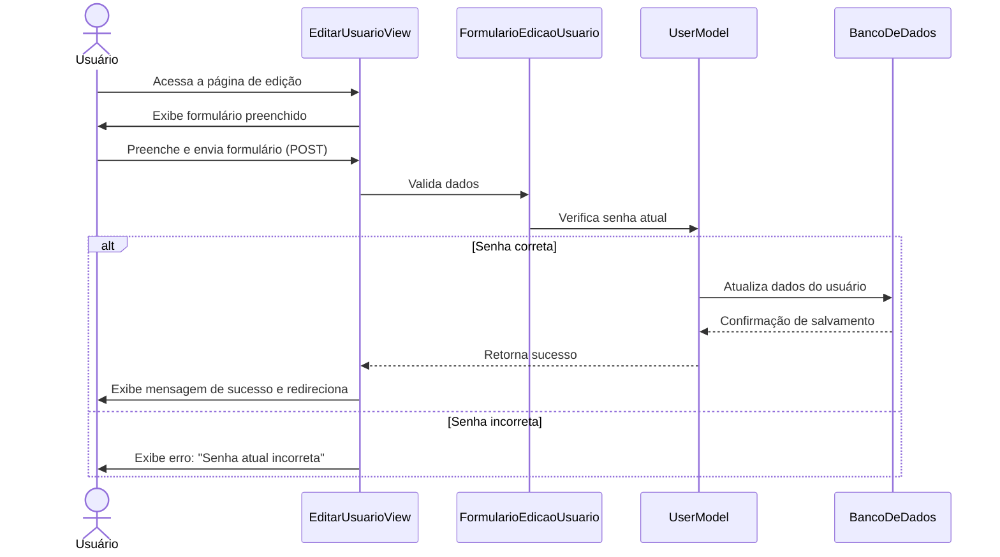
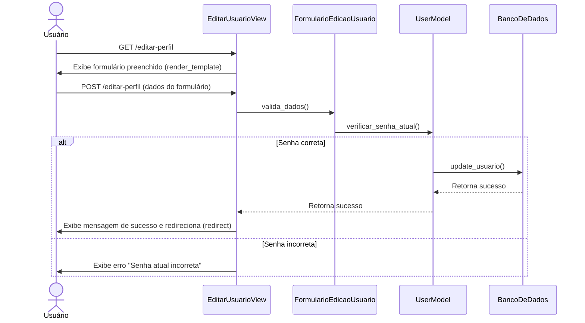
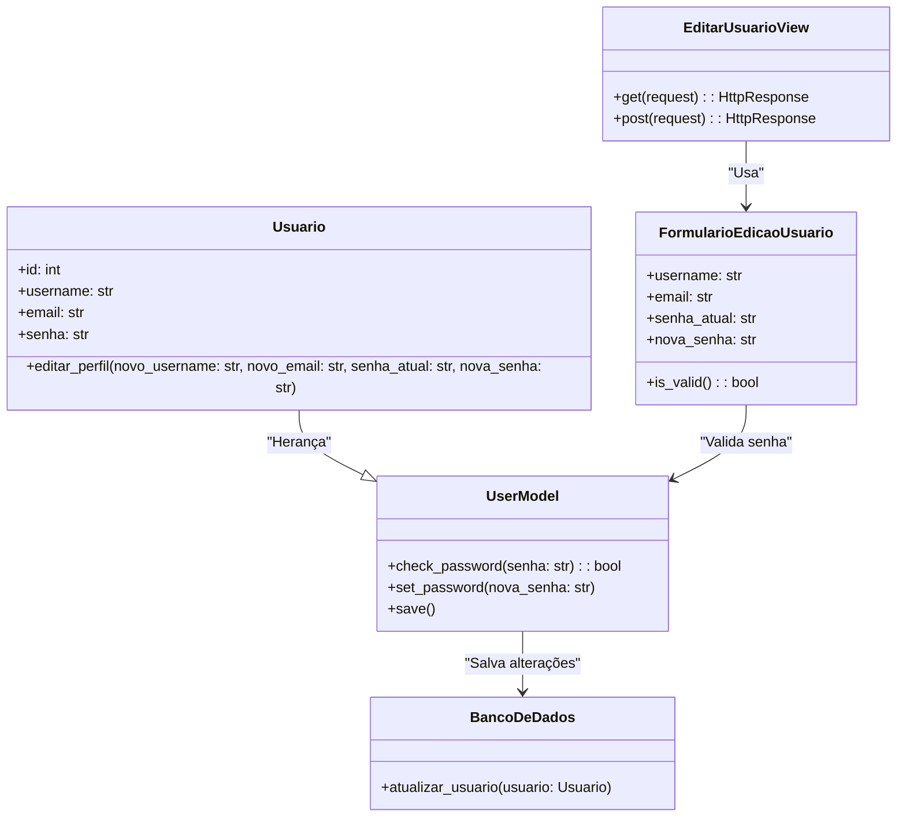

# CDU016. Editar conta de usuário

- **Ator principal**: Usuário  
- **Atores secundários**: ---  
- **Resumo**: O usuário edita as informações da sua conta, como nome de usuário, email e senha.  
- **Pré-condição**: O usuário deve estar logado no sistema.  
- **Pós-condição**: As informações da conta são atualizadas.  

## Fluxo Principal  
| **Ações do Ator** | **Ações do Sistema** |  
|------------------|------------------|  
| 1 - O usuário acessa a página de perfil e seleciona "Editar Conta". | 2 - Exibe a tela de edição de conta. |  
| 3 - O usuário preenche os novos dados e confirma. | 4 - Valida os dados e salva as alterações. |  
| 5 - O sistema exibe uma mensagem de sucesso. | 6 - Redireciona para a tela de perfil com os dados atualizados. |  

## Fluxo Alternativo I - Senha incorreta  
| **Ações do Ator** | **Ações do Sistema** |  
|------------------|------------------|  
| 3.1 - O usuário insere uma senha atual incorreta. | 4.1 - O sistema exibe um erro informando que a senha está incorreta. |  
| 3.2 - O usuário tenta novamente. | 4.2 - Se a senha for correta, continua para o passo 5 do fluxo principal. |  

## Fluxo Alternativo II - Email ou Nome de Usuário já em uso  
| **Ações do Ator** | **Ações do Sistema** |  
|------------------|------------------|  
| 3.3 - O usuário insere um email ou nome de usuário já registrado no sistema. | 4.3 - O sistema exibe uma mensagem informando que o email/nome de usuário já está em uso. |  
| 3.4 - O usuário tenta novamente com novos dados. | 4.4 - Se os dados forem válidos, continua para o passo 5 do fluxo principal. |  

## Diagrama de Interação (Comunicação)

## Diagrama de Interação (Sequência)

## Diagrama de Classes de Projeto

