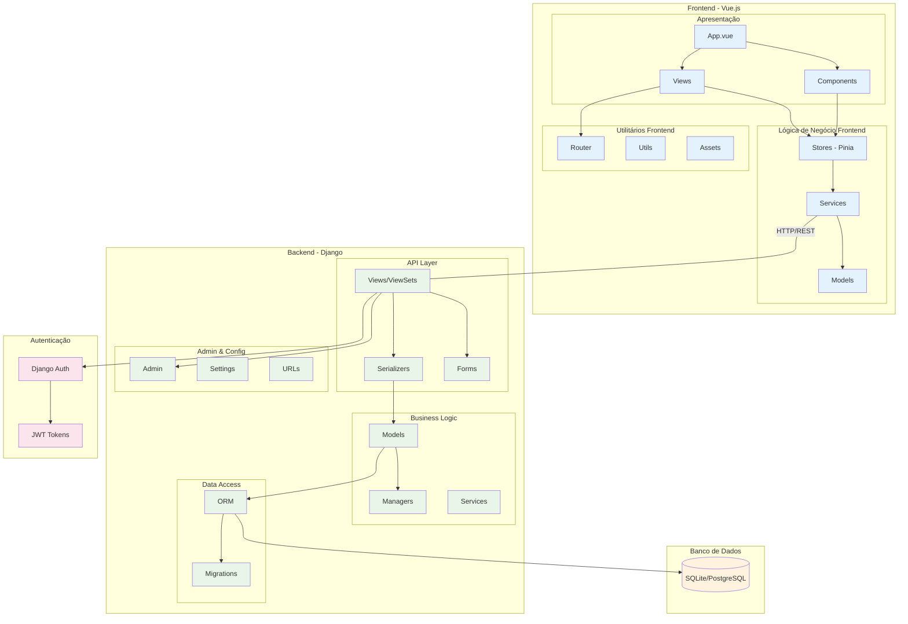
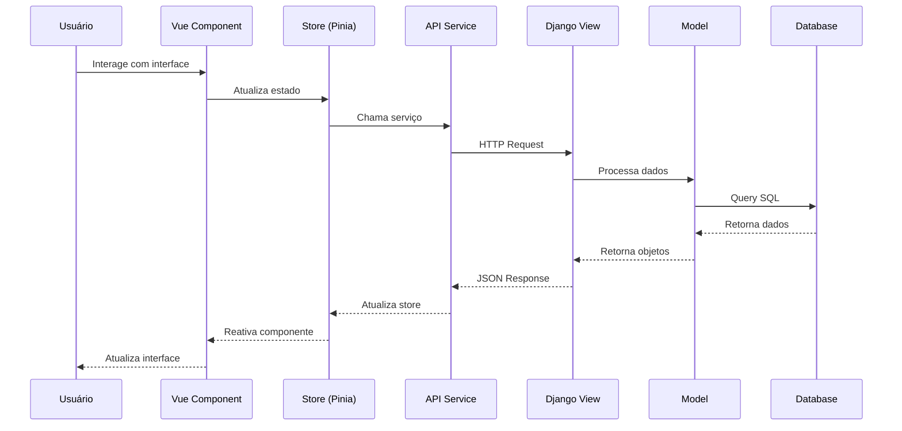

# Diagrama de Componentes

## 1. Visão Geral da Arquitetura



## 2. Detalhamento dos Componentes

### 2.1 Frontend (Vue.js + TypeScript)

#### **Camada de Apresentação**
- **App.vue**: Componente raiz da aplicação
- **Views**: Páginas principais da aplicação
  - `HomeView`: Página inicial
  - `LoginView`: Página de autenticação
  - `FichaView`: Visualização/edição de fichas
  - `MesaView`: Interface de mesas de jogo
- **Components**: Componentes reutilizáveis
  - `FichaComponent`: Componente de ficha de personagem
  - `AtributoComponent`: Exibição de atributos
  - `PericiasComponent`: Gerenciamento de perícias
  - `NavbarComponent`: Barra de navegação

#### **Camada de Lógica**
- **Stores (Pinia)**: Gerenciamento de estado global
  - `authStore`: Estado de autenticação
  - `fichaStore`: Estado das fichas
  - `mesaStore`: Estado das mesas
- **Services**: Comunicação com backend
  - `apiService`: Cliente HTTP base
  - `authService`: Serviços de autenticação
  - `fichaService`: CRUD de fichas
  - `mesaService`: Operações de mesa
- **Models**: Interfaces TypeScript
  - `User`: Modelo de usuário
  - `Ficha`: Modelo de ficha
  - `Atributo`: Modelo de atributo

#### **Utilitários**
- **Router**: Roteamento da aplicação
- **Utils**: Funções auxiliares
- **Assets**: Recursos estáticos

### 2.2 Backend (Django + DRF)

#### **Camada de API**
- **Views/ViewSets**: Endpoints da API REST
  - `FichaViewSet`: CRUD de fichas
  - `AtributoViewSet`: Gestão de atributos
  - `PericiasViewSet`: Gestão de perícias
  - `MesaViewSet`: Operações de mesa
- **Serializers**: Serialização JSON
  - `FichaSerializer`: Serialização de fichas
  - `UserSerializer`: Serialização de usuários
- **Forms**: Validação de dados

#### **Camada de Negócio**
- **Models**: Entidades do domínio
  - `Ficha`: Ficha de personagem
  - `Atributo`: Atributos do sistema
  - `Pericia`: Perícias disponíveis
  - `Classe`: Classes de personagem
  - `Mesa`: Mesas de jogo
- **Managers**: Lógica de consulta customizada
- **Services**: Regras de negócio complexas

#### **Camada de Dados**
- **ORM**: Object-Relational Mapping do Django
- **Migrations**: Controle de versão do schema

#### **Configuração**
- **Admin**: Interface administrativa
- **Settings**: Configurações da aplicação
- **URLs**: Roteamento do backend

### 2.3 Autenticação & Segurança
- **Django Auth**: Sistema de autenticação nativo
- **JWT Tokens**: Tokens para autenticação stateless

## 3. Fluxo de Dados



## 4. Padrões Arquiteturais Utilizados

### **Frontend**
- **MVVM (Model-View-ViewModel)**: Vue.js implementa este padrão
- **Store Pattern**: Pinia para gerenciamento de estado
- **Service Layer**: Separação da lógica de API
- **Component Pattern**: Reutilização de componentes

### **Backend**
- **MVC (Model-View-Controller)**: Django segue este padrão
- **Repository Pattern**: Models como repositórios
- **Serializer Pattern**: DRF serializers
- **Middleware Pattern**: Django middleware

## 5. Tecnologias e Dependências

### **Frontend**
- Vue.js 3 + Composition API
- TypeScript
- Pinia (Estado)
- Vue Router (Roteamento)
- Axios (HTTP)
- Vite (Build)

### **Backend**
- Django 4.x
- Django REST Framework
- SQLite (dev) / PostgreSQL (prod)
- Django CORS Headers
- Python 3.x

## 6. Interfaces entre Componentes

### **API Endpoints**
```
GET/POST   /api/fichas/         - Lista/Cria fichas
GET/PUT    /api/fichas/{id}/    - Detalhe/Atualiza ficha
GET        /api/atributos/      - Lista atributos
GET        /api/pericias/       - Lista perícias
GET/POST   /api/mesas/          - Lista/Cria mesas
POST       /api/auth/login/     - Autenticação
POST       /api/auth/register/  - Registro
```

### **Eventos de Estado (Frontend)**
- `fichaCreated`: Nova ficha criada
- `fichaUpdated`: Ficha atualizada
- `userLoggedIn`: Usuário autenticado
- `mesaJoined`: Usuário entrou na mesa

## 7. Considerações de Escalabilidade

- **Componentização**: Facilita manutenção e reuso
- **Separação de responsabilidades**: Cada camada tem função específica
- **API RESTful**: Permite integração com outras aplicações
- **State Management**: Gerenciamento eficiente do estado da aplicação
- **Modularização**: Código organizado em módulos independentes
