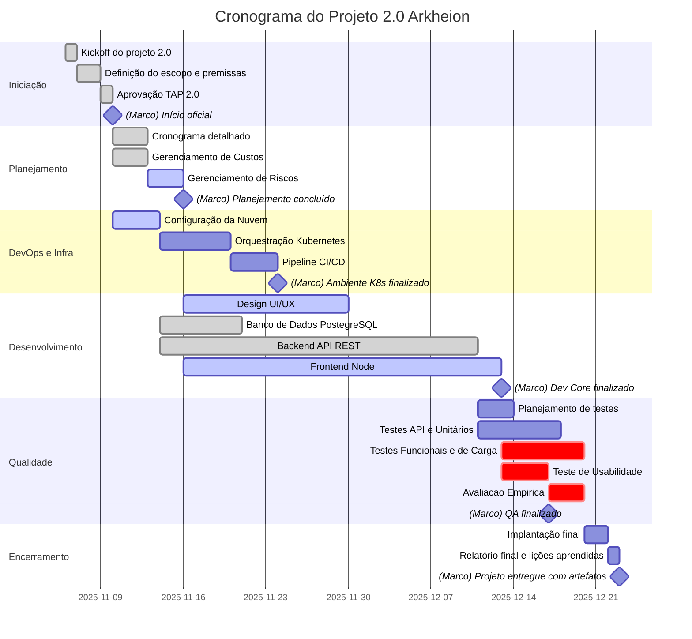

<!--  Converter as atividades em horas e ver como fica no gráfico de Gantt
      Usar o MS Project para o gráfico se o Mermaid não der certo -->
<!-- Analisar as sequências de atividades e dependências -->

