# Estrutura Analítica do Projeto - Fase 2

```mermaid

graph TD

A0[Arkheion Fase 2: Automacao, Qualidade e Validacao empirica] --> A
A0 --> B
A0 --> C
A0 --> D
A0 --> E
A0 --> F
A0 --> G

A[1 - Gerenciamento do Projeto]
A --> A1[Iniciacao e Planejamento]
A1 --> A1a[Elaboracao do TAP 2.0]
A1a --> A1b[Registro das Partes Interessadas]
A1b --> A1c[Definicao de Papeis e Responsabilidades]
A1c --> A1d[Elaboracao da EAP e Dicionario]

A --> A2[Planejamento Detalhado]
A2 --> A2a[Cronograma Gantt/PERT]
A2a --> A2b[Matriz de Riscos]
A2b --> A2c[Planilha Orcamentaria]
A2c --> A2d[Plano de Comunicacao]

A --> A3[Monitoramento e Controle]
A3 --> A3a[Acompanhamento de Tarefas e Marcos]
A3a --> A3b[Reunioes de Status]
A3b --> A3c[Controle de Custos da Nuvem]
A3c --> A3d[Gestao de Mudancas]

B[2 - Finalizacao da Implantacao em Nuvem]
B --> B1[Containerizacao Completa]
B1 --> B1a[Dockerizacao do Backend]
B1a --> B1b[Dockerizacao do Frontend]
B1b --> B1c[Dockerizacao do Banco de Dados]
B1c --> B1d[Docker Compose para Ambiente Local]

B --> B2[Deploy em Azure/AWS]
B2 --> B2a[Configuracao de Container Registry]
B2a --> B2b[Deploy de Backend em Producao]
B2b --> B2c[Deploy de Frontend em Producao]
B2c --> B2d[Configuracao de Banco de Dados Gerenciado]
B2d --> B2e[Configuracao de Rede e Seguranca]

B --> B3[Validacao da Implantacao]
B3 --> B3a[Testes de Conectividade entre Servicos]
B3a --> B3b[Testes de Comunicacao Backend-Frontend]
B3b --> B3c[Verificacao de Persistencia de Dados]
B3c --> B3d[Aprovacao da Implantacao IaaS]

C[3 - Infraestrutura DevOps e Kubernetes]
C --> C1[Configuracao do Cluster Kubernetes]
C1 --> C1a[Criacao do Cluster AKS/EKS]
C1a --> C1b[Configuracao de Nodes e Recursos]
C1b --> C1c[Configuracao de Namespaces]
C1c --> C1d[Configuracao de RBAC e Permissoes]

C --> C2[Orquestracao de Containers]
C2 --> C2a[Criacao de Deployments]
C2a --> C2b[Configuracao de Services]
C2b --> C2c[Configuracao de Ingress Controller]
C2c --> C2d[Configuracao de ConfigMaps e Secrets]
C2d --> C2e[Configuracao de Persistent Volumes]

C --> C3[Monitoramento e Observabilidade]
C3 --> C3a[Configuracao de Logs Centralizados]
C3a --> C3b[Dashboard de Monitoramento]

D[4 - Pipeline CI/CD]
D --> D1[Configuracao do Pipeline]
D1 --> D1a[Escolha da Plataforma CI/CD]
D1a --> D1b[Configuracao do Repositorio]
D1b --> D1c[Definicao de Stages do Pipeline]
D1c --> D1d[Configuracao de Variaveis e Secrets]

D --> D2[Automacao de Build]
D2 --> D2a[Build Automatizado do Backend]
D2a --> D2b[Build Automatizado do Frontend]
D2b --> D2c[Geracao de Imagens Docker]
D2c --> D2d[Push para Container Registry]

D --> D3[Automacao de Deploy]
D3 --> D3a[Deploy Automatico no Cluster Kubernetes]
D3a --> D3b[Estrategia de Rolling Update]
D3b --> D3c[Verificacao de Health Checks]
D3c --> D3d[Rollback Automatico em Caso de Falha]

D --> D4[Integracao de Testes no Pipeline]
D4 --> D4a[Execucao de Testes Unitarios]
D4a --> D4b[Execucao de Testes de Integracao]

E[5 - Testes Abrangentes]
E --> E1[Planejamento dos Testes]
E1 --> E1a[Identificacao de Modulos Criticos]
E1a --> E1b[Definicao de Estrategia de Testes]
E1b --> E1c[Selecao de Ferramentas de Teste]
E1c --> E1d[Preparacao de Ambientes de Teste]

E --> E2[Testes de API]
E2 --> E2a[Projeto de Casos de Teste de API]
E2a --> E2b[Configuracao de Ferramentas Postman/Insomnia]
E2b --> E2c[Execucao de Testes de Endpoints]
E2c --> E2d[Validacao de Respostas e Status Codes]
E2d --> E2e[Relatorio de Testes de API]

E --> E3[Testes Funcionais]
E3 --> E3a[Elaboracao de Casos de Teste]
E3a --> E3b[Testes de Fluxos Principais]
E3b --> E3c[Testes de Casos de Uso Criticos]
E3c --> E3d[Testes de Validacao de Dados]
E3d --> E3e[Relatorio de Testes Funcionais]

E --> E4[Testes Nao-Funcionais]
E4 --> E4a[Planejamento de Testes de Carga]
E4a --> E4b[Configuracao de Ferramentas JMeter/K6]
E4b --> E4c[Execucao de Testes de Performance]
E4c --> E4d[Execucao de Testes de Stress]
E4d --> E4e[Analise de Metricas de Desempenho]
E4e --> E4f[Relatorio de Testes Nao-Funcionais]

E --> E5[Consolidacao dos Resultados]
E5 --> E5a[Compilacao de Todos os Relatorios]
E5a --> E5b[Analise de Cobertura de Testes]
E5b --> E5c[Identificacao de Gaps]
E5c --> E5d[Relatorio Tecnico Consolidado]

F[6 - Testes de Usabilidade]
F --> F1[Preparacao dos Testes]
F1 --> F1a[Definicao de Objetivos e Metricas]
F1a --> F1b[Elaboracao de Roteiros e Tarefas]
F1b --> F1c[Preparacao de Termo de Consentimento]
F1c --> F1d[Selecao e Recrutamento de Participantes]

F --> F2[Execucao dos Testes]
F2 --> F2a[Aplicacao dos Testes com Usuarios]
F2a --> F2b[Observacao e Registro de Interacoes]
F2b --> F2c[Coleta de Feedback Qualitativo]
F2c --> F2d[Aplicacao de Questionarios]

F --> F3[Analise dos Resultados]
F3 --> F3a[Compilacao dos Dados Coletados]
F3a --> F3b[Analise de Metricas de Usabilidade]
F3b --> F3c[Identificacao de Problemas]
F3c --> F3d[Recomendacoes de Melhorias]
F3d --> F3e[Relatorio de Usabilidade]

G[7 - Avaliacao Empirica]
G --> G1[Planejamento do Estudo]
G1 --> G1a[Definicao do Metodo Cientifico]
G1a --> G1b[Planejamento da Coleta de Dados]
G1b --> G1c[Aprovacao Etica]

G --> G2[Preparacao do Experimento]
G2 --> G2a[Selecao de Participantes]
G2a --> G2b[Preparacao de Instrumentos de Coleta]
G2b --> G2c[Configuracao do Ambiente]

G --> G3[Execucao do Estudo]
G3 --> G3a[Aplicacao do Experimento Controlado]
G3a --> G3b[Coleta de Dados Quantitativos]
G3b --> G3c[Coleta de Dados Qualitativos]
G3c --> G3d[Registro de Observacoes]

G --> G4[Analise e Validacao]
G4 --> G4a[Analise Qualitativa de Respostas]
G4a --> G4b[Discussao dos Resultados]
G4b --> G4c[Relatorio de Avaliacao Empirica]

H[8 - Encerramento da Fase 2]
H --> H1[Documentacao Final]
H1 --> H1a[Compilacao de Todos os Artefatos]
H1a --> H1b[Atualizacao da Documentacao Tecnica]
H1b --> H1c[Manual de Deploy e Operacao]

H --> H2[Aprovacao e Entrega]
H2 --> H2a[Revisao com Product Owner]
H2a --> H2b[Validacao com Orientadores]
H2b --> H2c[Aprovacao Final das Entregas]
H2c --> H2d[Apresentacao Final]

H --> H3[Licoes Aprendidas]
H3 --> H3a[Registro de Desafios e Solucoes]
H3b --> H3c[Arquivamento do Projeto]

A0 --> H


```

# Dicionário da EAP - Fase 2

| **ID do pacote**   | **Nome do pacote de trabalho**                 | **Descrição do trabalho**                                                                                  |
| :----------------- | :--------------------------------------------- | :--------------------------------------------------------------------------------------------------------- |
| **1**              | **GERENCIAMENTO DO PROJETO**                   | Atividades relacionadas à gestão, planejamento e controle da Fase 2 do projeto.                            |
| 1.1                | Iniciação e Planejamento                       | Formalização do início da Fase 2 e elaboração dos documentos iniciais.                                     |
| 1.1.1              | Elaboração do TAP 2.0                          | Atualização do Termo de Abertura do Projeto para a Fase 2 com foco em DevOps e validação empírica.         |
| 1.1.2              | Registro das Partes Interessadas               | Identificar e documentar todos os stakeholders da Fase 2, incluindo avaliadores e voluntários.             |
| 1.1.3              | Definição de papéis e responsabilidades        | Estabelecer claramente as funções de cada membro da equipe na Fase 2.                                      |
| 1.1.4              | Elaboração da EAP e Dicionário                 | Criar a estrutura analítica do projeto e seu dicionário detalhado.                                         |
|                    |                                                |
| 1.2                | Planejamento detalhado                         | Elaboração de documentos de planejamento avançado exigidos na Fase 2.                                      |
| 1.2.1              | Cronograma Gantt                               | Criar cronograma detalhado com atividades, durações, dependências e marcos usando Gantt                    |
| 1.2.2              | Matriz de riscos                               | Elaborar e atualizar matriz de riscos específicos da Fase 2 (técnicos, financeiros, usuários, integração). |
| 1.2.3              | Planilha orçamentária                          | Criar planilha de controle de custos com foco em créditos da Azure/AWS e monitoramento de gastos.          |
| 1.2.4              | Plano de comunicação                           | Definir canais, frequência e responsáveis pela comunicação entre equipe, orientadores e voluntários.       |
|                    |                                                |
| 1.3                | Monitoramento e Controle                       | Acompanhamento contínuo do progresso e gestão de desvios.                                                  |
| 1.3.1              | Acompanhamento de tarefas e Marcos             | Monitorar o cumprimento de prazos e marcos definidos no cronograma.                                        |
| 1.3.2              | Reuniões de status                             | Conduzir reuniões periódicas com a equipe e orientadores para avaliar o progresso.                         |
| 1.3.3              | Controle de custos da Nuvem                    | Monitorar constantemente o consumo de créditos Azure/AWS para evitar ultrapassar o orçamento.              |
| 1.3.4              | Gestão de mudanças                             | Gerenciar alterações no escopo, cronograma ou recursos conforme necessário.                                |
| ================== | ============================================== |
| **2**              | **FINALIZAÇÃO DA IMPLANTAÇÃO EM NUVEM**        | Concluir a implantação pendente da Fase 1, migrando para contêineres em produção.                          |
| 2.1                | Containerização Completa                       | Dockerizar todos os componentes do sistema para execução em contêineres.                                   |
| 2.1.1              | Dockerização do Backend                        | Criar Dockerfile e configurar o backend Django para execução em contêiner.                                 |
| 2.1.2              | Dockerização do Frontend                       | Criar Dockerfile e configurar o frontend Vue.js para execução em contêiner.                                |
| 2.1.3              | Dockerização do Banco de Dados                 | Configurar contêiner para banco de dados PostgreSQL/MySQL com persistência.                                |
| 2.1.4              | Docker Compose para Ambiente Local             | Criar arquivo docker-compose.yml para orquestração local dos serviços.                                     |
|                    |                                                |
| 2.2                | Deploy em Azure/AWS                            | Realizar a implantação definitiva dos contêineres em ambiente de produção na nuvem.                        |
| 2.2.1              | Configuração de Container Registry             | Configurar Azure Container Registry (ACR) ou Amazon ECR para armazenar imagens Docker.                     |
| 2.2.2              | Deploy de Backend em Produção                  | Publicar e executar o backend containerizado em Azure App Service ou AWS ECS.                              |
| 2.2.3              | Deploy de Frontend em Produção                 | Publicar e executar o frontend containerizado em Azure App Service ou AWS ECS.                             |
| 2.2.4              | Configuração de Banco de Dados Gerenciado      | Provisionar e configurar Azure Database ou AWS RDS para o banco de dados em produção.                      |
| 2.2.5              | Configuração de Rede e Segurança               | Configurar Virtual Networks, Security Groups, HTTPS/SSL e políticas de acesso.                             |
|                    |                                                |
| 2.3                | Validação da Implantação                       | Verificar se todos os serviços estão funcionando corretamente em produção.                                 |
| 2.3.1              | Testes de Conectividade entre Serviços         | Validar comunicação entre backend, frontend e banco de dados.                                              |
| 2.3.2              | Testes de Comunicação Backend-Frontend         | Verificar se as chamadas de API estão funcionando corretamente.                                            |
| 2.3.3              | Verificação de Persistência de Dados           | Testar operações CRUD e garantir que os dados são persistidos corretamente.                                |
| 2.3.4              | Aprovação da Implantação IaaS                  | Obter aprovação formal de que a implantação em IaaS está funcional e completa.                             |
| ================== | ============================================== |
| **3**              | **INFRAESTRUTURA DEVOPS E KUBERNETES**         | Migrar de implantação manual para orquestração escalável com Kubernetes.                                   |
| 3.1                | Configuração do Cluster Kubernetes             | Provisionar e configurar cluster Kubernetes (AKS ou EKS).                                                  |
| 3.1.1              | Criação do Cluster AKS/EKS                     | Criar cluster gerenciado no Azure Kubernetes Service ou Amazon EKS.                                        |
| 3.1.2              | Configuração de nodes e recursos               | Definir quantidade de nós, tamanhos de VM e recursos computacionais do cluster.                            |
| 3.1.3              | Configuração de Namespaces                     | Criar namespaces para organizar recursos (production, staging, monitoring).                                |
| 3.1.4              | Configuração de RBAC e Permissões              | Configurar Role-Based Access Control para segurança e controle de acesso.                                  |
|                    |                                                |
| 3.2                | Orquestração de Containers                     | Criar manifestos Kubernetes para deploy e gerenciamento dos contêineres.                                   |
| 3.2.1              | Criação de Deployments                         | Criar arquivos YAML de Deployment para backend, frontend e outros serviços.                                |
| 3.2.2              | Configuração de Services                       | Configurar Services do Kubernetes para expor aplicações dentro e fora do cluster.                          |
| 3.2.3              | Configuração de Ingress Controller             | Configurar Ingress para roteamento de tráfego externo e gerenciamento de domínios.                         |
| 3.2.4              | Configuração de ConfigMaps e Secrets           | Gerenciar configurações e credenciais sensíveis usando ConfigMaps e Secrets.                               |
| 3.2.5              | Configuração de Persistent Volumes             | Configurar volumes persistentes para dados que precisam sobreviver a reinicializações de pods.             |
|                    |                                                |
| 3.3                | Monitoramento e Observabilidade                | Implementar ferramentas para monitorar a saúde e performance do cluster.                                   |
| 3.3.1              | Configuração de Logs Centralizados             | Implementar agregação de logs com ferramentas como Fluentd ou Azure Monitor.                               |
| 3.3.2              | Dashboard de Monitoramento                     | Criar dashboards no Grafana ou Azure Monitor para visualização de métricas.                                |
| ================== | ============================================== |
| **4**              | **PIPELINE CI/CD**                             | Automatizar processos de build, teste e deploy com integração e entrega contínuas.                         |
| 4.1                | Configuração do pipeline                       | Configurar infraestrutura de CI/CD usando Azure DevOps ou GitHub Actions.                                  |
| 4.1.1              | Escolha da plataforma CI/CD                    | Selecionar e justificar a plataforma de CI/CD (Azure DevOps, GitHub Actions, GitLab CI).                   |
| 4.1.2              | Configuração do repositório                    | Configurar webhooks e integrações entre repositório Git e plataforma de CI/CD.                             |
| 4.1.3              | Definição de stages do Pipeline                | Definir stages: build, test, deploy (staging), deploy (production).                                        |
| 4.1.4              | Configuração de variáveis e secrets            | Configurar variáveis de ambiente e secrets necessários para o pipeline.                                    |
|                    |                                                |
| 4.2                | Automação de build                             | Automatizar processo de construção das aplicações.                                                         |
| 4.2.1              | Build automatizado do Backend                  | Configurar stage de build para compilar e validar código do backend.                                       |
| 4.2.2              | Build automatizado do Frontend                 | Configurar stage de build para compilar e otimizar código do frontend.                                     |
| 4.2.3              | Geração de imagens Docker                      | Automatizar criação de imagens Docker a partir do código compilado.                                        |
| 4.2.4              | Push para Container Registry                   | Automatizar publicação das imagens no Container Registry.                                                  |
|                    |                                                |
| 4.3                | Automação de deploy                            | Automatizar processo de implantação no cluster Kubernetes.                                                 |
| 4.3.1              | Deploy automático no Cluster Kubernetes        | Configurar deploy automático usando kubectl ou Helm no cluster AKS/EKS.                                    |
| 4.3.2              | Estratégia de rolling update                   | Implementar estratégia de atualização gradual sem downtime.                                                |
| 4.3.3              | Verificação de health checks                   | Implementar verificações de saúde após deploy para garantir estabilidade.                                  |
| 4.3.4              | Rollback automático em caso de falha           | Configurar reversão automática para versão anterior se o deploy falhar.                                    |
|                    |                                                |
| 4.4                | Integração de testes no pipeline               | Integrar execução automatizada de testes no pipeline CI/CD.                                                |
| 4.4.1              | Execução de testes unitários                   | Configurar execução automática de testes unitários em cada commit.                                         |
| 4.4.2              | Execução de testes de integração               | Configurar execução de testes de integração antes do deploy.                                               |
| ================== | ============================================== |
| **5**              | **TESTES ABRANGENTES**                         | Realizar bateria completa de testes técnicos para garantir qualidade do sistema.                           |
| 5.1                | Planejamento dos testes                        | Definir estratégia, escopo e ferramentas para os testes.                                                   |
| 5.1.1              | Identificação de módulos críticos              | Mapear funcionalidades críticas que requerem cobertura de testes prioritária.                              |
| 5.1.2              | Definição de estratégia de testes              | Definir tipos de testes, prioridades e critérios de aceitação.                                             |
| 5.1.3              | Seleção de ferramentas de teste                | Escolher e configurar ferramentas (Postman, JMeter, Selenium, Pytest).                                     |
| 5.1.4              | Preparação de ambientes de teste               | Configurar ambientes isolados para execução de testes.                                                     |
|                    |                                                |
| 5.2                | Testes de API                                  | Testar todos os endpoints da API REST do backend.                                                          |
| 5.2.1              | Projeto de casos de teste de API               | Elaborar casos de teste para cada endpoint (GET, POST, PUT, DELETE).                                       |
| 5.2.2              | Configuração de ferramentas Postman/Insomnia   | Configurar coleções de testes automatizados no Postman ou Insomnia.                                        |
| 5.2.3              | Execução de testes de endpoints                | Executar testes de todos os endpoints da API.                                                              |
| 5.2.4              | Validação de respostas e status codes          | Verificar se respostas JSON e códigos HTTP estão corretos.                                                 |
| 5.2.5              | Relatório de testes de API                     | Documentar resultados dos testes de API com evidências.                                                    |
|                    |                                                |
| 5.3                | Testes funcionais                              | Validar funcionalidades do sistema de ponta a ponta.                                                       |
| 5.3.1              | Elaboração de casos de teste                   | Criar casos de teste detalhados para funcionalidades principais do sistema.                                |
| 5.3.2              | Testes de fluxos principais                    | Testar cenários completos de uso (criar mesa, adicionar jogadores, etc.).                                  |
| 5.3.3              | Testes de casos de uso críticos                | Validar casos de uso essenciais identificados na documentação.                                             |
| 5.3.4              | Testes de validação de dados                   | Verificar validações de entrada, regras de negócio e integridade de dados.                                 |
| 5.3.5              | Relatório de testes funcionais                 | Documentar resultados com evidências de execução e screenshots.                                            |
|                    |                                                |
| 5.4                | Testes Não-funcionais                          | Avaliar performance, carga e comportamento sob stress do sistema.                                          |
| 5.4.1              | Planejamento de testes de carga                | Definir cenários de carga, número de usuários simultâneos e métricas de sucesso.                           |
| 5.4.2              | Configuração de ferramentas JMeter/K6          | Configurar scripts de teste de carga usando Apache JMeter ou K6.                                           |
| 5.4.3              | Execução de testes de performance              | Executar testes com carga normal para medir tempos de resposta.                                            |
| 5.4.4              | Execução de testes de stress                   | Executar testes com carga extrema para identificar limites do sistema.                                     |
| 5.4.5              | Análise de métricas de desempenho              | Analisar tempos de resposta, throughput, taxa de erros e uso de recursos.                                  |
| 5.4.6              | Relatório de testes Não-funcionais             | Documentar resultados com gráficos e análise de performance.                                               |
|                    |                                                |
| 5.5                | Consolidação dos resultados                    | Compilar todos os resultados de testes em documentação unificada.                                          |
| 5.5.1              | Compilação de todos os relatórios              | Reunir relatórios de API, funcionais e não-funcionais em documento único.                                  |
| 5.5.2              | Análise de cobertura de testes                 | Calcular e documentar porcentagem de cobertura de código e funcionalidades.                                |
| 5.5.3              | Identificação de gaps                          | Identificar áreas não testadas ou com cobertura insuficiente.                                              |
| 5.5.4              | Relatório técnico consolidado                  | Produzir relatório técnico final de qualidade e testes do sistema.                                         |
| ================== | ============================================== |
| **6**              | **TESTES DE USABILIDADE**                      | Conduzir testes com usuários reais para avaliar experiência de uso.                                        |
| 6.1                | Preparação dos testes                          | Planejar e preparar materiais para os testes de usabilidade.                                               |
| 6.1.1              | Definição de objetivos e métricas              | Definir o que será avaliado (eficiência, eficácia, satisfação) e como medir.                               |
| 6.1.2              | Elaboração de roteiros e tarefas               | Criar tarefas específicas que os participantes devem executar no sistema.                                  |
| 6.1.3              | Preparação de termo de consentimento           | Elaborar termo de consentimento livre e esclarecido para participantes.                                    |
| 6.1.4              | Seleção e recrutamento de participantes        | Recrutar jogadores e mestres de RPG como voluntários para os testes.                                       |
|                    |                                                |
| 6.2                | Execução dos testes                            | Conduzir sessões de teste de usabilidade com participantes.                                                |
| 6.2.1              | Aplicação dos testes com usuários              | Facilitar sessões onde usuários executam tarefas no sistema.                                               |
| 6.2.2              | Observação e registro de interações            | Observar e documentar dificuldades, erros e comportamentos dos usuários.                                   |
| 6.2.3              | Coleta de feedback qualitativo                 | Coletar opiniões, sugestões e percepções dos participantes.                                                |
| 6.2.4              | Aplicação de questionários                     | Aplicar questionários pós-teste (SUS, SMEQ ou similar).                                                    |
|                    |                                                |
| 6.3                | Análise dos resultados                         | Analisar dados coletados e gerar recomendações.                                                            |
| 6.3.1              | Compilação dos dados coletados                 | Organizar observações, tempos de conclusão e respostas dos questionários.                                  |
| 6.3.2              | Análise de métricas de usabilidade             | Calcular métricas como taxa de sucesso, tempo médio e pontuação SUS.                                       |
| 6.3.3              | Identificação de problemas                     | Identificar principais problemas de usabilidade encontrados.                                               |
| 6.3.4              | Recomendações de melhorias                     | Propor melhorias específicas baseadas nos achados.                                                         |
| 6.3.5              | Relatório de usabilidade                       | Produzir relatório formal com metodologia, resultados e recomendações.                                     |
| ================== | ============================================== |
| **7**              | **AVALIAÇÃO EMPÍRICA**                         | Conduzir estudo científico formal para validar a eficácia do sistema.                                      |
| 7.1                | Planejamento do estudo                         | Desenhar o experimento ou estudo de caso seguindo rigor científico.                                        |
| 7.1.1              | Definição do método científico                 | Escolher método (ex. experimento controlado, estudo de caso, survey) e justificar.                         |
| 7.1.2              | Planejamento da coleta de dados                | Definir instrumentos (questionários, logs, observação) e procedimentos de coleta.                          |
| 7.1.3              | Aprovação ética                                | Obter aprovação ética se necessário e preparar termos de consentimento.                                    |
|                    |                                                |
| 7.2                | Preparação do experimento                      | Preparar todos os materiais e participantes para o estudo.                                                 |
| 7.2.1              | Seleção de participantes                       | Recrutar e selecionar participantes conforme critérios definidos.                                          |
| 7.2.2              | Preparação de instrumentos de coleta           | Criar formulários, questionários e configurar ferramentas de coleta de dados.                              |
| 7.2.3              | Configuração do ambiente                       | Preparar ambiente controlado para execução do experimento.                                                 |
|                    |                                                |
| 7.3                | Execução do estudo                             | Conduzir o experimento ou estudo de caso com participantes.                                                |
| 7.3.1              | Aplicação do experimento controlado            | Executar o protocolo experimental com grupos de controle e tratamento se aplicável.                        |
| 7.3.2              | Coleta de dados quantitativos                  | Coletar métricas objetivas (tempos, taxas de erro, etc.).                                                  |
| 7.3.3              | Coleta de dados qualitativos                   | Coletar percepções, opiniões e feedback dos participantes.                                                 |
| 7.3.4              | Registro de observações                        | Documentar observações relevantes durante a execução do estudo.                                            |
|                    |                                                |
| 7.4                | Análise e validação                            | Analisar dados coletados e validar hipóteses.                                                              |
| 7.4.1              | Análise qualitativa de respostas               | Analisar respostas abertas usando análise de conteúdo ou técnicas similares.                               |
| 7.4.2              | Discussão dos resultados                       | Interpretar resultados e discutir implicações, limitações e trabalhos futuros.                             |
| 7.4.3              | Relatório de avaliação empírica                | Produzir relatório científico formal com toda a metodologia e resultados do estudo.                        |
| ================== | ============================================== |
| **8**              | **ENCERRAMENTO DA FASE 2**                     | Formalização da conclusão e entrega dos artefatos da Fase 2.                                               |
| 8.1                | Documentação final                             | Consolidar toda a documentação gerada durante a Fase 2.                                                    |
| 8.1.1              | Compilação de todos os artefatos               | Reunir TAP, EAP, Gantt, matriz de riscos, orçamento e todos os relatórios.                                 |
| 8.1.2              | Atualização da documentação técnica            | Atualizar diagramas, documentação de arquitetura e código.                                                 |
| 8.1.3              | Manual de deploy e operação                    | Criar guia completo de deploy, operação e manutenção do sistema em Kubernetes.                             |
|                    |                                                |
| 8.2                | Aprovação e entrega                            | Obter aprovação formal e realizar apresentação final.                                                      |
| 8.2.1              | Revisão com Product Owner                      | Apresentar resultados e obter aprovação do Product Owner.                                                  |
| 8.2.2              | Validação com orientadores                     | Apresentar artefatos e resultados aos professores orientadores.                                            |
| 8.2.3              | Aprovação final das entregas                   | Obter aprovação formal de que todos os objetivos foram alcançados.                                         |
| 8.2.4              | Apresentação final                             | Realizar apresentação final do projeto para avaliação acadêmica.                                           |
|                    |                                                |
| 8.3                | Lições aprendidas                              | Registrar aprendizados e recomendações para o futuro.                                                      |
| 8.3.1              | Registro de desafios e soluções                | Documentar principais desafios enfrentados e como foram superados.                                         |
| 8.3.2              | Arquivamento do projeto                        | Garantir que todos os documentos e artefatos estejam devidamente armazenados e versionados.                |
