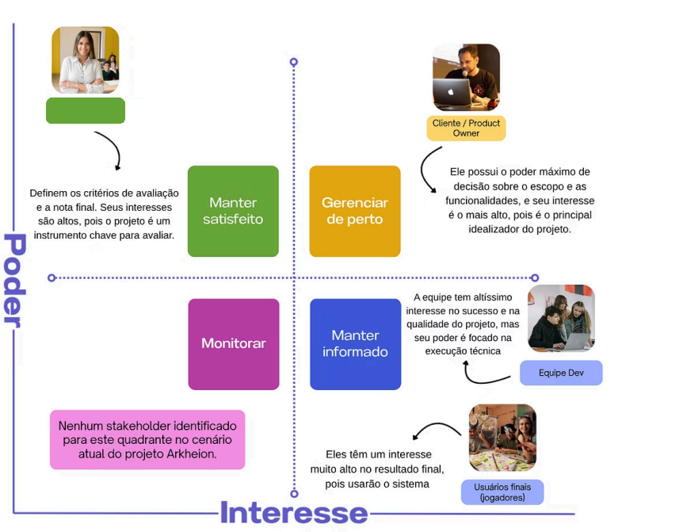

## 🎲 Plano de Gerenciamento de Partes Interessadas: Projeto Arkheion

O projeto de software "Fichas de RPG Arkheion".

---

### 1. Identificação dos Stakeholders (Interesse e Poder)

Esta tabela detalha as partes interessadas, seu nível de interesse, poder/influência e observações críticas para o projeto.

| Stakeholder | Interesse no Projeto | Poder/Influência | Observação |
| :--- | :--- | :--- | :--- |
| **Cliente / Product Owner** | Muito alto (principal idealizador, define os requisitos e espera um produto funcional que resolva o problema de gerenciamento de fichas de RPG). | Alto (controla o escopo do projeto, valida as entregas ao final de cada ciclo e tem a palavra final sobre as funcionalidades). | Stakeholder crítico. O alinhamento contínuo com ele é fundamental para o sucesso. |
| **Professores avaliadores** | Muito alto (interessados em avaliar as aplicações dos conceitos das disciplinas pela equipe). | Alto (definem os critérios de avaliação, os prazos e atribuem a nota final do projeto). | A aprovação deles é o principal critério de sucesso acadêmico. Todas as entregas devem atender aos seus requisitos. |
| **Usuários finais (Mestres e Jogadores)** | Alto (desejam uma plataforma intuitiva e funcional para criar, gerenciar e participar de mesas de RPG de forma simplificada). | Médio (a aceitação e o feedback deles validam a utilidade e a qualidade do sistema, mas não decidem sobre o projeto). | Devem ser considerados durante o desenvolvimento para garantir que a usabilidade e as funcionalidades sejam úteis na prática. |
| **Equipe de Desenvolvimento (Devs e Scrum Master)** | Alto (responsáveis pela execução técnica, qualidade do código, cumprimento dos prazos e, consequentemente, pela nota na disciplina). | Médio (influenciam diretamente a viabilidade técnica, o cronograma e a qualidade do produto final, mas não definem o escopo). | A comunicação e o engajamento da equipe são essenciais para a entrega de valor e para superar desafios técnicos. |

---

### 2. Matriz Poder-Interesse (Mapa de Stakeholders)

Esta é a organização das partes interessadas de acordo com a matriz de poder-interesse:

| Quadrante | Estratégia de Engajamento | Stakeholder(s) |
| :--- | :--- | :--- |
| **Alto Poder / Alto Interesse** | **Gerenciar de perto** | Cliente / Product Owner |
| **Alto Poder / Baixo Interesse** | **Manter satisfeito** | Professores avaliadores |
| **Baixo Poder / Alto Interesse** | **Manter informado** | Usuários finais (Mestres e Jogadores), Equipe de Desenvolvimento |
| **Baixo Poder / Baixo Interesse** | **Monitorar** | Nenhum stakeholder identificado no cenário atual do projeto Arkheion |

---

### 3. Mapeamento de Necessidades e Desejos

| Stakeholder | Necessidades (Obrigatório) | Desejos (Agrega Valor) |
| :--- | :--- | :--- |
| **Cliente / Product Owner** | Entrega do produto com funcionalidades principais funcionando (gerenciamento de ficha e mesa de jogo, etc.) e conclusão do projeto dentro do prazo acadêmico estipulado. | Uma interface de usuário (UI) com design polido e profissional, inclusão de funcionalidades extras que agregam valor (ex: rolador de dados integrado, chat) e o sistema ser bem recebido pela comunidade de jogadores. |
| **Professores avaliadores** | Entrega do projeto no prazo final, demonstração da aplicação prática dos conceitos ensinados nas disciplinas, entrega de artefatos do sistema para avaliação e uma apresentação final. | Um projeto que exceda os requisitos mínimos, mostrando proatividade e excelência técnica, e documentação de alta qualidade. |
| **Usuários finais** | Facilidade de uso (mais prático do que os métodos manuais), precisão das regras do sistema e o sistema ser confiável (não perder os dados das fichas). | Design responsivo para que o sistema funcione bem em tablets ou celulares, ferramentas de automação para tarefas repetitivas e opções de personalização da ficha e da interface. |
| **Equipe de Desenvolvimento** | Requisitos claros e estáveis por parte do Product Owner, obter a aprovação (nota) na disciplina e um ambiente de trabalho colaborativo e funcional. | Receber uma nota alta, oportunidade de aprender e aplicar novas tecnologias no projeto e criar um sistema do qual se orgulhem (portfólio). |

---

### 4. Estratégias de Engajamento e Comunicação

| Stakeholder | Estratégia de Engajamento | Como Manter Informado (O quê, Quando, Como) |
| :--- | :--- | :--- |
| **Cliente / Product Owner** | Apresentar Progresso Tangível (Sprint Review), Manter a Visão Alinhada (backlog visível e priorizado) e Envolvimento Contínuo (Sprint Planning). | Demonstração do incremento do produto, revisão do progresso, discussão e re-priorização do backlog. **Quando:** Ao final de cada ciclo de desenvolvimento. **Como:** Reuniões de Sprint Review e Sprint Planning, comunicação diária e assíncrona (WhatsApp/e-mail). |
| **Professores avaliadores** | Demonstrar Aplicação do Conhecimento nas apresentações e Cumprir Prazos Rigorosamente. | Entregas de artefatos nos prazos estabelecidos. **Quando:** Conforme a frequência de acompanhamento definida pela disciplina. **Como:** Envio por e-mail formal ou através da plataforma acadêmica, e apresentações formais para entregas de marcos. |
| **Usuários finais** | Envolvimento em Testes de Usabilidade (teste piloto), Manter um Canal de Comunicação (Discord/WhatsApp) e Implementar Feedback Visível. | Convites para sessões de teste de usabilidade. **Quando:** Sempre que uma nova versão significativa estiver disponível para teste. **Como:** Publicações em um canal de comunidade (Discord, WhatsApp). O feedback será coletado através de conversas no canal e formulários online. |
| **Equipe de Desenvolvimento** | Definir Papéis e Responsabilidades Claras, Celebrar as Conquistas e Remover Impedimentos Ativamente (Scrum Master). | Alinhamento sobre o que foi feito, o que será feito e quais são os impedimentos. **Quando:** Diariamente (Daily Stand-ups) e ao início e fim de cada ciclo (Planejamento e Retrospectiva). **Como:** Reuniões diárias (Daily Stand-ups), Reuniões de Planejamento e Retrospectiva do ciclo, uso contínuo de um quadro de tarefas compartilhado e um canal de comunicação em equipe. |
