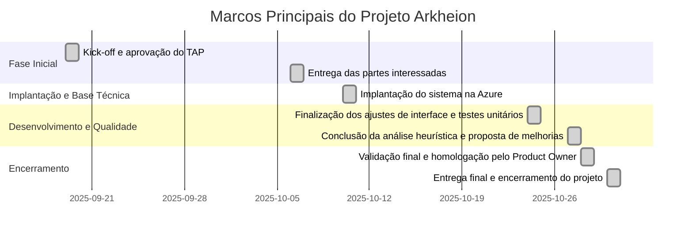

### ** Marcos Principais**

| **Data**   | **Marco**                                               | **Descrição**                                                                      |
| :--------- | :------------------------------------------------------ | :--------------------------------------------------------------------------------- |
| 19/09/2025 | Kick-off e aprovação do TAP                             | Início oficial do projeto e aprovação do Termo de Abertura do Projeto (TAP).       |
| 06/10/2025 | Entrega das partes interessadas e stakeholders          | Registro formal de todas as partes interessadas e aprovação do documento.          |
| 10/10/2025 | Implantação do sistema na Azure                         | Deploy inicial do sistema na nuvem, configuração básica e testes iniciais.         |
| 24/10/2025 | Finalização dos ajustes de interface e testes unitários | Ajustes finais de interface, responsividade e execução dos testes unitários.       |
| 27/10/2025 | Conclusão da análise heurística e proposta de melhorias | Finalização da avaliação Eureca, documentação de achados e sugestões de melhorias. |
| 28/10/2025 | Validação final e homologação pelo Product Owner        | Aprovação formal do sistema e funcionalidades pelo responsável do projeto.         |
| 30/10/2025 | Entrega final e encerramento do projeto                 | Consolidação da documentação, entrega oficial e encerramento da fase do projeto.   |

