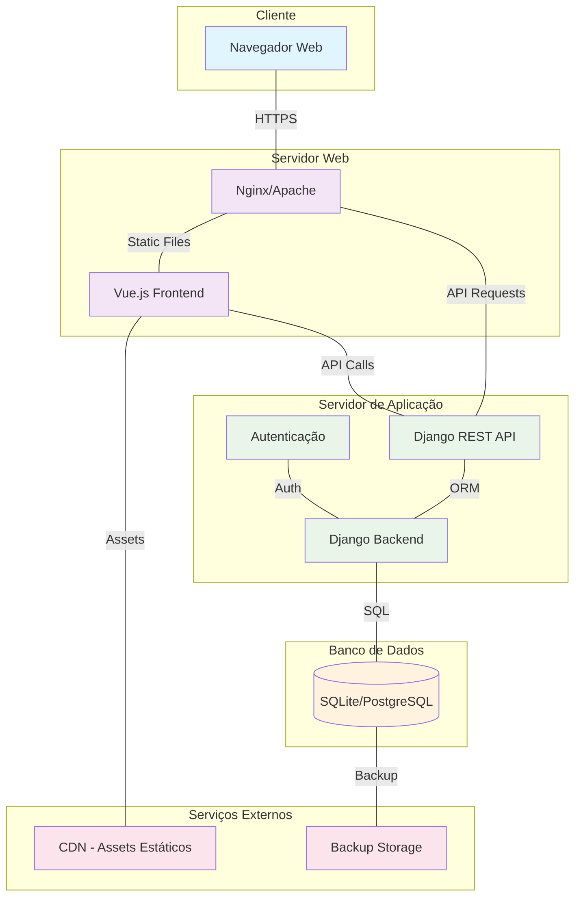

# Modelo de Implantação

## 1. Diagrama de Visão de Implantação

## 2. Diagrama de Implantação (Mermaid)

## 3. Descrição dos Componentes

### Cliente
- **Navegador Web**: Interface do usuário final que acessa a aplicação através de HTTPS

### Servidor Web  
- **Nginx/Apache**: Servidor web que serve arquivos estáticos e faz proxy reverso para a API
- **Vue.js Frontend**: Aplicação frontend responsiva construída em Vue.js

### Servidor de Aplicação
- **Django Backend**: Framework principal que implementa a lógica de negócio
- **Django REST API**: Endpoints da API REST para comunicação com o frontend
- **Autenticação**: Sistema de autenticação e autorização de usuários

### Banco de Dados
- **SQLite/PostgreSQL**: Banco de dados relacional para persistência dos dados (SQLite para desenvolvimento, PostgreSQL para produção)

### Serviços Externos
- **CDN**: Content Delivery Network para servir assets estáticos com melhor performance
- **Backup Storage**: Serviço de backup dos dados do banco

## 4. Fluxo de Comunicação

1. **Cliente → Servidor Web**: Usuário acessa a aplicação via HTTPS
2. **Servidor Web → Frontend**: Nginx serve os arquivos estáticos do Vue.js
3. **Frontend → API**: Vue.js faz chamadas para a API REST do Django
4. **API → Backend**: API processa requisições e aplica regras de negócio
5. **Backend → Banco**: Django ORM interage com o banco de dados
6. **Backup**: Dados são periodicamente salvos em storage externo

## 5. Considerações de Segurança

- Comunicação HTTPS obrigatória
- Autenticação baseada em tokens JWT
- Validação de entrada em todas as APIs
- Backup automatizado dos dados
- Firewall configurado para portas específicas