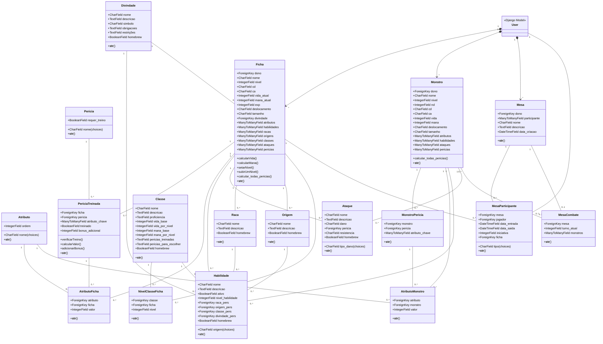

# Diagrama de Classes de Projeto

## Glossário

|  Termo            |  Explicação                                        |
| ----------------- | -------------------------------------------------- |
| **Ficha**          | Representa o conjunto de informações de um personagem, como nome, nível, atributos, classe, origem, raça, ataques, perícias, etc.  |
| **Classe**         | Define a classe do personagem, determinando suas características como vida base, mana, e o quanto esses atributos aumentam com o nível. |
| **Origem**         | Representa a origem do personagem, como seu passado ou linhagem, que pode influenciar suas habilidades e poderes. |
| **Raça**           | Define a espécie ou grupo étnico do personagem, com características e habilidades próprias. |
| **Atributo**       | Características que determinam a força, agilidade, inteligência e outros aspectos do personagem. |
| **AtributoFicha**  | Relaciona os atributos ao personagem, armazenando o valor de cada atributo específico na ficha do personagem. |
| **Perícia**        | Habilidade ou competência específica que o personagem pode ter, como usar armas, alquimia, etc. |
| **PeríciaTreinada**| Indica se o personagem treinou ou não uma determinada perícia, afetando o valor de sua habilidade nessa área. |
| **Ataque**         | Define os ataques do personagem, incluindo seu nome, dano e tipo de dano. |
| **User**           | Representa o usuário no sistema, que pode criar e gerenciar as fichas dos personagens. |

