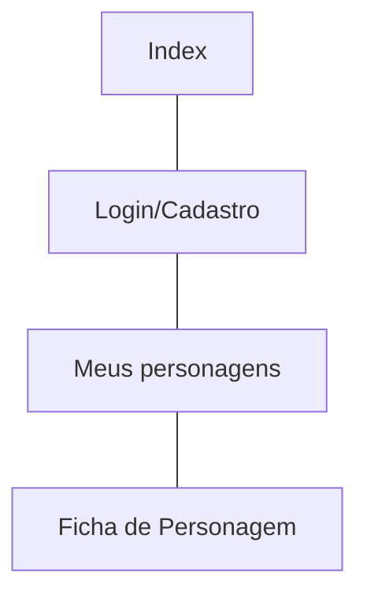
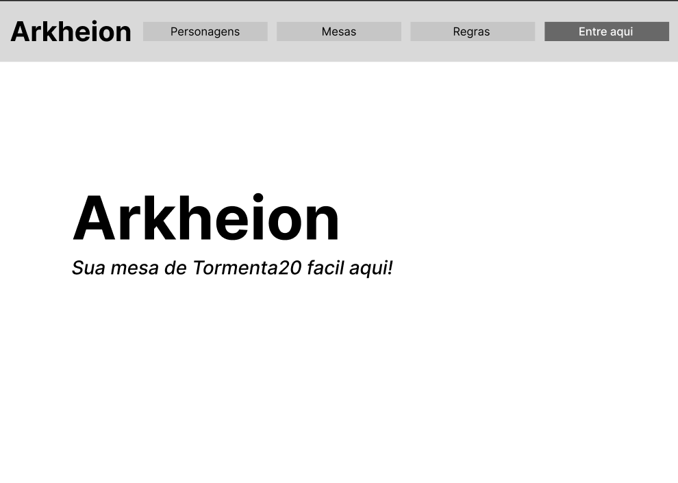
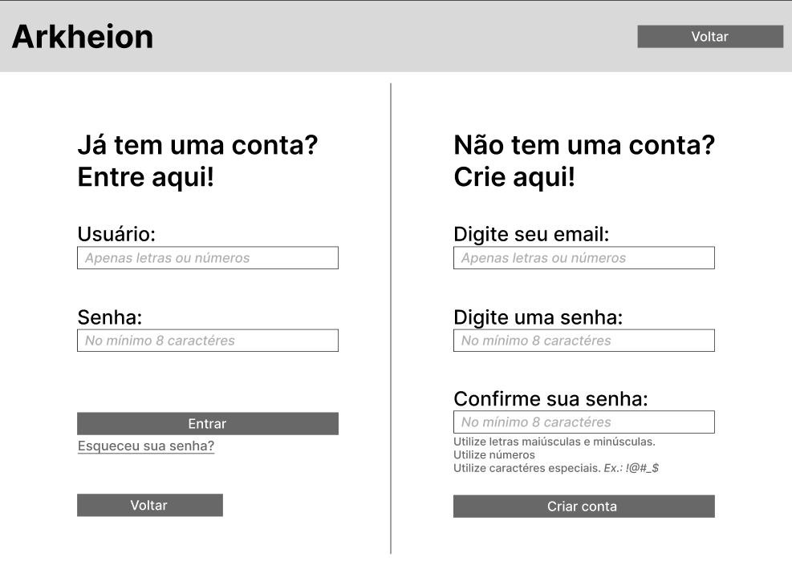
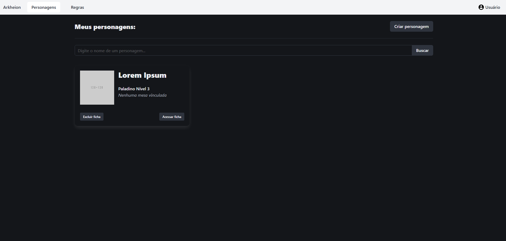
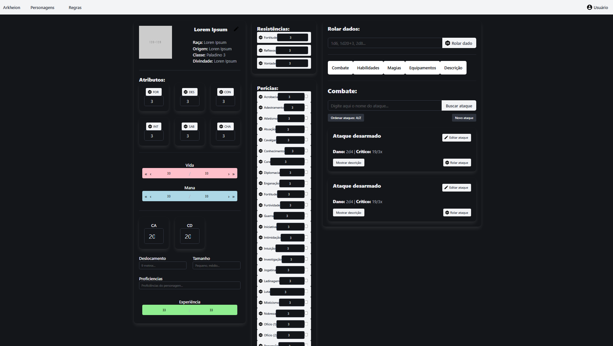

# Protótipos de Interface com o Usuário

## Mapa do Site

[Link para o protótipo no Figma](https://www.figma.com/design/5HkprkVqT7eL0Uj8PekuEQ/Arkheion?node-id=0-1&t=jG22orVcYEbwFbH8-1)

## A. Tela 1: Index
> A tela inicial, do usuário sem login ao entrar na página pela primeira vez.

## B. Tela 2: Login/Cadastro
> A tela de login e cadastro.

## C. Tela 3: Meus personagens
> A tela de personagens, mostrando todas as fichas criadas pelo usuário.

## D. Tela 4: Ficha (Combate)
> A tela mostrando uma ficha de personagem.

