# Relatório de Avaliação Heurística - Arkheion

## 1. Introdução

### 1.1 Objetivo

Este relatório apresenta os resultados da avaliação heurística, utilizando a técnica Eureca, da interface do sistema Arkheion, identificando problemas de usabilidade e propondo melhorias.

### 1.2 Metodologia

A avaliação foi realizada com base nos passos da técnica Eureca (Matos et al., 2025), usando como instrumento de apoio a lista de diretrízes Eureca (Matos et al., 2024)

### 1.3 Escopo da Avaliação

- **Sistema:** Arkheion
- **Data da avaliação:** 26/10/25
- **Avaliador(a):** Agnes Gonçalves Barbosa
- **Versão avaliada:** v1 (API) / 0.0.0 (Frontend) - Em desenvolvimento

## 2. Resumo Executivo

### 2.1 Problemas Identificados por Tela

- **Dashboard:** 7 problemas
- **Personagens:** 5 problemas
- **Criar Ficha:** 5 problemas
- **Ficha:** 5 problemas
- **Homebrew:** 5 problemas

### 2.2 Distribuição por Gravidade

- **Gravidade Alta:** 6 problemas
- **Gravidade Média:** 18 problemas
- **Gravidade Baixa:** 3 problemas

## 3. Problemas Identificados por Tela

### 3.1 Dashboard

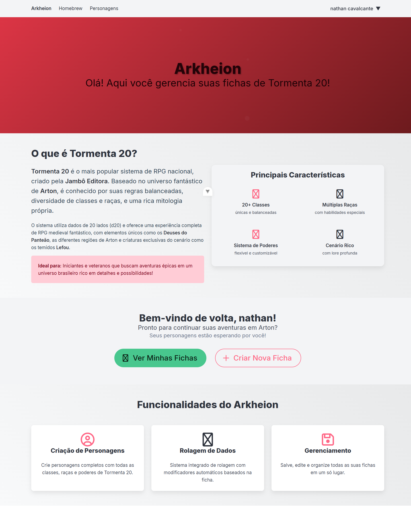

### Lista de Problemas de Usabilidade

#### Problema T1-001

| Campo | Informação |
| :--- | :--- |
| **ID** | T1-001 |
| **Descrição** | A identidade visual (marca gráfica, cores, tipografia) do banner principal não está em consonância com o restante da interface, que é genérica e moderna, falhando em reforçar o conceito do produto (RPG de fantasia). O estilo "medieval/fantasia" do título "Arkheion" não é replicado, gerando inconsistência.  |
| **Print** |  |
| **Heurística Violada** | FM15 - Identidade visual |
| **Sugestão de Melhoria** | Aplicar a paleta de cores, tipografia (para títulos e subtítulos) e elementos gráficos que remetam ao universo de fantasia (Tormenta 20) de forma consistente em toda a página (ex: nas caixas de "Principais Características" e "Funcionalidades do Arkheion"). |
| **Gravidade** | Alta |
| **Esforço** | Moderado |

#### Problema T1-002

| Campo | Informação |
| :--- | :--- |
| **ID** | T1-002 |
| **Descrição** | O contraste de cor entre o texto "Arkheion" no menu de navegação superior (canto superior esquerdo) e o fundo claro é insuficiente, tornando a leitura difícil e violando o princípio de evidenciar ações e informações. |
| **Print** | 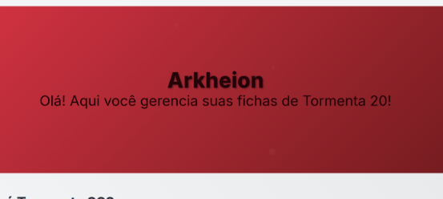 |
| **Heurística Violada** | FM11 - Contraste |
| **Sugestão de Melhoria** | Aumentar o contraste do texto "Arkheion" no menu de navegação, escolhendo uma cor mais escura ou aplicando um fundo que destaque o texto, melhorando a legibilidade. |
| **Gravidade** | Média |
| **Esforço** | Baixo |

#### Problema T1-003

| Campo | Informação |
| :--- | :--- |
| **ID** | T1-003 |
| **Descrição** | O campo de perfil do usuário ("nathan cavalcante ▼") no canto superior direito é muito discreto, com baixa visibilidade, dificultando a identificação rápida da área onde o usuário pode gerenciar sua conta. |
| **Print** |  |
| **Heurística Violada** | FM1 - Visibilidade |
| **Sugestão de Melhoria** | Destacar o perfil do usuário, utilizando um ícone de "avatar" ou "cabeça/perfil" mais proeminente e aumentar o tamanho da fonte ou a cor do nome do usuário.|
| **Gravidade** | Média |
| **Esforço** | Baixo |

#### Problema T1-004

| Campo | Informação |
| :--- | :--- |
| **ID** | T1-004 |
| **Descrição** | As ações principais "Ver Minhas Fichas" e "Criar Nova Ficha" têm destaque e design muito similares. A ação mais frequente ou crítica ("Criar Nova Ficha") deveria ter um destaque visual superior para guiar o usuário. |
| **Print** |  |
| **Heurística Violada** | FM2 - Hierarquia da informação |
| **Sugestão de Melhoria** | Aplicar um contraste mais forte ou um tamanho levemente maior ao botão "Criar Nova Ficha" (ex: cor complementar ou um tom mais vibrante) para destacá-lo como a ação mais relevante. |
| **Gravidade** | Média |
| **Esforço** | Baixo |

#### Problema T1-005

| Campo | Informação |
| :--- | :--- |
| **ID** | T1-005 |
| **Descrição** | Não existe um campo de busca ou um ícone de ajuda (FAQ, suporte) visível e destacado no topo da página. A busca é uma função essencial em sistemas de gerenciamento. |
| **Print** |  |
| **Heurística Violada** | AC3 - Destaque para funções essenciais |
| **Sugestão de Melhoria** | Adicionar um ícone de lupa (busca) no cabeçalho ou uma opção de "Ajuda" ("?") para cumprir a diretriz de manter ícones essenciais visíveis no topo.|
| **Gravidade** | Média |
| **Esforço** | Moderado |

#### Problema T1-006

| Campo | Informação |
| :--- | :--- |
| **ID** | T1-006 |
| **Descrição** | O bloco de texto informativo sobre "Tormenta 20" utiliza uma cor de fundo rosa/vermelha que, visualmente, remete a uma mensagem de erro ou aviso negativo, o que pode causar confusão ou percepção incorreta de que há algo "errado" na seção. |
| **Print** | 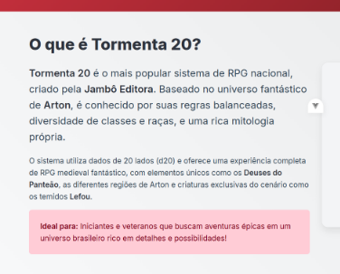 |
| **Heurística Violada** | FM11 - Contraste (e má aplicação de cor para propósito) |
| **Sugestão de Melhoria** | Alterar a cor de fundo do bloco para um tom mais neutro ou que se harmonize com o conceito (ex: um tom de verde ou azul escuro) para evitar a conotação de erro. |
| **Gravidade** | Média |
| **Esforço** | Baixo |

#### Problema T1-007

| Campo | Informação |
| :--- | :--- |
| **ID** | T1-007 |
| **Descrição** | O texto do segundo parágrafo na seção "O que é Tormenta 20?" está apresentado em um bloco grande, com baixa leiturabilidade e escaneabilidade, dificultando a leitura rápida. |
| **Print** |  |
| **Heurística Violada** | FM13 - Leiturabilidade  |
| **Sugestão de Melhoria** | Quebrar o texto em parágrafos menores ou utilizar listas (bullet points) para facilitar a leitura e a compreensão da informação, além de aumentar levemente o espaçamento entre as linhas. [cite: 547] |
| **Gravidade** | Baixa |
| **Esforço** | Baixo |

### 3.2 Personagens

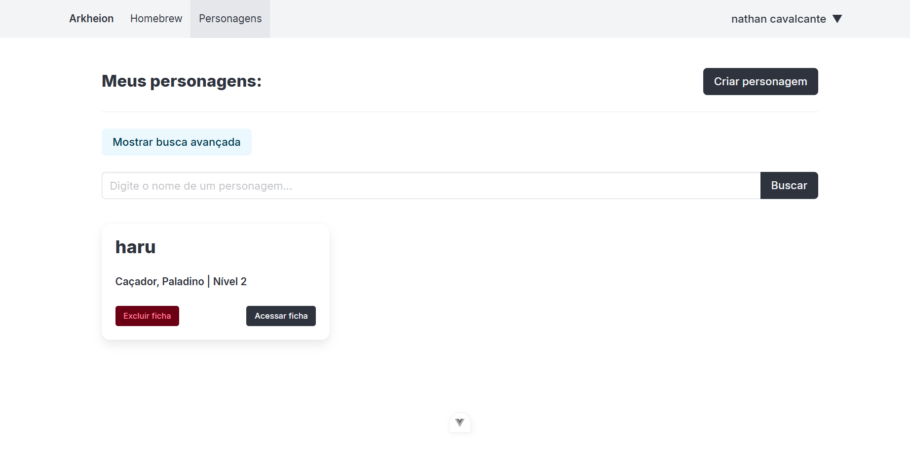
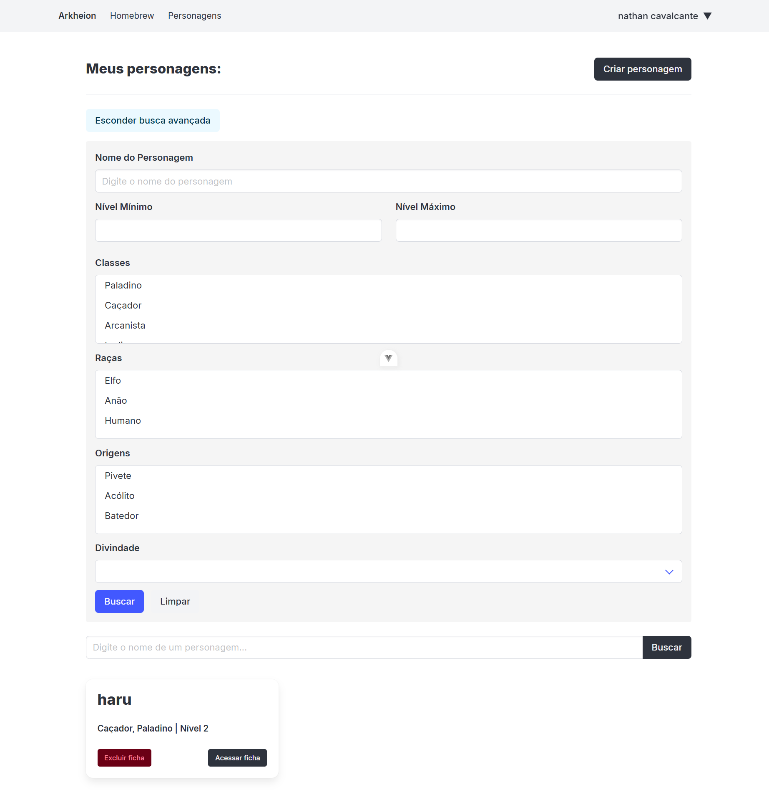

#### Problema T2-001

| Campo | Informação |
| :--- | :--- |
| **ID** | T2-001 |
| **Descrição** | A funcionalidade de "Busca Avançada" está sendo utilizada como um formulário de filtro, violando o princípio de digitação otimizada. Os campos de "Classes", "Raças", e "Origens" exigem que o usuário digite a informação, em vez de oferecer *checkboxes* ou listas de seleção (*dropdowns*) com as opções válidas de Tormenta 20. |
| **Print** |  |
| **Heurística Violada** | AF11 - Digitação otimizada. A diretriz visa facilitar a entrada de textos utilizando listas e caixas de seleção para otimizar a necessidade de digitação. |
| **Sugestão de Melhoria** | Converter os campos de texto "Classes", "Raças" e "Origens" em listas de seleção (ou *checkboxes* para múltiplas escolhas) com as opções pré-definidas do sistema T20, reduzindo o esforço do usuário e prevenindo erros de digitação. |
| **Gravidade** | Alta |
| **Esforço** | Moderado |

#### Problema T2-002

| Campo | Informação |
| :--- | :--- |
| **ID** | T2-002 |
| **Descrição** | O botão "Mostrar busca avançada" está posicionado muito longe do campo de busca que ele complementa. Sua localização, isolada no canto superior esquerdo da barra de busca, o faz parecer um link secundário, não uma funcionalidade intrínseca do campo de busca. |
| **Print** | 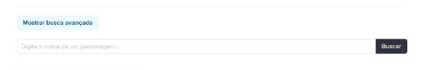 |
| **Heurística Violada** | FM8 - Proximidade. A diretriz exige que informações que pertencem a um mesmo grupo de significado sejam mantidas próximas. |
| **Sugestão de Melhoria** | Mover o link "Mostrar busca avançada" para dentro ou adjacente ao campo de busca simples (ex: no lado direito do campo, próximo ao botão "Buscar"), agrupando visualmente a função ao seu contexto. |
| **Gravidade** | Média |
| **Esforço** | Leve |

#### Problema T2-003

| Campo | Informação |
| :--- | :--- |
| **ID** | T2-003 |
| **Descrição** | O rótulo "Meus personagens:" está com a fonte muito grande, competindo com o título de navegação (que é o elemento mais importante na hierarquia de títulos) e as ações primárias da tela ("Criar personagem"). |
| **Print** | 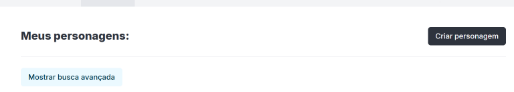 |
| **Heurística Violada** | FM2 - Hierarquia da informação. A hierarquia visual deve ser clara, da informação geral à específica, e da mais relevante para a menos relevante. O título de conteúdo está excessivamente em destaque. |
| **Sugestão de Melhoria** | Reduzir o tamanho da fonte do rótulo "Meus personagens:" para que ele funcione como um título de seção, mas sem competir em escala com a navegação superior e sem ofuscar as ações importantes. |
| **Gravidade** | Baixa |
| **Esforço** | Leve |

#### Problema T2-004

| Campo | Informação |
| :--- | :--- |
| **ID** | T2-004 |
| **Descrição** | A busca avançada inclui os campos "Nível Mínimo" e "Nível Máximo", mas não há qualquer restrição de formato de dados nem prevenção de erros. O usuário pode digitar letras, números negativos ou valores que não fazem sentido (ex: Mínimo 20, Máximo 1). |
| **Print** | 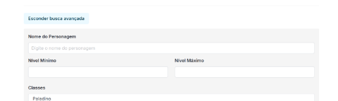 |
| **Heurística Violada** | AF9 - Prevenção de erros e AF10 - Restrições. A interface não previne a ocorrência de erros nem restringe o preenchimento de informações para evitar erros. |
| **Sugestão de Melhoria** | Restringir a entrada de dados para números inteiros (formato `type="number"`) e, idealmente, adicionar validação em tempo real para garantir que o "Nível Mínimo" não seja maior que o "Nível Máximo". |
| **Gravidade** | Média |
| **Esforço** | Moderado |

#### Problema T2-05

| Campo | Informação |
| :--- | :--- |
| **ID** | T2-05 |
| **Descrição** | O card do personagem (ex: "haru") é o único elemento que mostra um resultado. Não há um rótulo claro ou uma seção que indique a quantidade total de personagens encontrados (ex: "1 Personagem Encontrado"). |
| **Print** |  |
| **Heurística Violada** | CO2 - Feedback adequado. O sistema deve responder à ação do usuário (como uma busca ou filtro) de forma imediata. |
| **Sugestão de Melhoria** | Adicionar um feedback de resultado visível acima dos cards, como: "1 Personagem Encontrado" (ou "5 Personagens Encontrados"). Em caso de busca vazia, deve-se mostrar uma mensagem clara como "Nenhum personagem encontrado com esses filtros". |
| **Gravidade** | Média |
| **Esforço** | Leve |

### 3.3 Criar Ficha

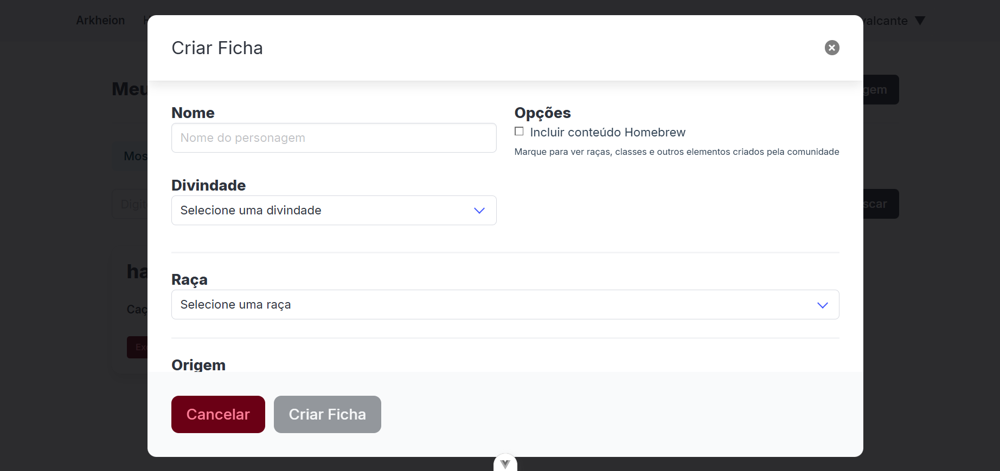

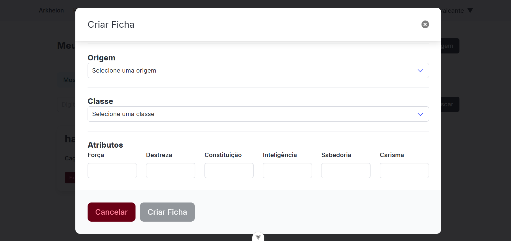

#### Problema T3-001

| Campo | Informação |
| :--- | :--- |
| **ID** | T3-001 |
| **Descrição** | O botão "Cancelar" (uma ação segura e secundária) é apresentado em vermelho/vinho sólido. Esta cor é universalmente associada a ações destrutivas (como "Excluir"), dando a ele um destaque indevido e perigoso. |
| **Print** |  |
| **Heurística Violada** | FM2 - Hierarquia da informação e AF9 - Prevenção de erros. A hierarquia visual está invertida, destacando a ação errada, e a cor falha em prevenir erros (o usuário pode associar a cor vermelha a uma ação perigosa). |
| **Sugestão de Melhoria** | Alterar o botão "Cancelar" para um estilo secundário (ex: vazado, com borda cinza). A cor vermelha deve ser reservada apenas para ações destrutivas. |
| **Gravidade** | Alta |
| **Esforço** | Leve |

#### Problema T3-002

| Campo | Informação |
| :--- | :--- |
| **ID** | T3-002 |
| **Descrição** | O modal de "Criar Ficha" é excessivamente longo, exigindo que o usuário role a tela para ver todos os campos (como "Atributos"). Modais são destinados a tarefas curtas e focadas. |
| **Print** |  |
| **Heurística Violada** | PU4 - Redução do esforço cognitivo. Forçar o usuário a rolar e lembrar de campos "escondidos" dentro de um modal aumenta a carga cognitiva. (Também viola PD4 - Densidade Informacional). |
| **Sugestão de Melhoria** | Implementar um "stepper" (passo-a-passo) dentro do modal (ex: Passo 1: Informações Básicas, Passo 2: Atributos) ou mover a criação de ficha para uma página dedicada. |
| **Gravidade** | Média |
| **Esforço** | Moderado |

#### Problema T3-003

| Campo | Informação |
| :--- | :--- |
| **ID** | T3-003 |
| **Descrição** | Os botões do modal ("Cancelar" em vinho sólido, "Criar Ficha" em cinza sólido desabilitado) são inconsistentes com os botões de criação vistos em outras telas (ex: "+ Criar Nova Ficha" vermelho-vazado no Dashboard e "Criar personagem" cinza-escuro em Personagens). |
| **Print** |  |
| **Heurística Violada** | FM6 - Consistência interna. O sistema falha em "Manter consistência de padrões visuais e de comando dentro do mesmo aplicativo", aumentando a carga cognitiva do usuário. |
| **Sugestão de Melhoria** | Aplicar o sistema de design de botões (Primário, Secundário) de forma consistente em todo o sistema. O botão "Criar Ficha" deve ter o estilo "Primário" (quando habilitado) e "Cancelar" o estilo "Secundário". |
| **Gravidade** | Média |
| **Esforço** | Moderado |

#### Problema T3-004

| Campo | Informação |
| :--- | :--- |
| **ID** | T3-004 |
| **Descrição** | Na visualização desktop (larga), os campos de texto dos "Atributos" (Força, Destreza, etc.) estão muito distantes de seus respectivos rótulos, dificultando a associação rápida entre o nome do atributo e o campo onde o valor deve ser inserido. Está mais perto do nome "Atributos" que do campo correspondente. |
| **Print** |  |
| **Heurística Violada** | FM8 - Proximidade. A diretriz exige "Manter próximas informações que pertencem a um mesmo grupo de significado." |
| **Sugestão de Melhoria** | Redesenhar o layout dos atributos, aninhando o rótulo ("Força") diretamente acima ou ao lado do seu campo de texto correspondente, diminuindo a distância horizontal para garantir o agrupamento de significado. |
| **Gravidade** | Média |
| **Esforço** | Leve |

#### Problema T3-005

| Campo | Informação |
| :--- | :--- |
| **ID** | T3-005 |
| **Descrição** | O modal é muito longo para a tela, como evidenciado pela barra de rolagem visível. Forçar o usuário a rolar dentro de um modal em um dispositivo móvel é uma má prática e não otimiza a experiência para a tela menor. |
| **Print** |  |
| **Heurística Violada** | PD3 - Responsividade e PD4 - Densidade Informacional. A interface não se adequa corretamente, "miniaturizando" um componente de desktop em vez de adaptá-lo para um fluxo móvel (ex: uma página dedicada). |
| **Sugestão de Melhoria** | Substituir o modal por uma página de "Criar Ficha" dedicada em dispositivos móveis, ou usar um componente "stepper" (passo-a-passo) para dividir a tarefa. |
| **Gravidade** | Média |
| **Esforço** | Grande |

### 3.4 Ficha

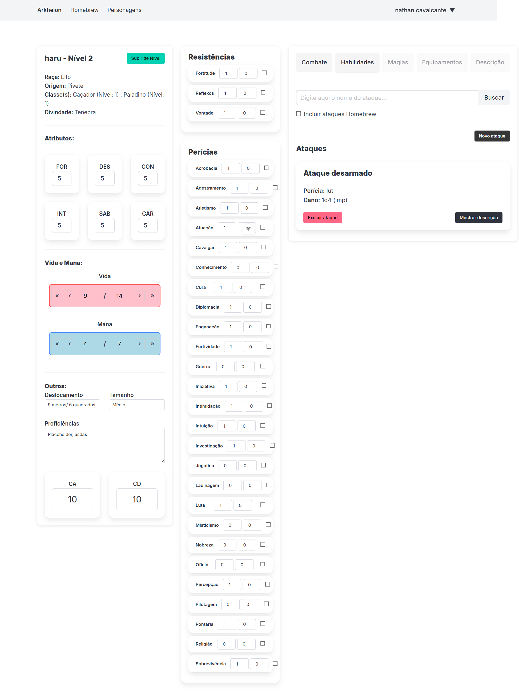

#### Problema T4-001

| Campo | Informação |
| :--- | :--- |
| **ID** | T4-001 |
| **Descrição** | Na lista de "Perícias", os elementos de cada linha (rótulo, campos numéricos e checkbox) estão desalinhados verticalmente e com espaçamento inconsistente. O rótulo fica à esquerda, enquanto os campos numéricos e o checkbox flutuam desordenadamente no centro/direita. Isso quebra o fluxo de leitura e dificulta a varredura visual da lista. |
| **Print** | 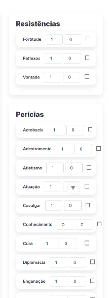  |
| **Heurística Violada** | FM9 - Alinhamento. A diretriz exige "Manter os elementos da página alinhados, para dar ordem de leitura". O alinhamento misto quebra essa ordem. |
| **Sugestão de Melhoria** | Reformatar a lista de perícias em colunas claras (ex: Rótulo à esquerda, Bônus Total alinhado à direita, Checkbox alinhado à direita), garantindo que todos os elementos de uma mesma linha estejam verticalmente centralizados. |
| **Gravidade** | Média |
| **Esforço** | Moderado |

#### Problema T4-002

| Campo | Informação |
| :--- | :--- |
| **ID** | T4-002 |
| **Descrição** | Na seção "Perícias", a lista apresenta três colunas interativas (dois campos numéricos e um checkbox) sem nenhum rótulo ou cabeçalho que explique o que cada coluna representa. O usuário não sabe o que os números (Bônus, Total, Modificador?) ou o checkbox (Treinado?) significam. |
| **Print** |  |
| **Heurística Violada** | CO3 - Affordance - dicas e FM1 - Visibilidade. A interface não oferece "dicas" (rótulos/cabeçalhos) para a compreensão do uso dos campos, minimizando o esforço cognitivo. |
| **Sugestão de Melhoria** | Adicionar um cabeçalho de colunas claro acima da lista de perícias (ex: "Bônus", "Total", "Treinado?") para que o usuário entenda o propósito de cada campo de entrada e do checkbox. |
| **Gravidade** | Alta |
| **Esforço** | Moderado |

#### Problema T4-003

| Campo | Informação |
| :--- | :--- |
| **ID** | T4-003 |
| **Descrição** | As três colunas principais que compõem o layout da ficha têm alturas drasticamente diferentes. A coluna central (Perícias) é significativamente mais longa que as outras, resultando em grandes áreas de espaço em branco e um layout desbalanceado na parte inferior da tela. |
| **Print** |  |
| **Heurística Violada** | FM9 - Alinhamento. O desalinhamento severo da base das colunas quebra a estrutura do grid, a ordem visual e faz a página parecer desorganizada. |
| **Sugestão de Melhoria** | Reorganizar os blocos da ficha (movendo blocos menores de colunas longas para colunas curtas) ou usar um layout de página única, distribuindo o conteúdo verticalmente. |
| **Gravidade** | Média |
| **Esforço** | Grande |

#### Problema T4-004

| Campo | Informação |
| :--- | :--- |
| **ID** | T4-004 |
| **Descrição** | O layout principal da ficha é mais largo que o contêiner (viewport) definido pelo cabeçalho. As colunas de conteúdo (Resistências, Perícias, Ataques) "vazam" para a direita, ultrapassando o alinhamento do cabeçalho e forçando o usuário a rolar a tela horizontalmente para ver todo o conteúdo. |
| **Print** |  |
| **Heurística Violada** | PD3 - Responsividade. A interface falha em "responder ao tamanho da tela e adequar a quantidade de informação" sem quebrar o layout, forçando a rolagem horizontal desnecessária. |
| **Sugestão de Melhoria** | Reestruturar o layout da ficha para que as colunas se encaixem no *viewport* (área visível da tela), seja reduzindo as margens, ou movendo as colunas para uma disposição vertical em telas menores/médias. |
| **Gravidade** | Alta |
| **Esforço** | Grande |

#### Problema T4-005

| Campo | Informação |
| :--- | :--- |
| **ID** | T4-005 |
| **Descrição** | A interface não possui diferenciação visual entre campos numéricos que são editáveis (como os bônus de perícias/resistências) e campos que são calculados ou não-editáveis (como os valores de Atributos, CA, CD, Vida e Mana). Todos são apresentados em caixas de input idênticas. |
| **Print** |   |
| **Heurística Violada** | CO3 - Affordance - dicas. Ao fazer campos não-editáveis parecerem *inputs* de texto, a interface oferece uma "dica" (affordance) visual incorreta, causando confusão e frustração. |
| **Sugestão de Melhoria** | Aplicar um estilo visual distinto para campos não-editáveis (calculados). Por exemplo, remover a borda da caixa e exibir apenas o número em negrito, ou usar um fundo cinza (estilo "disabled") para a caixa de input. |
| **Gravidade** | Média |
| **Esforço** | Moderado |

### 3.5 Homebrew

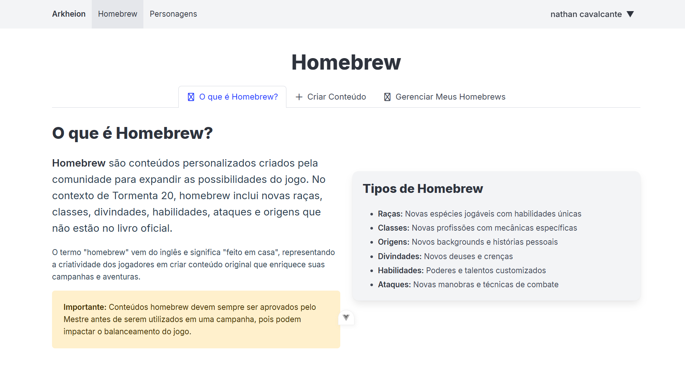

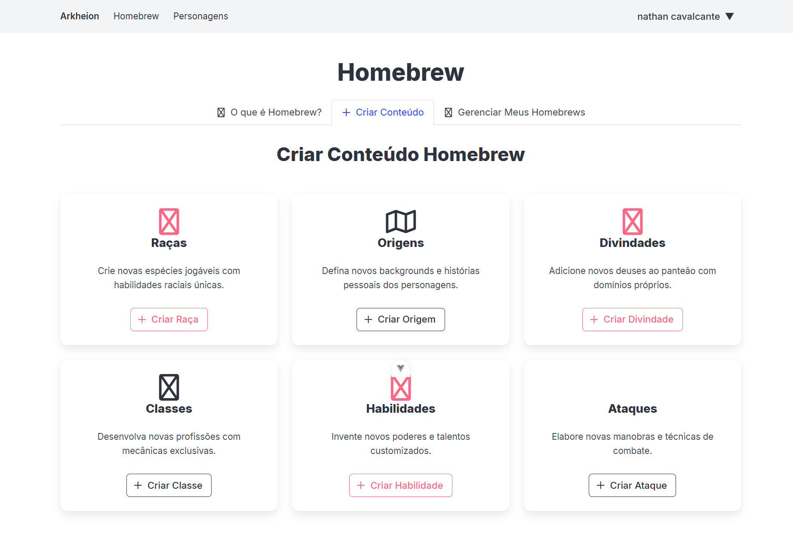

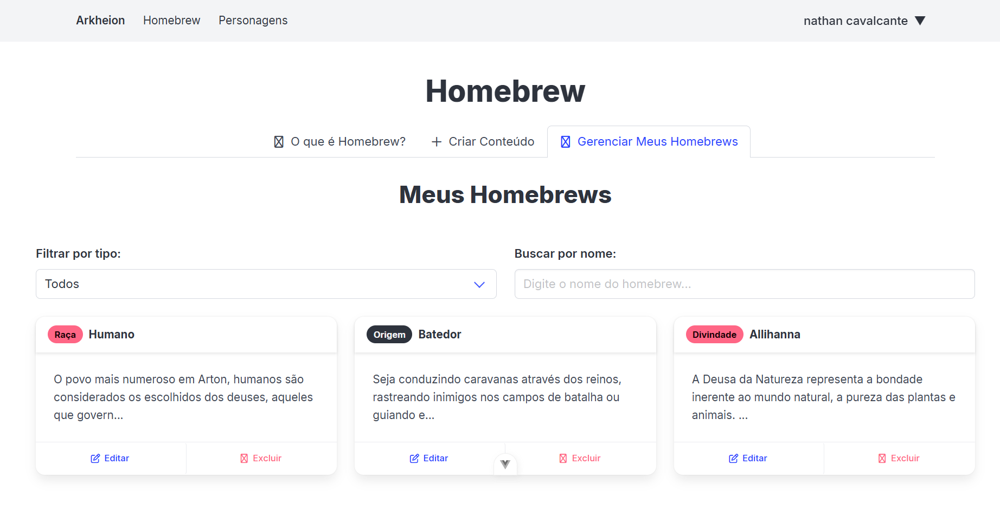

#### Problema T5-001

| Campo | Informação |
| :--- | :--- |
| **ID** | T5-001 |
| **Descrição** | Na tela "Criar Conteúdo Homebrew", os ícones para "Raças", "Divindades", "Classes" e "Habilidades" são genéricos e inconsistentes (ícones placeholder "X" e "janela"), não tendo relação metafórica clara com o conteúdo que representam. |
| **Print** |  |
| **Heurística Violada** | CO4 - Metáfora e FM6 - Consistência interna. O uso de ícones inadequados falha em comunicar a função e quebra a consistência visual. |
| **Sugestão de Melhoria** | Substituir os ícones placeholder por metáforas que representem visualmente cada categoria (ex: um ícone de "máscara" ou "cabeça" para Raças, "cálice" ou "símbolo religioso" para Divindades, "livro aberto" para Habilidades). |
| **Gravidade** | Alta |
| **Esforço** | Leve |

#### Problema T5-002

| Campo | Informação |
| :--- | :--- |
| **ID** | T5-002 |
| **Descrição** | Na tela "Criar Conteúdo Homebrew", os botões de criação (ex: "+ Criar Raça") usam um estilo novo (vazado com borda e texto rosa). Este é mais um estilo de botão inconsistente, que não corresponde aos botões de criação do Dashboard (vazado vermelho) nem da tela de Personagens (sólido cinza). |
| **Print** |  |
| **Heurística Violada** | FM6 - Consistência interna. A falta de um padrão visual consistente para botões de "Criar" em todo o aplicativo aumenta a carga cognitiva do usuário. |
| **Sugestão de Melhoria** | Definir um estilo único (ex: Primário Sólido) para a ação de criação e usá-lo consistentemente em todas as telas, independentemente da cor de destaque do tema. |
| **Gravidade** | Média |
| **Esforço** | Moderado |

#### Problema T5-003

| Campo | Informação |
| :--- | :--- |
| **ID** | T5-003 |
| **Descrição** | As ações nos cards de "Meus Homebrews" ("Editar" e "Excluir" como *text-links*) são visualmente inconsistentes com as ações nos cards de "Meus Personagens" ("Acessar ficha" e "Excluir ficha" como botões sólidos). |
| **Print** |  |
| **Heurística Violada** | FM6 - Consistência interna. O usuário não sabe como as ações em cards serão apresentadas (links ou botões) no sistema, quebrando a consistência de comando. |
| **Sugestão de Melhoria** | Padronizar o estilo das ações em todos os cards do sistema. Por exemplo, a ação primária ("Editar" / "Acessar") deve ser um botão, e a destrutiva ("Excluir") um botão secundário ou link. |
| **Gravidade** | Média |
| **Esforço** | Moderado |

#### Problema T5-004

| Campo | Informação |
| :--- | :--- |
| **ID** | T5-004 |
| **Descrição** | A ação de "Excluir" na tela "Meus Homebrews" é um link de texto vermelho, que é inconsistente com a ação de "Excluir" na tela de Personagens (um botão vermelho sólido). |
| **Print** |  |
| **Heurística Violada** | FM6 - Consistência interna. A mesma ação destrutiva é apresentada de formas diferentes em componentes de card similares, forçando o usuário a reinterpretar a função do comando. |
| **Sugestão de Melhoria** | Padronizar o estilo da ação "Excluir" em todos os cards do sistema, mantendo a mesma representação visual (seja link ou botão, mas de forma consistente) para a mesma ação. |
| **Gravidade** | Média |
| **Esforço** | Leve |

#### Problema T5-005

| Campo | Informação |
| :--- | :--- |
| **ID** | T5-005 |
| **Descrição** | O bloco amarelo de "Importante" na tela "O que é Homebrew?" (usado para alertar sobre o balanceamento) tem uma cor de fundo que remete a um erro grave ou alerta de sistema. A cor amarela é mais adequada para avisos temporários ou de atenção, não para informações contextuais fixas. |
| **Print** |  |
| **Heurística Violada** | CO6 - Adequação ao contexto. O uso de uma cor de alerta excessivamente forte para uma informação estática e de contexto que não é um erro ou aviso imediato é inadequado. |
| **Sugestão de Melhoria** | Mudar o bloco para um estilo menos intrusivo (ex: um bloco cinza claro com a borda amarela ou vermelha apenas na lateral) para comunicar a importância sem dar a sensação de um erro crítico de sistema. |
| **Gravidade** | Baixa |
| **Esforço** | Leve |

### Legenda de Gravidade:

- **Alta:** Problema que impede ou dificulta significativamente a realização de tarefas
- **Média:** Problema que causa frustração ou demora na realização de tarefas
- **Baixa:** Problema menor que não afeta significativamente a usabilidade

### Legenda de Esforço:

- **Leve:** Alteração simples, requer poucas horas de desenvolvimento
- **Moderado:** Alteração de complexidade média, requer alguns dias de desenvolvimento
- **Grande:** Alteração complexa, requer semanas de desenvolvimento ou reestruturação

---

**Data do relatório:** 26 de outubro de 2025
**Versão do documento:** 1.0
