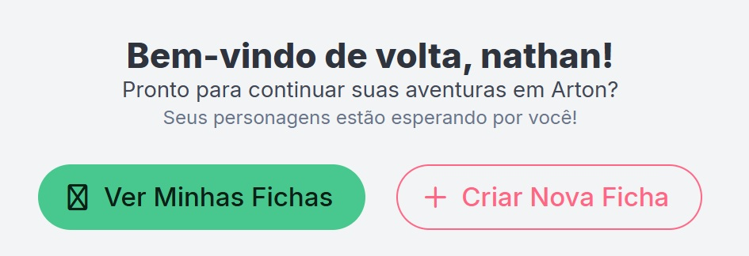
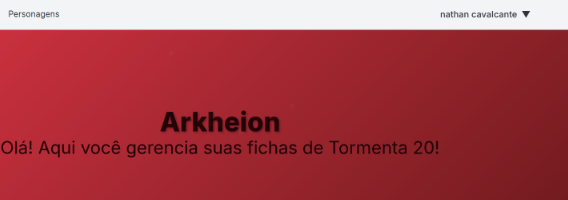

# Relatório de Avaliação Heurística - Arkheion

## 1. Introdução

### 1.1 Objetivo

Este relatório apresenta os resultados da avaliação heurística, utilizando a técnica Eureca, da interface do sistema Arkheion, identificando problemas de usabilidade e propondo melhorias.

### 1.2 Metodologia

A avaliação foi realizada com base nos passos da técnica Eureca (Matos et al., 2025), usando como instrumento de apoio a lista de diretrizes Eureca (Matos et al., 2024)

### 1.3 Escopo da avaliação

- **Sistema:** Arkheion
- **Data da avaliação:** 29/10/25
- **Avaliador(a):** Lucas Pinheiro da Costa
- **Versão avaliada:** v1 (API) / 0.0.0 (Frontend) - Em desenvolvimento

  

## 2. Resumo executivo

### 2.1 Problemas identificados por tela

- **Dashboard:** 5 problemas
- **Criar ficha:** 5 problemas
- **Ficha:** 5 problemas

### 2.2 Distribuição por gravidade

- **Gravidade Alta:** 3 problemas
- **Gravidade Média:** 10 problemas
- **Gravidade Baixa:** 2 problemas

  

## 3. Problemas identificados por tela

### 3.1 Dashboard

#### Problema T1-001

| Campo | Informação |
| :--- | :--- |
| **ID** | T1-001 |
| **Descrição** | Vários ícones usados para representar características positivas ou funcionalidades (ex: "20+ Classes", "Múltiplas Raças", "Rolagem de Dados") usam um "X" dentro de um quadrado. A metáfora do "X" é universalmente associada a "fechar", "errado", "cancelar" ou "remover". Usá-lo para representar uma funcionalidade existente é confuso. |
| **Print** | `dashboard.jpg` (Seções "Principais Características" e "Funcionalidades do Arkheion") |
| **Heurística Violada** | **CO4 - Metáfora**. Os signos gráficos utilizados não representam o mundo real ou convenções de interface esperadas, causando confusão sobre o significado da funcionalidade. |
| **Sugestão de Melhoria** | Substituir os ícones "X" por ícones que representem de fato a funcionalidade. Por exemplo, "Rolagem de Dados" poderia ser um ícone de dado (d20), "20+ Classes" poderia ser um ícone de livro ou pergaminho, etc. |
| **Gravidade** | Média |
| **Esforço** | Leve (troca de ícones) |

#### Problema T1-002

| Campo | Informação |
| :--- | :--- |
| **ID** | T1-002 |
| **Descrição** | Os dois botões de ação principais, "Ver Minhas Fichas" e "Criar Nova Ficha", possuem estilos visuais inconsistentes e cores semanticamente confusas. "Ver Minhas Fichas" é verde (cor de "sucesso" ou "confirmação"), enquanto "Criar Nova Ficha" é vermelho/rosa (cor de "perigo", "cancelar" ou "erro"). Criar algo novo é uma ação primária e positiva, não deveria usar uma cor de alerta. |
| **Print** |  |
| **Heurística Violada** | **FM6 - Consistência interna**. A interface não mantém consistência nos padrões visuais de comando (botões). A cor vermelha também viola a **CO1 - Linguagem apropriada**, pois a "linguagem visual" da cor está em desacordo com o objetivo da ação. |
| **Sugestão de Melhoria** | Definir um estilo padrão para botões primários e secundários. Se ambas forem ações primárias, poderiam ter o mesmo estilo (ex: ambas verdes). Se "Criar Nova Ficha" for a ação principal, ela deveria ser o botão verde (preenchido), e "Ver Minhas Fichas" poderia ser um botão secundário (vazado, com cor neutra ou verde). |
| **Gravidade** | Média |
| **Esforço** | Leve (alteração de CSS) |

#### Problema T1-003

| Campo | Informação |
| :--- | :--- |
| **ID** | T1-003 |
| **Descrição** | O visual do banner principal não combina com o resto do site. O título "Arkheion" tem um jeito medieval, mas esse clima não aparece em outras partes da página, deixando tudo meio sem identidade. |
| **Print** |  |
| **Heurística Violada** | FM15 - Identidade visual |
| **Sugestão de Melhoria** | Usar cores, fontes e detalhes gráficos que lembrem o universo de fantasia em toda a página, não só no banner. |
| **Gravidade** | Alta |
| **Esforço** | Moderado |

#### Problema T1-004

| Campo | Informação |
| :--- | :--- |
| **ID** | T1-004 |
| **Descrição** | O nome do usuário no canto superior direito está pequeno e quase não chama atenção, o que dificulta perceber onde mexer nas opções da conta. |
| **Print** |  |
| **Heurística Violada** | FM1 - Visibilidade |
| **Sugestão de Melhoria** | Deixar o nome do usuário mais visível, usando um ícone de perfil maior e uma cor ou fonte que destaque melhor essa área. |
| **Gravidade** | Média |
| **Esforço** | Baixo |

#### Problema T1-005

| Campo | Informação |
| :--- | :--- |
| **ID** | T1-005 |
| **Descrição** | Não tem nenhum campo de busca ou botão de ajuda visível no topo da página. Fica difícil para o usuário encontrar informações ou pedir suporte quando precisa. |
| **Print** |  |
| **Heurística Violada** | AC3 - Destaque para funções essenciais |
| **Sugestão de Melhoria** | Colocar um ícone de lupa para busca ou um botão de "Ajuda" ("?") no cabeçalho, deixando essas opções fáceis de achar logo que o usuário entra no sistema. |
| **Gravidade** | Média |
| **Esforço** | Moderado |

  

### 3.2 Criar Ficha

#### Problema T2-001

| Campo | Informação |
| :--- | :--- |
| **ID** | T2-001 |
| **Descrição** | O botão de ação "Criar Ficha", que aparece na parte inferior do modal, se repete com a denominação do modal que aparece na parte superior. |
| **Print** |  |
| **Heurística Violada** | FM6 - Consistência interna (Manter consistência de padrões visuais e de comando dentro do mesmo aplicativo). |
| **Sugestão de Melhoria** | Alterar o texto do botão para uma ação mais clara e específica, evitando repetir o nome do modal. Por exemplo, utilizar "Salvar Ficha" ou "Confirmar Criação" para diferenciar a ação do título/modal e tornar o comando mais objetivo para o usuário. |
| **Gravidade** | Baixa |
| **Esforço** | Leve |

#### Problema T2-002

| Campo | Informação |
| :--- | :--- |
| **ID** | T2-002 |
| **Descrição** | O modal é muito longo, exigindo que o usuário role a tela para ver todos os campos (evidenciado pela necessidade de dois prints). Os botões de ação ("Cancelar" e "Criar ficha") estão no fim do conteúdo, o que significa que eles não ficam visíveis quando o usuário está preenchendo os primeiros campos (como "Nome"). |
| **Print** |  |
| **Heurística Violada** | FM1 - Visibilidade. As informações principais e ações (botões) devem se manter visíveis para minimizar o esforço cognitivo do usuário. O usuário pode ficar confuso sem ver os botões de ação. |
| **Sugestão de Melhoria** | Opção A (ideal): quebrar o formulário em etapas (passo-a-passo). Opção B (mais simples): fixar o rodapé do modal (a área dos botões "Cancelar" e "Criar ficha") para que ele permaneça sempre visível, independentemente da rolagem do conteúdo. |
| **Gravidade** | Média (causa frustração e pode fazer o usuário se perder) |
| **Esforço** | Moderado (para a opção B) ou Grande (para a opção A) |

#### Problema T2-003

| Campo | Informação |
| :--- | :--- |
| **ID** | T2-003 |
| **Descrição** | O botão de ação principal, "Criar ficha", está desabilitado por padrão. No entanto, a interface não fornece nenhum feedback ou dica visual (como asteriscos (*) ou texto de ajuda) para informar ao usuário quais campos são obrigatórios para que o botão seja habilitado. Isso força o usuário a adivinhar quais dados precisa preencher. |
| **Print** |  |
| **Heurística Violada** | CO3 - Affordance - dicas: a interface não oferece indicações visuais claras sobre os campos obrigatórios, dificultando a compreensão do usuário. PU4 - Redução do esforço cognitivo: o usuário precisa lembrar ou adivinhar quais campos preencher, aumentando a carga cognitiva. CO2 - Feedback adequado: não há resposta ou orientação visual quando o botão "Criar ficha" permanece desabilitado, deixando o usuário sem saber como proceder. |
| **Sugestão de Melhoria** | Adicionar um indicador visual (como um asterisco vermelho (*)) aos rótulos (labels) de todos os campos obrigatórios (ex: "Nome *"). O botão "Criar ficha" deve ser habilitado assim que todos os campos mandatórios forem preenchidos. |
| **Gravidade** | Média (causa frustração e demora) |
| **Esforço** | Leve (alteração textual/visual simples) |

#### Problema T2-004

| Campo | Informação |
| :--- | :--- |
| **ID** | T2-004 |
| **Descrição** | Os campos de preenchimento como "Divindade", "Raça", "Origem" e outros não apresentam informações complementares, dicas ou explicações que ajudem o usuário a entender o significado, a utilidade e o impacto de cada campo no contexto da ficha de RPG. Isso dificulta o preenchimento correto, especialmente para usuários iniciantes ou leigos no tema. |
| **Print** |  |
| **Heurística Violada** | CO3 - Affordance - dicas: a ausência de explicações ou informações complementares nos campos dificulta a compreensão do usuário sobre o significado e a utilidade de cada campo. PU4 - Redução do esforço cognitivo: o usuário precisa lembrar ou deduzir o propósito dos campos, aumentando a carga cognitiva e o risco de preenchimento incorreto. |
| **Sugestão de Melhoria** | Implementar tooltips ou modais flutuantes acionados ao passar o mouse sobre ícones de interrogação posicionados ao lado dos rótulos dos campos. Esses tooltips devem fornecer explicações claras e objetivas sobre o significado, a utilidade e o impacto de cada campo, facilitando o preenchimento para usuários iniciantes ou leigos em RPG de mesa. |
| **Gravidade** | Média |
| **Esforço** | Leve |

#### Problema T2-005

| Campo | Informação |
| :--- | :--- |
| **ID** | T2-005 |
| **Descrição** | O checkbox "Incluir conteúdo Homebrew" está isolado em uma seção de "Opções", distante dos campos que realmente são impactados por ele (Raça, Divindade, Classe, Origem). Essa separação pode dificultar a compreensão do usuário sobre sua função, levando-o a ignorar ou não perceber o filtro antes de preencher os campos. |
| **Print** |  |
| **Heurística Violada** | FM8 - Proximidade. Elementos relacionados, como filtros e os campos que eles afetam, devem estar agrupados para facilitar o entendimento e uso. |
| **Sugestão de Melhoria** | Posicionar o checkbox "Incluir conteúdo Homebrew" imediatamente acima do primeiro campo de seleção afetado (ex: "Divindade" ou "Raça"), tornando a relação entre o filtro e os campos mais evidente e intuitiva. |
| **Gravidade** | Baixa (problema menor, mas pode causar confusão) |
| **Esforço** | Leve (reorganização simples do componente) |

  

### 3.3 Ficha

#### Problema T3-001

| Campo | Informação |
| :--- | :--- |
| **ID** | T3-001 |
| **Descrição** | A interface para modificar "Vida" e "Mana" é ambígua. Ela exibe um número estático (ex: '9') entre quatro botões ('«', '<', '>', '»'). Não fica claro o que cada botão faz (subtrai 1? define o máximo?) e, o mais importante, não há uma forma óbvia de inserir um valor específico (ex: se o personagem tomar 5 de dano). |
| **Print** | `ficha.jpg` (Seção "Vida e Mana") |
| **Heurística Violada** | **CO3 - Affordance**. A interface não oferece dicas que ajudem a compreender seu uso. A funcionalidade de alterar Vida/Mana, que é central, não é intuitiva. |
| **Sugestão de Melhoria** | Substituir o componente por um mais claro: um campo de *input* numérico editável ao lado do valor máximo (ex: `[ 9 ] / 14`). Os botões poderiam ser simplificados para `+` e `-` para incrementos e decrementos simples. |
| **Gravidade** | Alta (alterar pontos de vida/mana é uma das ações mais frequentes e cruciais em uma ficha) |
| **Esforço** | Moderado (requer substituição do componente de UI) |

#### Problema T3-002

| Campo | Informação |
| :--- | :--- |
| **ID** | T3-002 |
| **Descrição** | Na seção "Perícias", cada perícia tem dois campos numéricos (ex: "Acrobacia" [1] [0]) e um *checkbox*. Não há nenhum rótulo (label) acima dessas colunas para indicar o que cada elemento significa (ex: "Total", "Bônus Atributo", "Outros", "Treinado"). O usuário precisa adivinhar a função de cada campo. |
| **Print** | `ficha.jpg` (Seção "Perícias") |
| **Heurística Violada** | **CO3 - Affordance**. A ausência de rótulos nos cabeçalhos das colunas impede a compreensão imediata do que os números e o *checkbox* representam. |
| **Sugestão de Melhoria** | Adicionar rótulos de cabeçalho claros acima das colunas de "Perícias". Por exemplo: "Perícia", "Total", "Atributo", "Outros", "Treinado". |
| **Gravidade** | Média |
| **Esforço** | Leve (adicionar rótulos textuais) |

#### Problema T3-003

| Campo | Informação |
| :--- | :--- |
| **ID** | T3-003 |
| **Descrição** | As três colunas da ficha têm tamanhos muito diferentes. A coluna do meio (Perícias) é bem mais comprida que as outras, deixando muito espaço vazio e fazendo o final da página parecer bagunçado. |
| **Print** | `ficha.jpg` (Colunas que compõem a página Ficha) |
| **Heurística Violada** | FM9 - Alinhamento. O desalinhamento das colunas quebra a ordem visual e deixa a página desorganizada. |
| **Sugestão de Melhoria** | Reorganizar os blocos da ficha, juntando os menores nas colunas mais curtas ou mudando para um layout de página única, com tudo em uma coluna só. |
| **Gravidade** | Média |
| **Esforço** | Grande |

#### Problema T3-004

| Campo | Informação |
| :--- | :--- |
| **ID** | T3-004 |
| **Descrição** | A aba ativa na seção principal ("Combate") não tem nenhum destaque visual. Ela está formatada exatamente da mesma maneira que as abas inativas ("Habilidades", "Magias", etc.). O usuário não recebe feedback visual imediato sobre qual seção está visualizando. |
| **Print** | `ficha.jpg` (Abas "Combate", "Habilidades", "Magias"...) |
| **Heurística Violada** | **CO2 - Feedback adequado**. A interface não responde à ação do usuário (ou ao estado atual) informando visualmente qual aba está selecionada. |
| **Sugestão de Melhoria** | Aplicar um estilo visual claro para a aba ativa, como um sublinhado, cor de fundo diferente, ou texto em negrito, para diferenciá-la das abas inativas. |
| **Gravidade** | Média (o usuário pode se confundir sobre qual seção da ficha está vendo) |
| **Esforço** | Leve (alteração de CSS) |

#### Problema T3-005

| Campo | Informação |
| :--- | :--- |
| **ID** | T3-005 |
| **Descrição** | O botão "Excluir ataque" é vermelho/rosa, o que é adequado para uma ação destrutiva. No entanto, ele usa a *exata mesma* cor e estilo do botão "+ Criar Nova Ficha" da tela *Dashboard*. A mesma cor não pode significar "Criar" (uma ação construtiva) e "Excluir" (uma ação destrutiva). |
| **Print** | `ficha.jpg` (Comparar botão "Excluir ataque" com a imagem `dashboard.jpg`) |
| **Heurística Violada** | **FM6 - Consistência interna**. A linguagem visual (uso de cores) é inconsistente e contraditória entre diferentes telas do sistema, gerando confusão sobre o significado das ações. |
| **Sugestão de Melhoria** | Definir uma paleta de cores semântica. Reservar o vermelho/rosa *apenas* para ações destrutivas (Excluir, Cancelar). Usar outra cor (como o verde do botão "Ver Minhas Fichas") para ações construtivas/primárias (Criar, Salvar). |
| **Gravidade** | Alta |
| **Esforço** | Leve (alteração de CSS, mas requer uma decisão de design) |

  

### Legenda de Gravidade:

- **Alta:** Problema que impede ou dificulta significativamente a realização de tarefas
- **Média:** Problema que causa frustração ou demora na realização de tarefas
- **Baixa:** Problema menor que não afeta significativamente a usabilidade

### Legenda de Esforço:

- **Leve:** Alteração simples, requer poucas horas de desenvolvimento
- **Moderado:** Alteração de complexidade média, requer alguns dias de desenvolvimento
- **Grande:** Alteração complexa, requer semanas de desenvolvimento ou reestruturação

---

**Data do relatório:** 29 de outubro de 2025
**Versão do documento:** 1.0
