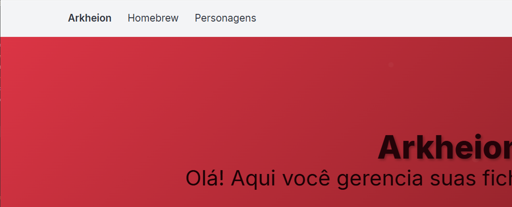
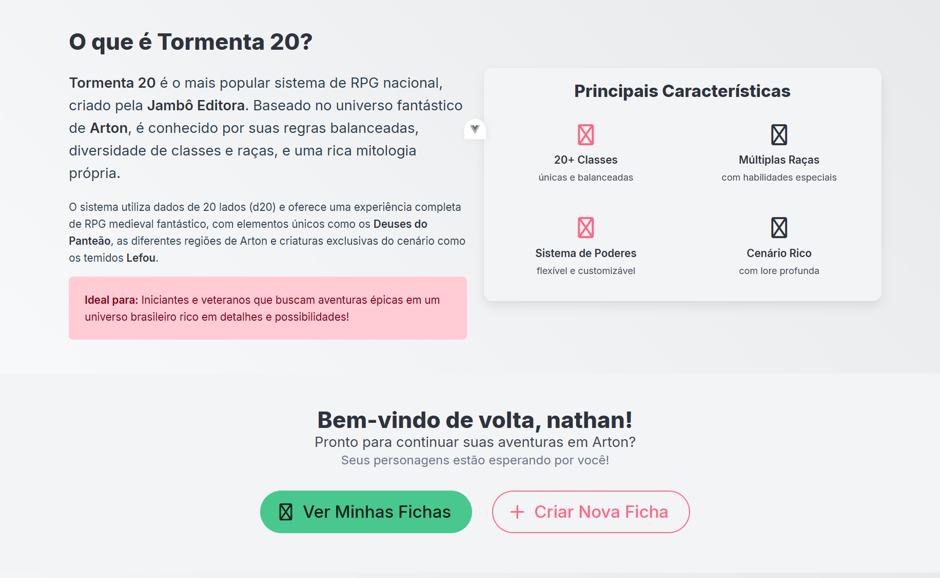
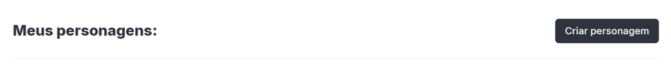
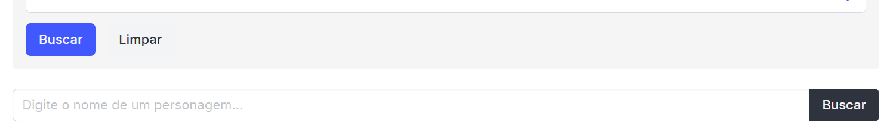
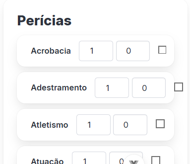

# Relatório de Avaliação Heurística - Arkheion

## 1. Introdução

### 1.1 Objetivo

Este relatório apresenta os resultados da avaliação heurística, utilizando a técnica Eureca, da interface do sistema Arkheion, identificando problemas de usabilidade e propondo melhorias.

### 1.2 Metodologia

A avaliação foi realizada com base nos passos da técnica Eureca (Matos et al., 2025), usando como instrumento de apoio a lista de diretrízes Eureca (Matos et al., 2024)

### 1.3 Escopo da Avaliação

- **Sistema:** Arkheion
- **Data da avaliação:** 26/10/25
- **Avaliador(a):** Nathan Cavalcante de Lima
- **Versão avaliada:** v1 (API) / 0.0.0 (Frontend) - Em desenvolvimento

## 2. Resumo Executivo

### 2.1 Problemas Identificados por Tela

- **Dashboard:** 5 problemas
- **Personagens:** 5 problemas
- **Criar Ficha:** 5 problemas
- **Ficha:** 5 problemas
- **Homebrew:** 5 problemas

### 2.2 Distribuição por Gravidade

- **Gravidade Alta:** 11 problemas
- **Gravidade Média:** 13 problemas
- **Gravidade Baixa:** 1 problema

## 3. Problemas Identificados por Tela

### 3.1 Dashboard

#### Problema T1-001

| Campo                    | Informação                                                                                                                                                                    |
| ------------------------ | ----------------------------------------------------------------------------------------------------------------------------------------------------------------------------- |
| **ID**                   | T1-001                                                                                                                                                                        |
| **Descrição**            | O nome do sistema "Arkheion" no canto superior esquerdo é apresentado como texto simples, idêntico aos outros links de navegação. Não há um logotipo distinto para o sistema. |
| **Print**                |                                                                                                                                      |
| **Heurística Violada**   | FM15 - Identidade visual. O aplicativo deve conter uma identidade visual (marca gráfica) para construir e reforçar a marca do produto.                                        |
| **Sugestão de Melhoria** | Criar uma marca gráfica (logotipo) para o "Arkheion" e posicioná-la no canto superior esquerdo, substituindo o texto simples.                                                 |
| **Gravidade**            | Baixa                                                                                                                                                                         |
| **Esforço**              | Leve                                                                                                                                                                          |

#### Problema T1-002

| Campo                    | Informação                                                                                                                                                                                                                 |
| ------------------------ | -------------------------------------------------------------------------------------------------------------------------------------------------------------------------------------------------------------------------- |
| **ID**                   | T1-002                                                                                                                                                                                                                     |
| **Descrição**            | Botões do cabeçalho do site somem ao diminuir o tamanho da tela                                                                                                                                                            |
| **Print**                |                                                                                                                                                                                   |
| **Heurística Violada**   | PD3 - Responsividade. A interface deve "responder ao tamanho da tela e adequar a quantidade de informação, dependendo do dispositivo" . O desaparecimento dos botões é uma falha nessa adequação.                          |
| **Sugestão de Melhoria** | Implementar um "menu hambúrguer" (ícone de três linhas) em telas menores. Este menu deve agrupar os links de navegação (Homebrew, Personagens) e o link de perfil (nathan cavalcante) para garantir que fiquem acessíveis. |
| **Gravidade**            | Alta                                                                                                                                                                                                                       |
| **Esforço**              | Moderado                                                                                                                                                                                                                   |

#### Problema T1-003

| Campo                    | Informação                                                                                                                                                                                                                                       |
| ------------------------ | ------------------------------------------------------------------------------------------------------------------------------------------------------------------------------------------------------------------------------------------------ |
| **ID**                   | T1-003                                                                                                                                                                                                                                           |
| **Descrição**            | Na seção "Principais Características", os ícones usados para "20+ Classes", "Múltiplas Raças", "Sistema de Poderes" e "Cenário Rico" são ícones genéricos (placeholder) e inadequados.                                                           |
| **Print**                |                                                                                                                                                                                                         |
| **Heurística Violada**   | CO4 - Metáfora e FM5 - Consistência externa. O uso de ícones que não representam o mundo real e quebram convenções universais.                                                                                                                   |
| **Sugestão de Melhoria** | Substituir os ícones placeholder por metáforas que representem visualmente cada característica. (Ex: um ícone de "espada/escudo" para Classes; "silhuetas de personagens" para Raças; "mão com magia" para Poderes; "mapa antigo" para Cenário). |
| **Gravidade**            | Alta                                                                                                                                                                                                                                             |
| **Esforço**              | Leve                                                                                                                                                                                                                                             |

#### Problema T1-004

| Campo                    | Informação                                                                                                                                                                                                                            |
| ------------------------ | ------------------------------------------------------------------------------------------------------------------------------------------------------------------------------------------------------------------------------------- |
| **ID**                   | T1-004                                                                                                                                                                                                                                |
| **Descrição**            | A barra de navegação principal ("Arkheion", "Homebrew", "Personagens") não fornece nenhuma indicação visual de qual página ou seção está ativa no momento. O usuário não sabe onde está na arquitetura do site.                       |
| **Print**                |                                                                                                                                                                                              |
| **Heurística Violada**   | AC7 - Contextualização de página. A diretriz exige "Deixar evidentes informações contextuais sobre a página atual... para auxiliar usuários a entenderem onde estão no site ou aplicativo" .                                          |
| **Sugestão de Melhoria** | Implementar um estado "ativo" para o link da página atual. Isso pode ser feito alterando a cor de fundo, o peso da fonte (bold) ou adicionando um sublinhado ao link da página em que o usuário se encontra (neste caso, "Arkheion"). |
| **Gravidade**            | Alta                                                                                                                                                                                                                                  |
| **Esforço**              | Leve                                                                                                                                                                                                                                  |

#### Problema T1-005

| Campo                    | Informação                                                                                                                                                                                                                                                                             |
| ------------------------ | -------------------------------------------------------------------------------------------------------------------------------------------------------------------------------------------------------------------------------------------------------------------------------------- |
| **ID**                   | T1-005                                                                                                                                                                                                                                                                                 |
| **Descrição**            | A hierarquia da informação na tela é ineficiente para um usuário logado. A seção "O que é Tormenta 20?" (informação genérica) é apresentada acima das ações principais ("Ver Minhas Fichas"), forçando o usuário recorrente a rolar a tela para acessar suas funções mais importantes. |
| **Print**                |                                                                                                                                                                                                                                               |
| **Heurística Violada**   | FM2 - Hierarquia da informação. A diretriz orienta a distribuir a informação da mais relevante para a menos relevante . Para um usuário logado, as ações são mais relevantes que a descrição do sistema.                                                                               |
| **Sugestão de Melhoria** | Inverter a ordem das seções: posicionar a seção "Bem-vindo de volta, nathan!" (com os botões de ação) acima da seção "O que é Tormenta 20?".                                                                                                                                           |
| **Gravidade**            | Média                                                                                                                                                                                                                                                                                  |
| **Esforço**              | Leve                                                                                                                                                                                                                                                                                   |

### 3.2 Personagens

#### Problema T2-001

| Campo                    | Informação                                                                                                                                                                                                                                                         |
| ------------------------ | ------------------------------------------------------------------------------------------------------------------------------------------------------------------------------------------------------------------------------------------------------------------ |
| **ID**                   | T2-001                                                                                                                                                                                                                                                             |
| **Descrição**            | A página utiliza pelo menos 4 estilos de botões diferentes sem uma lógica clara: "Criar personagem" (cinza escuro preenchido), "Mostrar busca avançada" (cinza claro vazado), "Buscar" (cinza escuro preenchido, pequeno) e "Excluir ficha" (vermelho preenchido). |
| **Print**                |                                                                                                                                                                                                                           |
| **Heurística Violada**   | FM6 - Consistência interna. Falha em manter consistência de padrões visuais e de comando dentro do mesmo aplicativo .                                                                                                                                              |
| **Sugestão de Melhoria** | Definir um sistema de design para botões (ex: Primário, Secundário, Destrutivo) e aplicá-los de forma consistente. Por exemplo, "Criar" e "Acessar" (Primário), "Busca Avançada" (Secundário), "Excluir" (Destrutivo).                                             |
| **Gravidade**            | Média                                                                                                                                                                                                                                                              |
| **Esforço**              | Moderado                                                                                                                                                                                                                                                           |

#### Problema T2-002

| Campo                    | Informação                                                                                                                                                                                                                                        |
| ------------------------ | ------------------------------------------------------------------------------------------------------------------------------------------------------------------------------------------------------------------------------------------------- |
| **ID**                   | T2-002                                                                                                                                                                                                                                            |
| **Descrição**            | A ação de "Criar" é representada por dois botões visualmente opostos. No Dashboard, é o botão "+ Criar Nova Ficha" (vazado, com borda vermelha e ícone). Na tela de Personagens, é o botão "Criar personagem" (sólido, cinza escuro e sem ícone). |
| **Print**                |                                                                                                                                                                                                          |
| **Heurística Violada**   | FM6 - Consistência interna. A mesma ação de "Criar" não possui um padrão visual consistente, forçando o usuário a reaprender a função do botão em cada tela .                                                                                     |
| **Sugestão de Melhoria** | Definir um estilo único para a ação "Criar" (ex: botão primário, talvez verde) e aplicá-lo em todas as telas, mudando apenas o rótulo (ex: "Criar Personagem", "Criar Ficha").                                                                    |
| **Gravidade**            | Média                                                                                                                                                                                                                                             |
| **Esforço**              | Leve                                                                                                                                                                                                                                              |

#### Problema T2-003

| Campo                    | Informação                                                                                                                                                                                                                                     |
| ------------------------ | ---------------------------------------------------------------------------------------------------------------------------------------------------------------------------------------------------------------------------------------------- |
| **ID**                   | T2-003                                                                                                                                                                                                                                         |
| **Descrição**            | A interface exibe dois campos de busca por nome e dois botões "Buscar" simultaneamente: um no formulário de busca avançada ("Nome do Personagem") e outro logo abaixo ("Digite o nome de um personagem...").                                   |
| **Print**                |                                                                                                                                                                                                       |
| **Heurística Violada**   | PU4 - Redução do esforço cognitivo. A diretriz visa poupar esforços cognitivos do usuário, como "pedir o mesmo dado ao usuário diversas vezes na mesma interação" . Isso cria confusão, pois o usuário não sabe qual campo de busca deve usar. |
| **Sugestão de Melhoria** | Ao "Mostrar busca avançada", o campo de busca simples (inferior) deve ser ocultado ou seu valor deve ser sincronizado com o campo "Nome do Personagem" do formulário.                                                                          |
| **Gravidade**            | Alta                                                                                                                                                                                                                                           |
| **Esforço**              | Moderado                                                                                                                                                                                                                                       |

#### Problema T2-004

| Campo                    | Informação                                                                                                                                                                                                                             |
| ------------------------ | -------------------------------------------------------------------------------------------------------------------------------------------------------------------------------------------------------------------------------------- |
| **ID**                   | T2-004                                                                                                                                                                                                                                 |
| **Descrição**            | No card do personagem "haru", a ação destrutiva ("Excluir ficha") possui um destaque visual (cor vermelha sólida) muito maior do que a ação primária e mais comum ("Acessar ficha"), que está em cinza escuro.                         |
| **Print**                |                                                                                                                                                                                               |
| **Heurística Violada**   | FM2 - Hierarquia da informação. A hierarquia visual está invertida, pois o contraste da ação mais perigosa é maior que o da ação principal . Também viola a AF9 - Prevenção de erros, pois destaca uma ação que leva à perda de dados. |
| **Sugestão de Melhoria** | Inverter o destaque: "Acessar ficha" deve ser o botão primário (ex: preenchido com uma cor de destaque positiva) e "Excluir ficha" deve ser um botão secundário (ex: vazado com borda vermelha, ou apenas um link de texto vermelho).  |
| **Gravidade**            | Alta                                                                                                                                                                                                                                   |
| **Esforço**              | Leve                                                                                                                                                                                                                                   |

#### Problema T2-005

| Campo                    | Informação                                                                                                                                                                                                                                                                             |
| ------------------------ | -------------------------------------------------------------------------------------------------------------------------------------------------------------------------------------------------------------------------------------------------------------------------------------- |
| **ID**                   | T2-005                                                                                                                                                                                                                                                                                 |
| **Descrição**            | Na tela de "Busca Avançada", a ação de "Buscar" é representada por dois botões visualmente distintos e conflitantes: um botão azul e sólido ("Buscar") associado ao formulário avançado, e um botão cinza escuro e sólido ("Buscar") associado à busca simples, que permanece visível. |
| **Print**                |                                                                                                                                                                                                                                               |
| **Heurística Violada**   | FM6 - Consistência interna. A diretriz exige que comandos e padrões visuais sejam consistentes . Apresentar a mesma ação ("Buscar") com dois estilos diferentes na mesma tela cria confusão.                                                                                           |
| **Sugestão de Melhoria** | Unificar o estilo do botão "Buscar". Idealmente, a busca avançada deveria usar o mesmo componente de busca da busca simples, apenas adicionando os novos filtros (conforme T2-003). Se mantiver os dois, os botões "Buscar" devem ter o mesmo estilo.                                  |
| **Gravidade**            | Média                                                                                                                                                                                                                                                                                  |
| **Esforço**              | Leve                                                                                                                                                                                                                                                                                   |

### 3.3 Criar Ficha

#### Problema T3-001

| Campo                    | Informação                                                                                                                                                                                                              |
| ------------------------ | ----------------------------------------------------------------------------------------------------------------------------------------------------------------------------------------------------------------------- |
| **ID**                   | T3-001                                                                                                                                                                                                                  |
| **Descrição**            | O botão "Cancelar" (uma ação segura e secundária) é apresentado em vermelho/vinho sólido. Esta cor é universalmente associada a ações destrutivas (como "Excluir"), dando a ele um destaque indevido e perigoso.        |
| **Print**                |                                                                                                                                                                                |
| **Heurística Violada**   | FM2 - Hierarquia da informação e AF9 - Prevenção de erros . A hierarquia visual está invertida, destacando a ação errada, e a cor falha em prevenir erros (o usuário pode associar a cor vermelha a uma ação perigosa). |
| **Sugestão de Melhoria** | Alterar o botão "Cancelar" para um estilo secundário (ex: vazado, com borda cinza). A cor vermelha deve ser reservada apenas para ações destrutivas.                                                                    |
| **Gravidade**            | Alta                                                                                                                                                                                                                    |
| **Esforço**              | Leve                                                                                                                                                                                                                    |

#### Problema T3-002

| Campo                    | Informação                                                                                                                                                                                 |
| ------------------------ | ------------------------------------------------------------------------------------------------------------------------------------------------------------------------------------------ |
| **ID**                   | T3-002                                                                                                                                                                                     |
| **Descrição**            | O modal de "Criar Ficha" é excessivamente longo, exigindo que o usuário role a tela para ver todos os campos (como "Atributos"). Modais são destinados a tarefas curtas e focadas.         |
| **Print**                |                                                                                                                                                    |
| **Heurística Violada**   | PU4 - Redução do esforço cognitivo . Forçar o usuário a rolar e lembrar de campos "escondidos" dentro de um modal aumenta a carga cognitiva. (Também viola PD4 - Densidade Informacional). |
| **Sugestão de Melhoria** | Implementar um "stepper" (passo-a-passo) dentro do modal (ex: Passo 1: Informações Básicas, Passo 2: Atributos) ou mover a criação de ficha para uma página dedicada.                      |
| **Gravidade**            | Média                                                                                                                                                                                      |
| **Esforço**              | Moderado                                                                                                                                                                                   |

#### Problema T3-003

| Campo                    | Informação                                                                                                                                                                                                                                                               |
| ------------------------ | ------------------------------------------------------------------------------------------------------------------------------------------------------------------------------------------------------------------------------------------------------------------------ |
| **ID**                   | T3-003                                                                                                                                                                                                                                                                   |
| **Descrição**            | Os botões do modal ("Cancelar" em vinho sólido, "Criar Ficha" em cinza sólido desabilitado) são inconsistentes com os botões de criação vistos em outras telas (ex: "+ Criar Nova Ficha" vermelho-vazado no Dashboard e "Criar personagem" cinza-escuro em Personagens). |
| **Print**                |                                                                                                                                                                                                                                 |
| **Heurística Violada**   | FM6 - Consistência interna. O sistema falha em "Manter consistência de padrões visuais e de comando dentro do mesmo aplicativo" , aumentando a carga cognitiva do usuário.                                                                                               |
| **Sugestão de Melhoria** | Aplicar o sistema de design de botões (Primário, Secundário) de forma consistente. O botão "Criar Ficha" deve ter o estilo "Primário" (quando habilitado) e "Cancelar" o estilo "Secundário".                                                                            |
| **Gravidade**            | Média                                                                                                                                                                                                                                                                    |
| **Esforço**              | Moderado                                                                                                                                                                                                                                                                 |

#### Problema T3-004

| Campo                    | Informação                                                                                                                                                                                                                                                                                      |
| ------------------------ | ----------------------------------------------------------------------------------------------------------------------------------------------------------------------------------------------------------------------------------------------------------------------------------------------- |
| **ID**                   | T3-004                                                                                                                                                                                                                                                                                          |
| **Descrição**            | A hierarquia dos botões na versão móvel está invertida. A ação secundária e de desistência ("Cancelar") está posicionada acima da ação primária ("Criar Ficha"). Além disso, a ação "Cancelar" tem um destaque de cor (vermelho) muito mais forte do que a ação principal (cinza/desabilitado). |
| **Print**                |                                                                                                                                                                                                                                                        |
| **Heurística Violada**   | FM2 - Hierarquia da informação. A ordem de leitura (de cima para baixo) e o destaque visual devem priorizar a ação principal . A ação "Cancelar" nunca deve ser a mais destacada                                                                                                                |
| **Sugestão de Melhoria** | Inverter a ordem dos botões, colocando "Criar Ficha" no topo. Mudar "Cancelar" para um estilo secundário (ex: vazado) e dar o destaque (cor) para o botão "Criar Ficha".                                                                                                                        |
| **Gravidade**            | Alta                                                                                                                                                                                                                                                                                            |
| **Esforço**              | Leve                                                                                                                                                                                                                                                                                            |

#### Problema T3-005

| Campo                    | Informação                                                                                                                                                                                                  |
| ------------------------ | ----------------------------------------------------------------------------------------------------------------------------------------------------------------------------------------------------------- |
| **ID**                   | T3-005                                                                                                                                                                                                      |
| **Descrição**            | O modal é muito longo para a tela, como evidenciado pela barra de rolagem visível. Forçar o usuário a rolar dentro de um modal em um dispositivo móvel é uma má prática e aumenta a complexidade da tarefa. |
| **Print**                |                                                                                                                                                                    |
| **Heurística Violada**   | PD3 - Responsividade e PD4 - Densidade Informacional . A interface não se adequa corretamente, "miniaturizando" um componente de desktop em vez de adaptá-lo para um fluxo móvel (ex: uma página dedicada). |
| **Sugestão de Melhoria** | Substituir o modal por uma página de "Criar Ficha" dedicada em dispositivos móveis, ou usar um componente "stepper" (passo-a-passo) para dividir a tarefa.                                                  |
| **Gravidade**            | Média                                                                                                                                                                                                       |
| **Esforço**              | Grande                                                                                                                                                                                                      |

### 3.4 Ficha

#### Problema T4-001

| Campo                    | Informação                                                                                                                                                                                                                                           |
| ------------------------ | ---------------------------------------------------------------------------------------------------------------------------------------------------------------------------------------------------------------------------------------------------- |
| **ID**                   | T4-001                                                                                                                                                                                                                                               |
| **Descrição**            | Na lista de "Perícias", os elementos de cada linha (rótulo, campos numéricos, checkbox) estão desalinhados, com o rótulo à esquerda, números ao centro e checkbox à direita. Isso quebra o fluxo de leitura e dificulta a varredura visual da lista. |
| **Print**                |                                                                                                                                                                                                             |
| **Heurística Violada**   | FM9 - Alinhamento. A diretriz exige "Manter os elementos da página alinhados, para dar ordem de leitura" . O alinhamento misto quebra essa ordem.                                                                                                    |
| **Sugestão de Melhoria** | Reformatar a lista de perícias em colunas claras (ex: Rótulo à esquerda, Bônus Total alinhado à direita, Checkbox alinhado à direita), para que o olho possa seguir uma linha reta.                                                                  |
| **Gravidade**            | Média                                                                                                                                                                                                                                                |
| **Esforço**              | Moderado                                                                                                                                                                                                                                             |

#### Problema T4-002

| Campo                    | Informação                                                                                                                                                                                                                                                                                    |
| ------------------------ | --------------------------------------------------------------------------------------------------------------------------------------------------------------------------------------------------------------------------------------------------------------------------------------------- |
| **ID**                   | T4-002                                                                                                                                                                                                                                                                                        |
| **Descrição**            | Na seção "Perícias", a lista de perícias (ex: "Acrobacia") apresenta três colunas interativas (um campo numérico, outro campo numérico e um checkbox) sem nenhum rótulo ou cabeçalho que explique o que cada coluna representa. O usuário não sabe o que os números ou o checkbox significam. |
| **Print**                |                                                                                                                                                                                                                                                      |
| **Heurística Violada**   | CO3 - Affordance - dicas e FM1 - Visibilidade. A interface não oferece "dicas" (rótulos) para a compreensão do uso do ambiente e não mantém visíveis as informações sobre como proceder e interagir com o componente, minimizando o esforço cognitivo.                                        |
| **Sugestão de Melhoria** | Adicionar um cabeçalho de colunas claro acima da lista de perícias (ex: "Total", "Bônus", "Treinado?") para que o usuário entenda o propósito de cada campo de entrada e do checkbox.                                                                                                         |
| **Gravidade**            | Alta                                                                                                                                                                                                                                                                                          |
| **Esforço**              | Moderado                                                                                                                                                                                                                                                                                      |

#### Problema T4-003

| Campo                    | Informação                                                                                                                                                                                                                                                                                                 |
| ------------------------ | ---------------------------------------------------------------------------------------------------------------------------------------------------------------------------------------------------------------------------------------------------------------------------------------------------------- |
| **ID**                   | T4-003                                                                                                                                                                                                                                                                                                     |
| **Descrição**            | As três colunas principais que compõem o layout da ficha têm alturas drasticamente diferentes. A coluna central (Perícias) é significativamente mais longa que a coluna da esquerda (Atributos, etc.) e a da direita (Ataques), resultando em grandes áreas de espaço em branco e um layout desbalanceado. |
| **Print**                |                                                                                                                                                                                                                                                                            |
| **Heurística Violada**   | FM9 - Alinhamento. A diretriz exige "Manter os elementos da página alinhados, para dar ordem de leitura". O desalinhamento severo da base das colunas quebra a estrutura do grid, a ordem visual e faz a página parecer desorganizada.                                                                     |
| **Sugestão de Melhoria** | Reorganizar os componentes (blocos) da ficha, distribuindo-os entre as três colunas de forma que tenham alturas finais mais próximas, criando um layout visualmente balanceado.                                                                                                                            |
| **Gravidade**            | Média                                                                                                                                                                                                                                                                                                      |
| **Esforço**              | Grande                                                                                                                                                                                                                                                                                                     |

#### Problema T4-004

| Campo                    | Informação                                                                                                                                                                                                                                                                                                                            |
| ------------------------ | ------------------------------------------------------------------------------------------------------------------------------------------------------------------------------------------------------------------------------------------------------------------------------------------------------------------------------------- |
| **ID**                   | T4-004                                                                                                                                                                                                                                                                                                                                |
| **Descrição**            | O layout principal da ficha é mais largo que o contêiner (viewport) definido pelo cabeçalho. As colunas de conteúdo (Resistências, Perícias, Ataques) "vazam" para a direita, ultrapassando o alinhamento do cabeçalho e forçando o usuário a rolar a tela horizontalmente para ver todo o conteúdo, o que quebra o layout da página. |
| **Print**                |                                                                                                                                                                                                                                                                                                       |
| **Heurística Violada**   | PD3 - Responsividade. A interface falha em "responder ao tamanho da tela e adequar a quantidade de informação, dependendo do dispositivo" . Também viola FM9 - Alinhamento , por quebrar a grade e a ordem de leitura.                                                                                                                |
| **Sugestão de Melhoria** | Reestruturar o layout da ficha para que as colunas se encaixem no viewport. Isso pode exigir a movimentação de seções (ex: "Perícias") para uma aba própria ("Perícias") ou para baixo da coluna de "Atributos".                                                                                                                      |
| **Gravidade**            | Alta                                                                                                                                                                                                                                                                                                                                  |
| **Esforço**              | Grande                                                                                                                                                                                                                                                                                                                                |

#### Problema T4-005

| Campo                    | Informação                                                                                                                                                                                                                                                                                                                                         |
| ------------------------ | -------------------------------------------------------------------------------------------------------------------------------------------------------------------------------------------------------------------------------------------------------------------------------------------------------------------------------------------------- |
| **ID**                   | T4-005                                                                                                                                                                                                                                                                                                                                             |
| **Descrição**            | A interface não possui diferenciação visual entre campos numéricos que são editáveis (como os bônus de perícias/resistências) e campos que são calculados ou não-editáveis (como os valores de Atributos, CA e CD). Todos são apresentados em caixas de input idênticas, dando uma "dica" (affordance) falsa de que podem ser clicados e editados. |
| **Print**                |                                                                                                                                                                                                                                                                                                           |
| **Heurística Violada**   | CO3 - Affordance - dicas. A interface falha em "Oferecer dicas para ajudar a compreensão do uso do ambiente" . Ao fazer campos não-editáveis parecerem inputs, ela oferece uma dica visual incorreta, causando confusão.                                                                                                                           |
| **Sugestão de Melhoria** | Aplicar um estilo visual distinto para campos não-editáveis (calculados). Por exemplo, remover a borda da caixa e exibir apenas o número em negrito, ou usar um fundo cinza (estilo "disabled") para a caixa de input.                                                                                                                             |
| **Gravidade**            | Média                                                                                                                                                                                                                                                                                                                                              |
| **Esforço**              | Moderado                                                                                                                                                                                                                                                                                                                                           |

### 3.5 Homebrew

#### Problema T5-001

| Campo                    | Informação                                                                                                                                                                                                             |
| ------------------------ | ---------------------------------------------------------------------------------------------------------------------------------------------------------------------------------------------------------------------- |
| **ID**                   | T5-001                                                                                                                                                                                                                 |
| **Descrição**            | Na tela "Criar Conteúdo Homebrew", os ícones para "Raças", "Divindades", "Classes" e "Habilidades" são os mesmos ícones placeholder ("X" e "janela") vistos no Dashboard, não tendo relação metafórica com o conteúdo. |
| **Print**                |                                                                                                                                                                               |
| **Heurística Violada**   | CO4 - Metáfora e FM5 - Consistência externa . O uso de ícones inadequados que quebram convenções universais falha em comunicar a função.                                                                               |
| **Sugestão de Melhoria** | Substituir os ícones placeholder por metáforas que representem visualmente cada categoria (ex: um ícone de "pergaminho" para Origens, "escudo" para Classes, etc.).                                                    |
| **Gravidade**            | Alta                                                                                                                                                                                                                   |
| **Esforço**              | Leve                                                                                                                                                                                                                   |

#### Problema T5-002

| Campo                    | Informação                                                                                                                                                                                                                                                                                  |
| ------------------------ | ------------------------------------------------------------------------------------------------------------------------------------------------------------------------------------------------------------------------------------------------------------------------------------------- |
| **ID**                   | T5-002                                                                                                                                                                                                                                                                                      |
| **Descrição**            | Na tela "Criar Conteúdo Homebrew", os botões de criação (ex: "+ Criar Raça") usam um estilo novo (vazado com borda rosa). Este é mais um estilo de botão inconsistente, que não corresponde aos botões de criação do Dashboard (vazado vermelho) nem da tela de Personagens (sólido cinza). |
| **Print**                |                                                                                                                                                                                                                                                    |
| **Heurística Violada**   | FM6 - Consistência interna. A falta de um padrão visual consistente para botões de "Criar" em todo o aplicativo aumenta a carga cognitiva do usuário .                                                                                                                                      |
| **Sugestão de Melhoria** | Definir um estilo único de "Botão Primário" (ex: sólido verde) e "Botão Secundário" (ex: vazado) e usá-los consistentemente em todo o sistema.                                                                                                                                              |
| **Gravidade**            | Média                                                                                                                                                                                                                                                                                       |
| **Esforço**              | Moderado                                                                                                                                                                                                                                                                                    |

#### Problema T5-003

| Campo                    | Informação                                                                                                                                                                                                         |
| ------------------------ | ------------------------------------------------------------------------------------------------------------------------------------------------------------------------------------------------------------------ |
| **ID**                   | T5-003                                                                                                                                                                                                             |
| **Descrição**            | As ações nos cards de "Meus Homebrews" ("Editar" e "Excluir" como text-links) são visualmente inconsistentes com as ações nos cards de "Meus Personagens" ("Acessar ficha" e "Excluir ficha" como botões sólidos). |
| **Print**                |                                                                                                                                                                           |
| **Heurística Violada**   | FM6 - Consistência interna. A diretriz exige "Manter consistência de padrões visuais e de comando" . O usuário não sabe como as ações em cards serão apresentadas.                                                 |
| **Sugestão de Melhoria** | Padronizar o estilo das ações em todos os cards do sistema. Por exemplo, a ação primária ("Editar" / "Acessar") deve ser um botão, e a destrutiva ("Excluir") um botão secundário ou link.                         |
| **Gravidade**            | Média                                                                                                                                                                                                              |
| **Esforço**              | Moderado                                                                                                                                                                                                           |

#### Problema T5-004

| Campo                    | Informação                                                                                                                                                                                                      |
| ------------------------ | --------------------------------------------------------------------------------------------------------------------------------------------------------------------------------------------------------------- |
| **ID**                   | T5-004                                                                                                                                                                                                          |
| **Descrição**            | A ação de "Excluir" na tela "Meus Homebrews" (um link de texto vermelho) é inconsistente com a ação de "Excluir" na tela de Personagens (um botão vermelho sólido).                                             |
| **Print**                |                                                                                                                                                                        |
| **Heurística Violada**   | FM6 - Consistência interna. A diretriz exige "Manter consistência de padrões visuais e de comando" . A mesma ação destrutiva é apresentada de formas completamente diferentes em componentes de card similares. |
| **Sugestão de Melhoria** | Padronizar o estilo da ação "Excluir" em todos os cards do sistema (seja como botão secundário ou como link de texto vermelho, mas de forma consistente).                                                       |
| **Gravidade**            | Média                                                                                                                                                                                                           |
| **Esforço**              | Leve                                                                                                                                                                                                            |

#### Problema T5-005

| Campo                    | Informação                                                                                                                                                                                                                                                           |
| ------------------------ | -------------------------------------------------------------------------------------------------------------------------------------------------------------------------------------------------------------------------------------------------------------------- |
| **ID**                   | T5-005                                                                                                                                                                                                                                                               |
| **Descrição**            | A barra de navegação principal (cabeçalho) não é responsiva. Em vez de se agrupar em um menu "hambúrguer", os links de navegação ("Homebrew", "Personagens") e o menu de usuário ("nathan cavalcante") simplesmente desaparecem, deixando o usuário preso na página. |
| **Print**                |                                                                                                                                                                                                                             |
| **Heurística Violada**   | PD3 - Responsividade e PD2 - Adequação a padrões . A interface falha em se adequar ao dispositivo móvel e quebra um padrão universal (o menu "hambúrguer").                                                                                                          |
| **Sugestão de Melhoria** | Implementar um menu "hambúrguer" que, ao ser clicado, exiba os links de navegação e o menu do usuário.                                                                                                                                                               |
| **Gravidade**            | Alta                                                                                                                                                                                                                                                                 |
| **Esforço**              | Moderado                                                                                                                                                                                                                                                             |

### Legenda de Gravidade:

- **Alta:** Problema que impede ou dificulta significativamente a realização de tarefas
- **Média:** Problema que causa frustração ou demora na realização de tarefas
- **Baixa:** Problema menor que não afeta significativamente a usabilidade

### Legenda de Esforço:

- **Leve:** Alteração simples, requer poucas horas de desenvolvimento
- **Moderado:** Alteração de complexidade média, requer alguns dias de desenvolvimento
- **Grande:** Alteração complexa, requer semanas de desenvolvimento ou reestruturação

---

**Data do relatório:** 26 de outubro de 2025
**Versão do documento:** 1.0
