# Relatório de Avaliação Heurística - Arkheion

## 1. Introdução

### 1.1 Objetivo

Este relatório apresenta os resultados da avaliação heurística consolidada, utilizando a técnica Eureca, da interface do sistema Arkheion, identificando problemas de usabilidade e propondo melhorias.

### 1.2 Metodologia

A avaliação foi realizada com base nos passos da técnica Eureca (Matos et al., 2025), usando como instrumento de apoio a lista de diretrízes Eureca (Matos et al., 2024). O relatório consolida as avaliações de dois especialistas independentes.

### 1.3 Escopo da Avaliação

- **Sistema:** Arkheion
- **Data da avaliação:** 26/10/25
- **Avaliadores:** Nathan Cavalcante de Lima, Lucas Pinheiro da Costa e Agnes Gonçalves Barbosa
- **Versão avaliada:** v1 (API) / 0.0.0 (Frontend) - Em desenvolvimento

## 2. Resumo Executivo

### 2.1 Problemas Identificados por Tela

- **Dashboard:** 7 problemas
- **Personagens:** 7 problemas
- **Criar Ficha:** 6 problemas
- **Ficha:** 9 problemas
- **Homebrew:** 6 problemas

### 2.2 Distribuição por Gravidade

- **Gravidade Alta:** 15 problemas
- **Gravidade Média:** 17 problemas
- **Gravidade Baixa:** 3 problemas

**Total:** 35 problemas identificados

## 3. Problemas Identificados por Tela

_Os problemas estão organizados por tela e ordenados por gravidade (Alta, Média, Baixa)_

### 3.1 Dashboard

#### Problema T1-001

| Campo                    | Informação                                                                                                                                                                                                                                                                                                                                                |
| ------------------------ | --------------------------------------------------------------------------------------------------------------------------------------------------------------------------------------------------------------------------------------------------------------------------------------------------------------------------------------------------------- |
| **ID**                   | T1-001                                                                                                                                                                                                                                                                                                                                                    |
| **Descrição**            | A identidade visual (marca gráfica, cores, tipografia) do banner principal não está em consonância com o restante da interface. O estilo "medieval/fantasia" do título "Arkheion" não é replicado no sistema, gerando inconsistência visual. O nome do sistema no canto superior esquerdo também é apresentado como texto simples, sem logotipo distinto. |
| **Print**                |                                                                                                                                                                                                                                                                                                                   |
| **Heurística Violada**   | FM15 - Identidade visual                                                                                                                                                                                                                                                                                                                                  |
| **Sugestão de Melhoria** | Criar uma marca gráfica (logotipo) para o "Arkheion" e aplicar a paleta de cores, tipografia e elementos gráficos que remetam ao universo de fantasia (Tormenta 20) de forma consistente em toda a página.                                                                                                                                                |
| **Gravidade**            | Alta                                                                                                                                                                                                                                                                                                                                                      |
| **Esforço**              | Moderado                                                                                                                                                                                                                                                                                                                                                  |

#### Problema T1-002

| Campo                    | Informação                                                                                                                                                                                             |
| ------------------------ | ------------------------------------------------------------------------------------------------------------------------------------------------------------------------------------------------------ |
| **ID**                   | T1-002                                                                                                                                                                                                 |
| **Descrição**            | Botões do cabeçalho do site somem ao diminuir o tamanho da tela. A barra de navegação não é responsiva, impossibilitando o acesso às funcionalidades principais em dispositivos móveis.                |
| **Print**                | 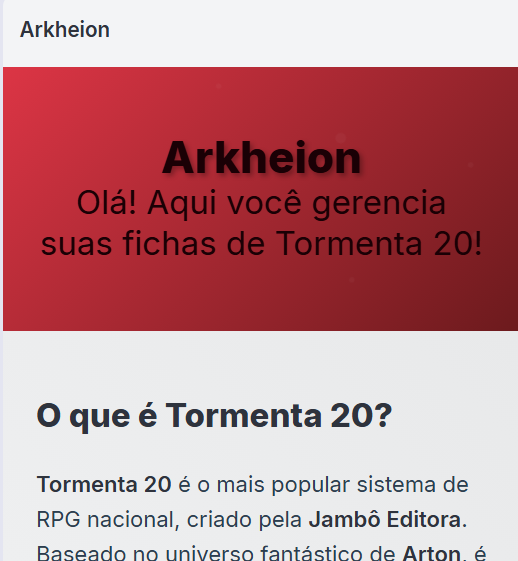                                                                                                                                                              |
| **Heurística Violada**   | PD3 - Responsividade                                                                                                                                                                                   |
| **Sugestão de Melhoria** | Implementar um "menu hambúrguer" (ícone de três linhas) em telas menores. Este menu deve agrupar os links de navegação (Homebrew, Personagens) e o link de perfil para garantir que fiquem acessíveis. |
| **Gravidade**            | Alta                                                                                                                                                                                                   |
| **Esforço**              | Moderado                                                                                                                                                                                               |

#### Problema T1-003

| Campo                    | Informação                                                                                                                                                                                                                                               |
| ------------------------ | -------------------------------------------------------------------------------------------------------------------------------------------------------------------------------------------------------------------------------------------------------- |
| **ID**                   | T1-003                                                                                                                                                                                                                                                   |
| **Descrição**            | Na seção "Principais Características", os ícones usados para "20+ Classes", "Múltiplas Raças", "Sistema de Poderes" e "Cenário Rico" são ícones genéricos (placeholder) e inadequados, não representando visualmente o conteúdo que deveriam simbolizar. |
| **Print**                | 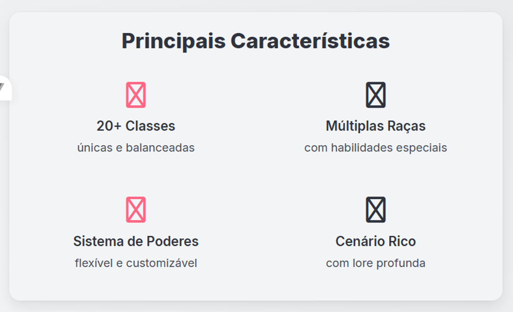                                                                                                                                                                                                                |
| **Heurística Violada**   | CO4 - Metáfora e FM5 - Consistência externa                                                                                                                                                                                                              |
| **Sugestão de Melhoria** | Substituir os ícones placeholder por metáforas que representem visualmente cada característica (Ex: um ícone de "espada/escudo" para Classes; "silhuetas de personagens" para Raças; "mão com magia" para Poderes; "mapa antigo" para Cenário).          |
| **Gravidade**            | Alta                                                                                                                                                                                                                                                     |
| **Esforço**              | Leve                                                                                                                                                                                                                                                     |

#### Problema T1-004

| Campo                    | Informação                                                                                                                                                                                                   |
| ------------------------ | ------------------------------------------------------------------------------------------------------------------------------------------------------------------------------------------------------------ |
| **ID**                   | T1-004                                                                                                                                                                                                       |
| **Descrição**            | A barra de navegação principal não fornece nenhuma indicação visual de qual página ou seção está ativa no momento. O usuário não sabe onde está na arquitetura do site.                                      |
| **Print**                | 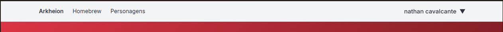                                                                                                                                                                    |
| **Heurística Violada**   | AC7 - Contextualização de página                                                                                                                                                                             |
| **Sugestão de Melhoria** | Implementar um estado "ativo" para o link da página atual. Isso pode ser feito alterando a cor de fundo, o peso da fonte (bold) ou adicionando um sublinhado ao link da página em que o usuário se encontra. |
| **Gravidade**            | Alta                                                                                                                                                                                                         |
| **Esforço**              | Leve                                                                                                                                                                                                         |

#### Problema T1-005

| Campo                    | Informação                                                                                                                                                                                                   |
| ------------------------ | ------------------------------------------------------------------------------------------------------------------------------------------------------------------------------------------------------------ |
| **ID**                   | T1-005                                                                                                                                                                                                       |
| **Descrição**            | As ações principais "Ver Minhas Fichas" e "Criar Nova Ficha" têm destaque e design muito similares. A ação mais frequente ("Criar Nova Ficha") deveria ter um destaque visual superior para guiar o usuário. |
| **Print**                |                                                                                                                                                                      |
| **Heurística Violada**   | FM2 - Hierarquia da informação                                                                                                                                                                               |
| **Sugestão de Melhoria** | Aplicar um contraste mais forte ou um tamanho levemente maior ao botão "Criar Nova Ficha" (ex: cor complementar ou um tom mais vibrante) para destacá-lo como a ação mais relevante.                         |
| **Gravidade**            | Média                                                                                                                                                                                                        |
| **Esforço**              | Baixo                                                                                                                                                                                                        |

#### Problema T1-006

| Campo                    | Informação                                                                                                                                                                                                      |
| ------------------------ | --------------------------------------------------------------------------------------------------------------------------------------------------------------------------------------------------------------- |
| **ID**                   | T1-006                                                                                                                                                                                                          |
| **Descrição**            | O contraste de cor entre o texto "Arkheion" no menu de navegação superior e o fundo claro é insuficiente, tornando a leitura difícil. Também não há campo de busca ou ícone de ajuda visível no topo da página. |
| **Print**                |                                                                                                                                                                         |
| **Heurística Violada**   | FM11 - Contraste e AC3 - Destaque para funções essenciais                                                                                                                                                       |
| **Sugestão de Melhoria** | Aumentar o contraste do texto "Arkheion" no menu de navegação e adicionar um ícone de lupa (busca) no cabeçalho ou uma opção de "Ajuda" para cumprir a diretriz de manter ícones essenciais visíveis no topo.   |
| **Gravidade**            | Média                                                                                                                                                                                                           |
| **Esforço**              | Baixo                                                                                                                                                                                                           |

### 3.2 Personagens

#### Problema T2-001

| Campo                    | Informação                                                                                                                                                                                                                                                                                                         |
| ------------------------ | ------------------------------------------------------------------------------------------------------------------------------------------------------------------------------------------------------------------------------------------------------------------------------------------------------------------ |
| **ID**                   | T2-001                                                                                                                                                                                                                                                                                                             |
| **Descrição**            | A funcionalidade de "Busca Avançada" está sendo utilizada como um formulário de filtro, violando o princípio de digitação otimizada. Os campos de "Classes", "Raças", e "Origens" exigem que o usuário digite a informação, em vez de oferecer listas de seleção (dropdowns) com as opções válidas de Tormenta 20. |
| **Print**                |                                                                                                                                                                                                                                                                            |
| **Heurística Violada**   | AF11 - Digitação otimizada                                                                                                                                                                                                                                                                                         |
| **Sugestão de Melhoria** | Converter os campos de texto "Classes", "Raças" e "Origens" em listas de seleção (ou checkboxes para múltiplas escolhas) com as opções pré-definidas do sistema T20, reduzindo o esforço do usuário e prevenindo erros de digitação.                                                                               |
| **Gravidade**            | Alta                                                                                                                                                                                                                                                                                                               |
| **Esforço**              | Moderado                                                                                                                                                                                                                                                                                                           |

#### Problema T2-002

| Campo                    | Informação                                                                                                                                                                                                   |
| ------------------------ | ------------------------------------------------------------------------------------------------------------------------------------------------------------------------------------------------------------ |
| **ID**                   | T2-002                                                                                                                                                                                                       |
| **Descrição**            | A interface exibe dois campos de busca por nome e dois botões "Buscar" simultaneamente: um no formulário de busca avançada ("Nome do Personagem") e outro logo abaixo ("Digite o nome de um personagem..."). |
| **Print**                | 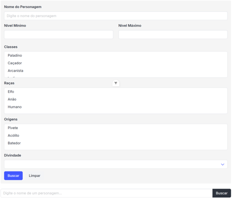                                                                                                                                                                    |
| **Heurística Violada**   | PU4 - Redução do esforço cognitivo                                                                                                                                                                           |
| **Sugestão de Melhoria** | Ao "Mostrar busca avançada", o campo de busca simples (inferior) deve ser ocultado ou seu valor deve ser sincronizado com o campo "Nome do Personagem" do formulário.                                        |
| **Gravidade**            | Alta                                                                                                                                                                                                         |
| **Esforço**              | Moderado                                                                                                                                                                                                     |

#### Problema T2-003

| Campo                    | Informação                                                                                                                                                                                                                            |
| ------------------------ | ------------------------------------------------------------------------------------------------------------------------------------------------------------------------------------------------------------------------------------- |
| **ID**                   | T2-003                                                                                                                                                                                                                                |
| **Descrição**            | No card do personagem "haru", a ação destrutiva ("Excluir ficha") possui um destaque visual (cor vermelha sólida) muito maior do que a ação primária e mais comum ("Acessar ficha"), que está em cinza escuro.                        |
| **Print**                | 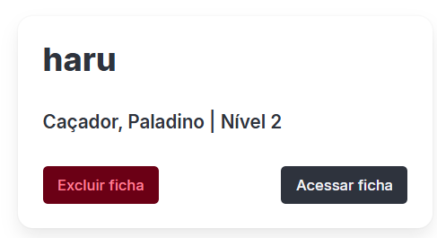                                                                                                                                                                                             |
| **Heurística Violada**   | FM2 - Hierarquia da informação e AF9 - Prevenção de erros                                                                                                                                                                             |
| **Sugestão de Melhoria** | Inverter o destaque: "Acessar ficha" deve ser o botão primário (ex: preenchido com uma cor de destaque positiva) e "Excluir ficha" deve ser um botão secundário (ex: vazado com borda vermelha, ou apenas um link de texto vermelho). |
| **Gravidade**            | Alta                                                                                                                                                                                                                                  |
| **Esforço**              | Leve                                                                                                                                                                                                                                  |

#### Problema T2-004

| Campo                    | Informação                                                                                                                                                                                                                                                         |
| ------------------------ | ------------------------------------------------------------------------------------------------------------------------------------------------------------------------------------------------------------------------------------------------------------------ |
| **ID**                   | T2-004                                                                                                                                                                                                                                                             |
| **Descrição**            | A página utiliza pelo menos 4 estilos de botões diferentes sem uma lógica clara: "Criar personagem" (cinza escuro preenchido), "Mostrar busca avançada" (cinza claro vazado), "Buscar" (cinza escuro preenchido, pequeno) e "Excluir ficha" (vermelho preenchido). |
| **Print**                | 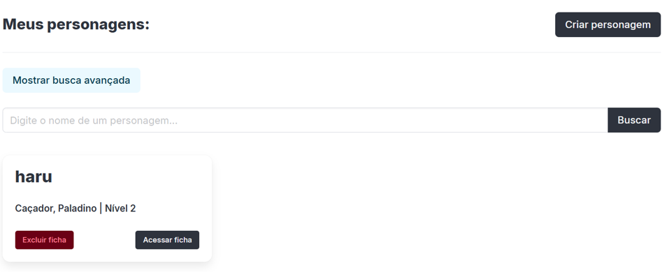                                                                                                                                                                                                                          |
| **Heurística Violada**   | FM6 - Consistência interna                                                                                                                                                                                                                                         |
| **Sugestão de Melhoria** | Definir um sistema de design para botões (ex: Primário, Secundário, Destrutivo) e aplicá-los de forma consistente. Por exemplo, "Criar" e "Acessar" (Primário), "Busca Avançada" (Secundário), "Excluir" (Destrutivo).                                             |
| **Gravidade**            | Média                                                                                                                                                                                                                                                              |
| **Esforço**              | Moderado                                                                                                                                                                                                                                                           |

#### Problema T2-005

| Campo                    | Informação                                                                                                                                                                                                                                                |
| ------------------------ | --------------------------------------------------------------------------------------------------------------------------------------------------------------------------------------------------------------------------------------------------------- |
| **ID**                   | T2-005                                                                                                                                                                                                                                                    |
| **Descrição**            | A busca avançada inclui os campos "Nível Mínimo" e "Nível Máximo", mas não há qualquer restrição de formato de dados nem prevenção de erros. O usuário pode digitar letras, números negativos ou valores que não fazem sentido (ex: Mínimo 20, Máximo 1). |
| **Print**                |                                                                                                                                                                                                                   |
| **Heurística Violada**   | AF9 - Prevenção de erros e AF10 - Restrições                                                                                                                                                                                                              |
| **Sugestão de Melhoria** | Restringir a entrada de dados para números inteiros (formato `type="number"`) e adicionar validação em tempo real para garantir que o "Nível Mínimo" não seja maior que o "Nível Máximo".                                                                 |
| **Gravidade**            | Média                                                                                                                                                                                                                                                     |
| **Esforço**              | Moderado                                                                                                                                                                                                                                                  |

#### Problema T2-006

| Campo                    | Informação                                                                                                                                                                                                                                      |
| ------------------------ | ----------------------------------------------------------------------------------------------------------------------------------------------------------------------------------------------------------------------------------------------- |
| **ID**                   | T2-006                                                                                                                                                                                                                                          |
| **Descrição**            | O card do personagem é o único elemento que mostra um resultado. Não há um rótulo claro ou uma seção que indique a quantidade total de personagens encontrados (ex: "1 Personagem Encontrado").                                                 |
| **Print**                |                                                                                                                                                                                                         |
| **Heurística Violada**   | CO2 - Feedback adequado                                                                                                                                                                                                                         |
| **Sugestão de Melhoria** | Adicionar um feedback de resultado visível acima dos cards, como: "1 Personagem Encontrado" (ou "5 Personagens Encontrados"). Em caso de busca vazia, deve-se mostrar uma mensagem clara como "Nenhum personagem encontrado com esses filtros". |
| **Gravidade**            | Média                                                                                                                                                                                                                                           |
| **Esforço**              | Leve                                                                                                                                                                                                                                            |

#### Problema T2-007

| Campo                    | Informação                                                                                                                                                                                                                           |
| ------------------------ | ------------------------------------------------------------------------------------------------------------------------------------------------------------------------------------------------------------------------------------ |
| **ID**                   | T2-007                                                                                                                                                                                                                               |
| **Descrição**            | O rótulo "Meus personagens:" está com fonte muito grande, competindo com o título de navegação e as ações primárias da tela. Também o botão "Mostrar busca avançada" está posicionado muito longe do campo de busca que complementa. |
| **Print**                |                                                                                                                                                                                              |
| **Heurística Violada**   | FM2 - Hierarquia da informação e FM8 - Proximidade                                                                                                                                                                                   |
| **Sugestão de Melhoria** | Reduzir o tamanho da fonte do rótulo "Meus personagens:" e mover o link "Mostrar busca avançada" para dentro ou adjacente ao campo de busca simples, agrupando visualmente a função ao seu contexto.                                 |
| **Gravidade**            | Baixa                                                                                                                                                                                                                                |
| **Esforço**              | Leve                                                                                                                                                                                                                                 |

### 3.3 Criar Ficha

#### Problema T3-001

| Campo                    | Informação                                                                                                                                                                                                          |
| ------------------------ | ------------------------------------------------------------------------------------------------------------------------------------------------------------------------------------------------------------------- |
| **ID**                   | T3-001                                                                                                                                                                                                              |
| **Descrição**            | O modal de "Criar Ficha" é muito longo, exigindo rolagem para ver todos os campos. Os botões de ação ("Cancelar" e "Criar ficha") estão no final, ficando invisíveis quando o usuário preenche os primeiros campos. |
| **Print**                |                                                                                                                                                                    |
| **Heurística Violada**   | FM1 - Visibilidade                                                                                                                                                                                                  |
| **Sugestão de Melhoria** | Opção A (ideal): dividir o formulário em etapas (wizard). Opção B (mais simples): fixar o rodapé do modal para que os botões de ação permaneçam sempre visíveis durante a rolagem.                                  |
| **Gravidade**            | Média                                                                                                                                                                                                               |
| **Esforço**              | Moderado (opção B) ou Grande (opção A)                                                                                                                                                                              |

#### Problema T3-002

| Campo                    | Informação                                                                                                                                                                                                            |
| ------------------------ | --------------------------------------------------------------------------------------------------------------------------------------------------------------------------------------------------------------------- |
| **ID**                   | T3-002                                                                                                                                                                                                                |
| **Descrição**            | O botão "Criar ficha" está desabilitado por padrão, mas não há indicação visual (asteriscos, tooltips) sobre quais campos são obrigatórios para habilitá-lo. O usuário precisa adivinhar quais dados são necessários. |
| **Print**                |                                                                                                                                                                      |
| **Heurística Violada**   | CO3 - Affordance - dicas, PU4 - Redução do esforço cognitivo, CO2 - Feedback adequado                                                                                                                                 |
| **Sugestão de Melhoria** | Adicionar asteriscos vermelhos (\*) nos rótulos dos campos obrigatórios e habilitar o botão "Criar ficha" assim que todos os campos mandatórios forem preenchidos.                                                    |
| **Gravidade**            | Média                                                                                                                                                                                                                 |
| **Esforço**              | Leve                                                                                                                                                                                                                  |

#### Problema T3-003

| Campo                    | Informação                                                                                                                                                                                                       |
| ------------------------ | ---------------------------------------------------------------------------------------------------------------------------------------------------------------------------------------------------------------- |
| **ID**                   | T3-003                                                                                                                                                                                                           |
| **Descrição**            | Os campos "Divindade", "Raça", "Origem" e outros não apresentam dicas ou explicações sobre seu significado e impacto na ficha. Isso dificulta o preenchimento para usuários iniciantes ou leigos no sistema T20. |
| **Print**                |                                                                                                                                                                 |
| **Heurística Violada**   | CO3 - Affordance - dicas, PU4 - Redução do esforço cognitivo                                                                                                                                                     |
| **Sugestão de Melhoria** | Implementar tooltips ou ícones de interrogação (?) ao lado dos rótulos dos campos. Os tooltips devem explicar o significado, utilidade e impacto de cada campo no contexto da ficha de RPG.                      |
| **Gravidade**            | Média                                                                                                                                                                                                            |
| **Esforço**              | Leve                                                                                                                                                                                                             |

#### Problema T3-004

| Campo                    | Informação                                                                                                                                                                                                                 |
| ------------------------ | -------------------------------------------------------------------------------------------------------------------------------------------------------------------------------------------------------------------------- |
| **ID**                   | T3-004                                                                                                                                                                                                                     |
| **Descrição**            | O checkbox "Incluir conteúdo Homebrew" está isolado na seção "Opções", distante dos campos que são realmente afetados por ele (Raça, Divindade, Classe, Origem). Essa separação pode confundir o usuário sobre sua função. |
| **Print**                |                                                                                                                                                                           |
| **Heurística Violada**   | FM8 - Proximidade                                                                                                                                                                                                          |
| **Sugestão de Melhoria** | Posicionar o checkbox "Incluir conteúdo Homebrew" imediatamente acima do primeiro campo de seleção afetado (ex: "Divindade" ou "Raça"), tornando a relação entre o filtro e os campos mais evidente.                       |
| **Gravidade**            | Baixa                                                                                                                                                                                                                      |
| **Esforço**              | Leve                                                                                                                                                                                                                       |

#### Problema T3-005

| Campo                    | Informação                                                                                                                                                                   |
| ------------------------ | ---------------------------------------------------------------------------------------------------------------------------------------------------------------------------- |
| **ID**                   | T3-005                                                                                                                                                                       |
| **Descrição**            | O botão de ação "Criar Ficha" se repete com a denominação do modal que aparece na parte superior. Isso gera redundância e falta de clareza sobre a ação específica do botão. |
| **Print**                |                                                                                                                             |
| **Heurística Violada**   | FM6 - Consistência interna                                                                                                                                                   |
| **Sugestão de Melhoria** | Alterar o texto do botão para uma ação mais específica, como "Salvar Ficha" ou "Confirmar Criação", evitando repetir o nome do modal e tornando o comando mais objetivo.     |
| **Gravidade**            | Baixa                                                                                                                                                                        |
| **Esforço**              | Leve                                                                                                                                                                         |

#### Problema T3-001

| Campo                    | Informação                                                                                                                                                                                                       |
| ------------------------ | ---------------------------------------------------------------------------------------------------------------------------------------------------------------------------------------------------------------- |
| **ID**                   | T3-001                                                                                                                                                                                                           |
| **Descrição**            | O botão "Cancelar" (uma ação segura e secundária) é apresentado em vermelho/vinho sólido. Esta cor é universalmente associada a ações destrutivas (como "Excluir"), dando a ele um destaque indevido e perigoso. |
| **Print**                | 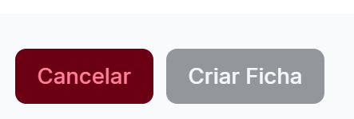                                                                                                                                                                        |
| **Heurística Violada**   | FM2 - Hierarquia da informação e AF9 - Prevenção de erros                                                                                                                                                        |
| **Sugestão de Melhoria** | Alterar o botão "Cancelar" para um estilo secundário (ex: vazado, com borda cinza). A cor vermelha deve ser reservada apenas para ações destrutivas.                                                             |
| **Gravidade**            | Alta                                                                                                                                                                                                             |
| **Esforço**              | Leve                                                                                                                                                                                                             |

#### Problema T3-002

| Campo                    | Informação                                                                                                                                                                                                                                                                                      |
| ------------------------ | ----------------------------------------------------------------------------------------------------------------------------------------------------------------------------------------------------------------------------------------------------------------------------------------------- |
| **ID**                   | T3-002                                                                                                                                                                                                                                                                                          |
| **Descrição**            | A hierarquia dos botões na versão móvel está invertida. A ação secundária e de desistência ("Cancelar") está posicionada acima da ação primária ("Criar Ficha"). Além disso, a ação "Cancelar" tem um destaque de cor (vermelho) muito mais forte do que a ação principal (cinza/desabilitado). |
| **Print**                | 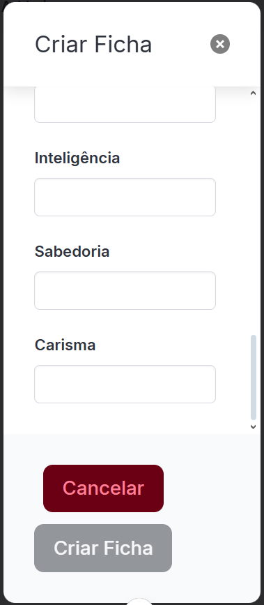                                                                                                                                                                                                                                                       |
| **Heurística Violada**   | FM2 - Hierarquia da informação                                                                                                                                                                                                                                                                  |
| **Sugestão de Melhoria** | Inverter a ordem dos botões, colocando "Criar Ficha" no topo. Mudar "Cancelar" para um estilo secundário (ex: vazado) e dar o destaque (cor) para o botão "Criar Ficha".                                                                                                                        |
| **Gravidade**            | Média                                                                                                                                                                                                                                                                                           |
| **Esforço**              | Baixo                                                                                                                                                                                                                                                                                           |

#### Problema T3-006

| Campo                    | Informação                                                                                                                                                                                                                                 |
| ------------------------ | ------------------------------------------------------------------------------------------------------------------------------------------------------------------------------------------------------------------------------------------ |
| **ID**                   | T3-006                                                                                                                                                                                                                                     |
| **Descrição**            | Na visualização desktop, os campos de texto dos "Atributos" (Força, Destreza, etc.) estão muito distantes de seus respectivos rótulos, dificultando a associação rápida entre o nome do atributo e o campo onde o valor deve ser inserido. |
| **Print**                |                                                                                                                                                                                                    |
| **Heurística Violada**   | FM8 - Proximidade                                                                                                                                                                                                                          |
| **Sugestão de Melhoria** | Redesenhar o layout dos atributos, aninhando o rótulo ("Força") diretamente acima ou ao lado do seu campo de texto correspondente, diminuindo a distância horizontal para garantir o agrupamento de significado.                           |
| **Gravidade**            | Média                                                                                                                                                                                                                                      |
| **Esforço**              | Leve                                                                                                                                                                                                                                       |

#### Problema T1-007

| Campo                    | Informação                                                                                                                                                                    |
| ------------------------ | ----------------------------------------------------------------------------------------------------------------------------------------------------------------------------- |
| **ID**                   | T1-007                                                                                                                                                                        |
| **Descrição**            | O texto do segundo parágrafo na seção "O que é Tormenta 20?" está apresentado em um bloco grande, com baixa leiturabilidade e escaneabilidade, dificultando a leitura rápida. |
| **Print**                |                                                                                                                                       |
| **Heurística Violada**   | FM13 - Leiturabilidade                                                                                                                                                        |
| **Sugestão de Melhoria** | Quebrar o texto em parágrafos menores ou utilizar listas (bullet points) para facilitar a leitura e compreensão, além de aumentar levemente o espaçamento entre as linhas.    |
| **Gravidade**            | Baixa                                                                                                                                                                         |
| **Esforço**              | Baixo                                                                                                                                                                         |

#### Problema T3-003

| Campo                    | Informação                                                                                                                                                               |
| ------------------------ | ------------------------------------------------------------------------------------------------------------------------------------------------------------------------ |
| **ID**                   | T3-003                                                                                                                                                                   |
| **Descrição**            | O modal de "Criar Ficha" é excessivamente longo, exigindo que o usuário role a tela para ver todos os campos (como "Atributos"). Modais são destinados a tarefas curtas. |
| **Print**                |                                                                                                                                  |
| **Heurística Violada**   | PU4 - Redução do esforço cognitivo e PD4 - Densidade Informacional                                                                                                       |
| **Sugestão de Melhoria** | Implementar um "stepper" (passo-a-passo) dentro do modal ou mover a criação de ficha para uma página dedicada.                                                           |
| **Gravidade**            | Média                                                                                                                                                                    |
| **Esforço**              | Moderado                                                                                                                                                                 |

#### Problema T3-004

| Campo                    | Informação                                                                                                                                                                                                                                                               |
| ------------------------ | ------------------------------------------------------------------------------------------------------------------------------------------------------------------------------------------------------------------------------------------------------------------------ |
| **ID**                   | T3-004                                                                                                                                                                                                                                                                   |
| **Descrição**            | Os botões do modal ("Cancelar" em vinho sólido, "Criar Ficha" em cinza sólido desabilitado) são inconsistentes com os botões de criação vistos em outras telas (ex: "+ Criar Nova Ficha" vermelho-vazado no Dashboard e "Criar personagem" cinza-escuro em Personagens). |
| **Print**                |                                                                                                                                                                                                                                 |
| **Heurística Violada**   | FM6 - Consistência interna                                                                                                                                                                                                                                               |
| **Sugestão de Melhoria** | Aplicar o sistema de design de botões (Primário, Secundário) de forma consistente em todo o sistema. O botão "Criar Ficha" deve ter o estilo "Primário" (quando habilitado) e "Cancelar" o estilo "Secundário".                                                          |
| **Gravidade**            | Média                                                                                                                                                                                                                                                                    |
| **Esforço**              | Moderado                                                                                                                                                                                                                                                                 |

#### Problema T3-005

| Campo                    | Informação                                                                                                                                                                                                                                                                                                                                                         |
| ------------------------ | ------------------------------------------------------------------------------------------------------------------------------------------------------------------------------------------------------------------------------------------------------------------------------------------------------------------------------------------------------------------ |
| **ID**                   | T3-005                                                                                                                                                                                                                                                                                                                                                             |
| **Descrição**            | Na visualização desktop (larga), os campos de texto dos "Atributos" (Força, Destreza, etc.) estão muito distantes de seus respectivos rótulos, dificultando a associação rápida entre o nome do atributo e o campo onde o valor deve ser inserido. O modal também é muito longo para a tela em dispositivos móveis, forçando o usuário a rolar dentro de um modal. |
| **Print**                |                                                                                                                                                                                                                                                                                                                            |
| **Heurística Violada**   | FM8 - Proximidade e PD3 - Responsividade                                                                                                                                                                                                                                                                                                                           |
| **Sugestão de Melhoria** | Redesenhar o layout dos atributos, aninhando o rótulo ("Força") diretamente acima ou ao lado do seu campo de texto correspondente. Em dispositivos móveis, substituir o modal por uma página de "Criar Ficha" dedicada ou usar um componente "stepper" (passo-a-passo) para dividir a tarefa.                                                                      |
| **Gravidade**            | Média                                                                                                                                                                                                                                                                                                                                                              |
| **Esforço**              | Grande                                                                                                                                                                                                                                                                                                                                                             |

### 3.4 Ficha

#### Problema T4-001

| Campo                    | Informação                                                                                                                                                                                                                                                                             |
| ------------------------ | -------------------------------------------------------------------------------------------------------------------------------------------------------------------------------------------------------------------------------------------------------------------------------------- |
| **ID**                   | T4-001                                                                                                                                                                                                                                                                                 |
| **Descrição**            | Na seção "Perícias", a lista apresenta três colunas interativas (dois campos numéricos e um checkbox) sem nenhum rótulo ou cabeçalho que explique o que cada coluna representa. O usuário não sabe o que os números (Bônus, Total, Modificador?) ou o checkbox (Treinado?) significam. |
| **Print**                |                                                                                                                                                                                                                                                |
| **Heurística Violada**   | CO3 - Affordance - dicas e FM1 - Visibilidade                                                                                                                                                                                                                                          |
| **Sugestão de Melhoria** | Adicionar um cabeçalho de colunas claro acima da lista de perícias (ex: "Bônus", "Total", "Treinado?") para que o usuário entenda o propósito de cada campo de entrada e do checkbox.                                                                                                  |
| **Gravidade**            | Alta                                                                                                                                                                                                                                                                                   |
| **Esforço**              | Moderado                                                                                                                                                                                                                                                                               |

#### Problema T4-002

| Campo                    | Informação                                                                                                                                                                                                                                                                                           |
| ------------------------ | ---------------------------------------------------------------------------------------------------------------------------------------------------------------------------------------------------------------------------------------------------------------------------------------------------- |
| **ID**                   | T4-002                                                                                                                                                                                                                                                                                               |
| **Descrição**            | O layout principal da ficha é mais largo que o contêiner (viewport) definido pelo cabeçalho. As colunas de conteúdo (Resistências, Perícias, Ataques) "vazam" para a direita, ultrapassando o alinhamento do cabeçalho e forçando o usuário a rolar a tela horizontalmente para ver todo o conteúdo. |
| **Print**                |                                                                                                                                                                                                                                                                      |
| **Heurística Violada**   | PD3 - Responsividade e FM9 - Alinhamento                                                                                                                                                                                                                                                             |
| **Sugestão de Melhoria** | Reestruturar o layout da ficha para que as colunas se encaixem no viewport (área visível da tela), seja reduzindo as margens, ou movendo as colunas para uma disposição vertical em telas menores/médias.                                                                                            |
| **Gravidade**            | Alta                                                                                                                                                                                                                                                                                                 |
| **Esforço**              | Grande                                                                                                                                                                                                                                                                                               |

#### Problema T4-003

| Campo                    | Informação                                                                                                                                                                                                                                                                           |
| ------------------------ | ------------------------------------------------------------------------------------------------------------------------------------------------------------------------------------------------------------------------------------------------------------------------------------ |
| **ID**                   | T4-003                                                                                                                                                                                                                                                                               |
| **Descrição**            | A interface não possui diferenciação visual entre campos numéricos que são editáveis (como os bônus de perícias/resistências) e campos que são calculados ou não-editáveis (como os valores de Atributos, CA, CD, Vida e Mana). Todos são apresentados em caixas de input idênticas. |
| **Print**                | 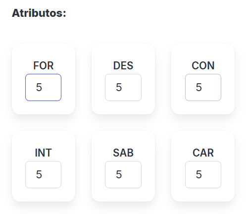                                                                                                                                                                                                                                            |
| **Heurística Violada**   | CO3 - Affordance - dicas                                                                                                                                                                                                                                                             |
| **Sugestão de Melhoria** | Aplicar um estilo visual distinto para campos não-editáveis (calculados). Por exemplo, remover a borda da caixa e exibir apenas o número em negrito, ou usar um fundo cinza (estilo "disabled") para a caixa de input.                                                               |
| **Gravidade**            | Média                                                                                                                                                                                                                                                                                |
| **Esforço**              | Moderado                                                                                                                                                                                                                                                                             |

#### Problema T4-004

| Campo                    | Informação                                                                                                                                                                                                                                                                 |
| ------------------------ | -------------------------------------------------------------------------------------------------------------------------------------------------------------------------------------------------------------------------------------------------------------------------- |
| **ID**                   | T4-004                                                                                                                                                                                                                                                                     |
| **Descrição**            | Na lista de "Perícias", os elementos de cada linha (rótulo, campos numéricos e checkbox) estão desalinhados verticalmente e com espaçamento inconsistente. O rótulo fica à esquerda, enquanto os campos numéricos e o checkbox flutuam desordenadamente no centro/direita. |
| **Print**                |                                                                                                                                                                                                                                    |
| **Heurística Violada**   | FM9 - Alinhamento                                                                                                                                                                                                                                                          |
| **Sugestão de Melhoria** | Reformatar a lista de perícias em colunas claras (ex: Rótulo à esquerda, Bônus Total alinhado à direita, Checkbox alinhado à direita), garantindo que todos os elementos de uma mesma linha estejam verticalmente centralizados.                                           |
| **Gravidade**            | Média                                                                                                                                                                                                                                                                      |
| **Esforço**              | Moderado                                                                                                                                                                                                                                                                   |

#### Problema T4-005

| Campo                    | Informação                                                                                                                                                                                                                                                                     |
| ------------------------ | ------------------------------------------------------------------------------------------------------------------------------------------------------------------------------------------------------------------------------------------------------------------------------ |
| **ID**                   | T4-005                                                                                                                                                                                                                                                                         |
| **Descrição**            | As três colunas principais que compõem o layout da ficha têm alturas drasticamente diferentes. A coluna central (Perícias) é significativamente mais longa que as outras, resultando em grandes áreas de espaço em branco e um layout desbalanceado na parte inferior da tela. |
| **Print**                |                                                                                                                                                                                                                                                |
| **Heurística Violada**   | FM9 - Alinhamento                                                                                                                                                                                                                                                              |
| **Sugestão de Melhoria** | Reorganizar os blocos da ficha (movendo blocos menores de colunas longas para colunas curtas) ou usar um layout de página única, distribuindo o conteúdo verticalmente.                                                                                                        |
| **Gravidade**            | Média                                                                                                                                                                                                                                                                          |
| **Esforço**              | Grande                                                                                                                                                                                                                                                                         |

#### Problema T4-006

| Campo                    | Informação                                                                                                                                                                                                                                              |
| ------------------------ | ------------------------------------------------------------------------------------------------------------------------------------------------------------------------------------------------------------------------------------------------------- |
| **ID**                   | T4-006                                                                                                                                                                                                                                                  |
| **Descrição**            | A interface para modificar "Vida" e "Mana" é ambígua, exibindo um número estático entre quatro botões ('«', '<', '>', '»'). Não é claro o que cada botão faz e não há forma óbvia de inserir um valor específico (ex: se o personagem tomar 5 de dano). |
| **Print**                |                                                                                                                                                                                                        |
| **Heurística Violada**   | CO3 - Affordance                                                                                                                                                                                                                                        |
| **Sugestão de Melhoria** | Substituir por um componente mais claro: um campo de input numérico editável ao lado do valor máximo (ex: `[ 9 ] / 14`). Os botões poderiam ser simplificados para `+` e `-` para incrementos e decrementos simples.                                    |
| **Gravidade**            | Alta                                                                                                                                                                                                                                                    |
| **Esforço**              | Moderado                                                                                                                                                                                                                                                |

#### Problema T4-007

| Campo                    | Informação                                                                                                                                                                                                                          |
| ------------------------ | ----------------------------------------------------------------------------------------------------------------------------------------------------------------------------------------------------------------------------------- |
| **ID**                   | T4-007                                                                                                                                                                                                                              |
| **Descrição**            | A aba ativa na seção principal ("Combate") não tem destaque visual, sendo formatada da mesma maneira que as abas inativas ("Habilidades", "Magias", etc.). O usuário não recebe feedback visual sobre qual seção está visualizando. |
| **Print**                |                                                                                                                                                                                    |
| **Heurística Violada**   | CO2 - Feedback adequado                                                                                                                                                                                                             |
| **Sugestão de Melhoria** | Aplicar um estilo visual claro para a aba ativa, como sublinhado, cor de fundo diferente, ou texto em negrito, para diferenciá-la das abas inativas.                                                                                |
| **Gravidade**            | Média                                                                                                                                                                                                                               |
| **Esforço**              | Leve                                                                                                                                                                                                                                |

#### Problema T4-008

| Campo                    | Informação                                                                                                                                                                                                                 |
| ------------------------ | -------------------------------------------------------------------------------------------------------------------------------------------------------------------------------------------------------------------------- |
| **ID**                   | T4-008                                                                                                                                                                                                                     |
| **Descrição**            | O botão "Excluir ataque" usa a mesma cor (vermelho/rosa) do botão "+ Criar Nova Ficha" do Dashboard. A mesma cor não pode significar "Criar" (ação construtiva) e "Excluir" (ação destrutiva), gerando confusão semântica. |
| **Print**                |                                                                                                                                                                           |
| **Heurística Violada**   | FM6 - Consistência interna                                                                                                                                                                                                 |
| **Sugestão de Melhoria** | Definir uma paleta de cores semântica consistente. Reservar vermelho/rosa apenas para ações destrutivas (Excluir, Cancelar). Usar verde para ações construtivas/primárias (Criar, Salvar).                                 |
| **Gravidade**            | Alta                                                                                                                                                                                                                       |
| **Esforço**              | Leve                                                                                                                                                                                                                       |

#### Problema T4-009

| Campo                    | Informação                                                                                                                                                                                                                                 |
| ------------------------ | ------------------------------------------------------------------------------------------------------------------------------------------------------------------------------------------------------------------------------------------ |
| **ID**                   | T4-009                                                                                                                                                                                                                                     |
| **Descrição**            | A interface não diferencia visualmente campos editáveis (como bônus de perícias/resistências) de campos calculados ou não-editáveis (como valores de Atributos, CA, CD, Vida e Mana). Todos são apresentados em caixas de input idênticas. |
| **Print**                |                                                                                                                                                                                                    |
| **Heurística Violada**   | CO3 - Affordance - dicas                                                                                                                                                                                                                   |
| **Sugestão de Melhoria** | Aplicar estilo visual distinto para campos não-editáveis (calculados). Por exemplo, remover a borda da caixa e exibir apenas o número em negrito, ou usar fundo cinza (estilo "disabled").                                                 |
| **Gravidade**            | Média                                                                                                                                                                                                                                      |
| **Esforço**              | Moderado                                                                                                                                                                                                                                   |

### 3.5 Homebrew

#### Problema T5-001

| Campo                    | Informação                                                                                                                                                                                                                                |
| ------------------------ | ----------------------------------------------------------------------------------------------------------------------------------------------------------------------------------------------------------------------------------------- |
| **ID**                   | T5-001                                                                                                                                                                                                                                    |
| **Descrição**            | Na tela "Criar Conteúdo Homebrew", os ícones para "Raças", "Divindades", "Classes" e "Habilidades" são genéricos e inconsistentes (ícones placeholder "X" e "janela"), não tendo relação metafórica clara com o conteúdo que representam. |
| **Print**                | 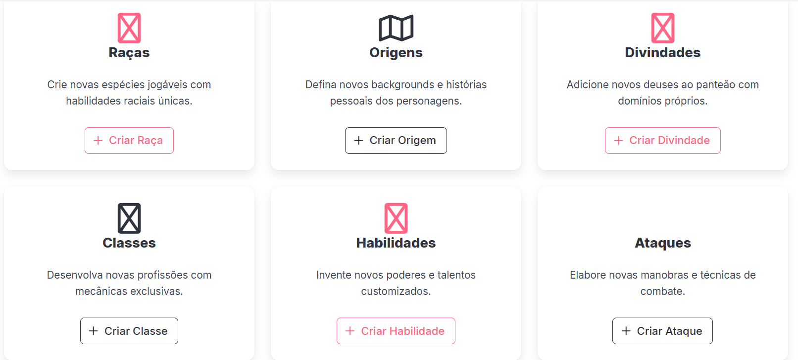                                                                                                                                                                                                 |
| **Heurística Violada**   | CO4 - Metáfora e FM6 - Consistência interna                                                                                                                                                                                               |
| **Sugestão de Melhoria** | Substituir os ícones placeholder por metáforas que representem visualmente cada categoria (ex: um ícone de "máscara" ou "cabeça" para Raças, "cálice" ou "símbolo religioso" para Divindades, "livro aberto" para Habilidades).           |
| **Gravidade**            | Alta                                                                                                                                                                                                                                      |
| **Esforço**              | Leve                                                                                                                                                                                                                                      |

#### Problema T5-002

| Campo                    | Informação                                                                                                                                                                                                                                                           |
| ------------------------ | -------------------------------------------------------------------------------------------------------------------------------------------------------------------------------------------------------------------------------------------------------------------- |
| **ID**                   | T5-002                                                                                                                                                                                                                                                               |
| **Descrição**            | A barra de navegação principal (cabeçalho) não é responsiva. Em vez de se agrupar em um menu "hambúrguer", os links de navegação ("Homebrew", "Personagens") e o menu de usuário ("nathan cavalcante") simplesmente desaparecem, deixando o usuário preso na página. |
| **Print**                | 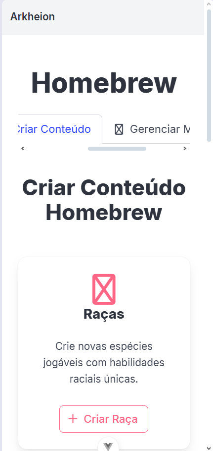                                                                                                                                                                                                                            |
| **Heurística Violada**   | PD3 - Responsividade e PD2 - Adequação a padrões                                                                                                                                                                                                                     |
| **Sugestão de Melhoria** | Implementar um menu "hambúrguer" que, ao ser clicado, exiba os links de navegação e o menu do usuário.                                                                                                                                                               |
| **Gravidade**            | Alta                                                                                                                                                                                                                                                                 |
| **Esforço**              | Moderado                                                                                                                                                                                                                                                             |

#### Problema T5-003

| Campo                    | Informação                                                                                                                                                                                                                                                                           |
| ------------------------ | ------------------------------------------------------------------------------------------------------------------------------------------------------------------------------------------------------------------------------------------------------------------------------------ |
| **ID**                   | T5-003                                                                                                                                                                                                                                                                               |
| **Descrição**            | Na tela "Criar Conteúdo Homebrew", os botões de criação (ex: "+ Criar Raça") usam um estilo novo (vazado com borda e texto rosa). Este é mais um estilo de botão inconsistente, que não corresponde aos botões de criação do Dashboard (vazado vermelho) nem da tela de Personagens. |
| **Print**                |                                                                                                                                                                                                                                             |
| **Heurística Violada**   | FM6 - Consistência interna                                                                                                                                                                                                                                                           |
| **Sugestão de Melhoria** | Definir um estilo único (ex: Primário Sólido) para a ação de criação e usá-lo consistentemente em todas as telas, independentemente da cor de destaque do tema.                                                                                                                      |
| **Gravidade**            | Média                                                                                                                                                                                                                                                                                |
| **Esforço**              | Moderado                                                                                                                                                                                                                                                                             |

#### Problema T5-004

| Campo                    | Informação                                                                                                                                                                                                         |
| ------------------------ | ------------------------------------------------------------------------------------------------------------------------------------------------------------------------------------------------------------------ |
| **ID**                   | T5-004                                                                                                                                                                                                             |
| **Descrição**            | As ações nos cards de "Meus Homebrews" ("Editar" e "Excluir" como text-links) são visualmente inconsistentes com as ações nos cards de "Meus Personagens" ("Acessar ficha" e "Excluir ficha" como botões sólidos). |
| **Print**                | 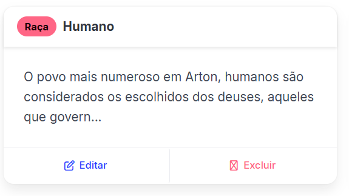                                                                                                                                                                          |
| **Heurística Violada**   | FM6 - Consistência interna                                                                                                                                                                                         |
| **Sugestão de Melhoria** | Padronizar o estilo das ações em todos os cards do sistema. Por exemplo, a ação primária ("Editar" / "Acessar") deve ser um botão, e a destrutiva ("Excluir") um botão secundário ou link.                         |
| **Gravidade**            | Média                                                                                                                                                                                                              |
| **Esforço**              | Moderado                                                                                                                                                                                                           |

#### Problema T5-005

| Campo                    | Informação                                                                                                                                                                  |
| ------------------------ | --------------------------------------------------------------------------------------------------------------------------------------------------------------------------- |
| **ID**                   | T5-005                                                                                                                                                                      |
| **Descrição**            | A ação de "Excluir" na tela "Meus Homebrews" é um link de texto vermelho, que é inconsistente com a ação de "Excluir" na tela de Personagens (um botão vermelho sólido).    |
| **Print**                |                                                                                                                                    |
| **Heurística Violada**   | FM6 - Consistência interna                                                                                                                                                  |
| **Sugestão de Melhoria** | Padronizar o estilo da ação "Excluir" em todos os cards do sistema, mantendo a mesma representação visual (seja link ou botão, mas de forma consistente) para a mesma ação. |
| **Gravidade**            | Média                                                                                                                                                                       |
| **Esforço**              | Leve                                                                                                                                                                        |

#### Problema T5-006

| Campo                    | Informação                                                                                                                                                                                                                                                                                |
| ------------------------ | ----------------------------------------------------------------------------------------------------------------------------------------------------------------------------------------------------------------------------------------------------------------------------------------- |
| **ID**                   | T5-006                                                                                                                                                                                                                                                                                    |
| **Descrição**            | O bloco amarelo de "Importante" na tela "O que é Homebrew?" (usado para alertar sobre o balanceamento) tem uma cor de fundo que remete a um erro grave ou alerta de sistema. A cor amarela é mais adequada para avisos temporários ou de atenção, não para informações contextuais fixas. |
| **Print**                |                                                                                                                                                                                                                                                      |
| **Heurística Violada**   | CO6 - Adequação ao contexto                                                                                                                                                                                                                                                               |
| **Sugestão de Melhoria** | Mudar o bloco para um estilo menos intrusivo (ex: um bloco cinza claro com a borda amarela ou vermelha apenas na lateral) para comunicar a importância sem dar a sensação de um erro crítico de sistema.                                                                                  |
| **Gravidade**            | Baixa                                                                                                                                                                                                                                                                                     |
| **Esforço**              | Leve                                                                                                                                                                                                                                                                                      |

### Legenda de Gravidade:

- **Alta:** Problema que impede ou dificulta significativamente a realização de tarefas
- **Média:** Problema que causa frustração ou demora na realização de tarefas
- **Baixa:** Problema menor que não afeta significativamente a usabilidade

### Legenda de Esforço:

- **Leve:** Alteração simples, requer poucas horas de desenvolvimento
- **Moderado:** Alteração de complexidade média, requer alguns dias de desenvolvimento
- **Grande:** Alteração complexa, requer semanas de desenvolvimento ou reestruturação

#### Problema T5-006

| Campo                    | Informação                                                                                                                                                                                                                                   |
| ------------------------ | -------------------------------------------------------------------------------------------------------------------------------------------------------------------------------------------------------------------------------------------- |
| **ID**                   | T5-006                                                                                                                                                                                                                                       |
| **Descrição**            | O bloco amarelo de "Importante" na tela "O que é Homebrew?" tem uma cor de fundo que remete a erro grave ou alerta de sistema. A cor amarela é inadequada para informações contextuais fixas, sendo mais apropriada para avisos temporários. |
| **Print**                |                                                                                                                                                                                                      |
| **Heurística Violada**   | CO6 - Adequação ao contexto                                                                                                                                                                                                                  |
| **Sugestão de Melhoria** | Mudar o bloco para um estilo menos intrusivo (ex: bloco cinza claro com borda amarela ou vermelha apenas na lateral) para comunicar a importância sem dar sensação de erro crítico de sistema.                                               |
| **Gravidade**            | Baixa                                                                                                                                                                                                                                        |
| **Esforço**              | Leve                                                                                                                                                                                                                                         |

## 4. Análise Consolidada

### 4.1 Principais Problemas por Categoria

#### Problemas de Consistência (8 problemas)

Os problemas mais recorrentes estão relacionados à **inconsistência interna** do sistema:

- Múltiplos estilos de botões sem lógica clara
- Ações similares com representações visuais diferentes
- Falta de padronização no sistema de design

#### Problemas de Responsividade (4 problemas)

O sistema apresenta sérias falhas de **responsividade**:

- Menu de navegação que desaparece em telas menores
- Layout que quebra e força rolagem horizontal
- Componentes não adaptados para dispositivos móveis

#### Problemas de Usabilidade (16 problemas)

Diversos problemas afetam a **experiência do usuário**:

- Falta de feedback adequado
- Campos sem rótulos ou instruções claras
- Hierarquia visual inadequada
- Digitação desnecessária em formulários

### 4.2 Recomendações Prioritárias

#### **Prioridade Crítica (Gravidade Alta)**

1. **Implementar menu responsivo** em todas as telas
2. **Criar sistema de design consistente** para botões e ações
3. **Adicionar rótulos explicativos** nas colunas da ficha de personagem
4. **Corrigir hierarquia visual** dos botões de ação

#### **Prioridade Alta (Gravidade Média)**

1. **Padronizar estilos de componentes** em todo o sistema
2. **Otimizar formulários** com dropdowns e validações
3. **Melhorar layout responsivo** da ficha de personagem
4. **Implementar feedback de ações** do usuário

#### **Prioridade Baixa (Gravidade Baixa)**

1. **Criar identidade visual** mais coesa
2. **Ajustar elementos de alerta** contextual

---

**Data do relatório:** 29 de outubro de 2025
**Versão do documento:** 1.0
**Avaliadores:** Nathan Cavalcante de Lima, Lucas Pinheiro da Costa e Agnes Gonçalves Barbosa
